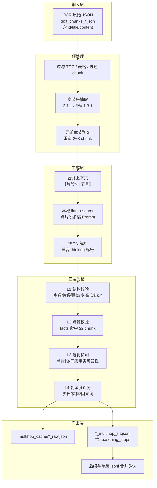
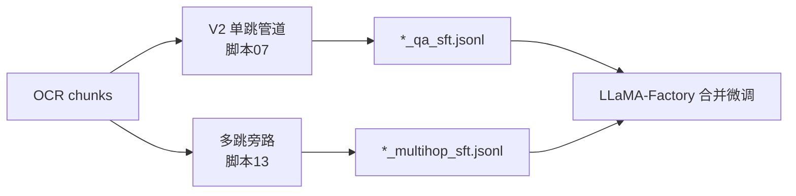
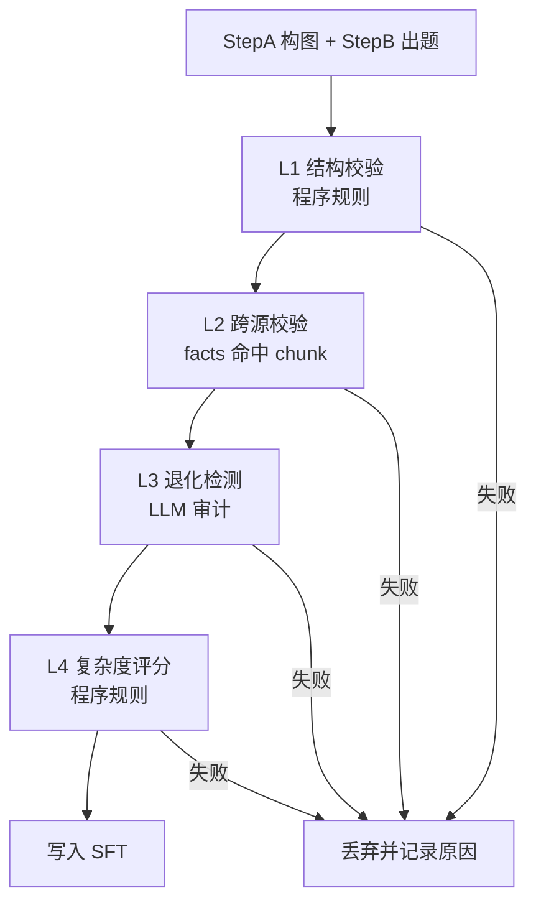

# 单文档跨 Chunk 多跳 QA 技术路线

## 1. 背景与目标

### 1.1 现状

当前主链路 [文档01_技术文档QA管道V2总体设计方案.plan.md](/home/wugk/.cursor/plans/文档01_技术文档QA管道V2总体设计方案.plan.md) 与 [脚本07_QA管道主程序_Python入口.py](/home/wugk/.cursor/plans/脚本07_QA管道主程序_Python入口.py) 产出的是**单跳 QA**：每个 OCR chunk 独立蒸馏出题 → 答案先行 → Rubric → MetaFilter，最终导出 `*_sft.jsonl`（`instruction` + `input` + `output`）。

已跑通数据集示例：

| 数据集 | 单跳规模 | 原始 OCR |
|--------|----------|----------|
| 01-01 告警处理 | 2348 条 | `text_chunks_*_converted.json` |
| DDM 开发指南 | 435 条 | 172 chunks |
| DDM 用户指南 | 已跑通 | 134 chunks |

### 1.2 目标

新增**单文档跨 chunk 多跳**能力：

- 同一 PDF/文档内，综合 **2~3 个相关章节 chunk** 才能回答
- 与 V2 **旁路并行**，不改动现有 21 步主链路
- **通用脚本**：通过环境变量指定任意文档目录，不绑定特定数据集
- 产出保留 `reasoning_steps` / `supporting_facts` 等审计字段；微调时可选择是否将推理链喂入模型

### 1.3 非目标（本阶段不做）

- 跨文档多跳（DDM + 告警处理联合出题）→ 后续「文档17」
- 改写 V2 内部算子链
- 重新 OCR 或重跑单跳管道

---

## 2. 为何不复用现有 `Text2MultiHopQAGenerator`

DataFlow 已有 [Text2MultiHopQAGenerator](/home/wugk/finetune/DataFlow/dataflow/operators/core_text/generate/text2multihopqa_generator.py) 与 [Text2MultiHopQAGeneratorPrompt](/home/wugk/finetune/DataFlow/dataflow/prompts/text2qa.py)，但**不适合直接用于技术文档跨 chunk**：

| 维度 | 现有算子 | 本方案需求 |
|------|----------|------------|
| 输入单位 | 单个 `text` 字段 | 2~3 个带章节号的 chunk 合并 |
| 事实抽取 | 按句号滑窗取 3 句三元组 | 按章节父子关系聚类 |
| 跨源约束 | 无 chunk 边界 | 强制 `supporting_facts` 来自 ≥2 片段 |
| 技术文档噪声 | 无 TOC 过滤 | 需过滤目录页、纯表格 chunk |
| Prompt | 通用多跳 | 需「片段1/片段2」显式标注 + 流程链/配置链模板 |

结论：**借鉴其 JSON 输出结构与 `APILLMServing_request` 调用方式**，新建专用脚本而非硬接 V2 或 core_text 算子。

---

## 3. 总体架构



与 V2 关系：



---

## 4. 核心技术模块设计

### 4.1 Chunk 加载与过滤

**输入**：DeepSeek-OCR 原始 `text_chunks_*.json`（`result[]` 含 `id`, `title`, `content`），**不用** `*_converted.json`（会丢失 id/章节元数据）。

**过滤规则**（与 [ocr_chunks_to_dataflow.py](/home/wugk/finetune/finetune/test/ocr_chunks_to_dataflow.py) 对齐并增强）：

- 最小字符数：默认 150（`MH_MIN_CHUNK_CHARS`）
- 纯表格 chunk：`| ` 行占比 ≥ 60% 丢弃
- 目录型 chunk：同一短文本内 ≥4 个 `x.y.z` 节号且正文极少 → 丢弃

### 4.2 章节号抽取

从 chunk 首行匹配：

```
^#{1,4}\s*(\d+(?:\.\d+)*)
^(\d+(?:\.\d+)+)\s+
^#\s*(\d+)\s+
```

得到 `section` 如 `2.1.1`、`1.3.2`。无法解析的 chunk 不参与聚类（本阶段策略，后续可改为顺序邻接聚类）。

### 4.3 聚类策略（单文档跨 chunk 核心）

**按父章节分组 + 滑窗**：

1. 对每个有 `section` 的 chunk，计算 `parent = section` 去掉末段（`2.1.1.2` → `2.1.1`）
2. 同 parent 下按节号排序
3. 滑窗生成 size=2 和 size=3 的 cluster
4. 要求 cluster 内 **≥2 个不同 section**
5. 全局上限 `MH_MAX_CLUSTERS`（默认 80），按文档顺序截断

**DDM 开发指南 dry-run 预估**：225 原始 → 150 可用 chunk → **80 组聚类**（如 `1.1+1.2`、`2.4.1+2.4.2+2.4.3`、`3.1.1+3.1.2` 等）。

**合并上下文格式**：

```
【片段1 | 节号 2.4.1】
<chunk1 正文，超长则截断>

【片段2 | 节号 2.4.2】
<chunk2 正文>
```

单 cluster 合并上限 `MH_MAX_CONTEXT`（默认 10000 字符）。

### 4.4 多跳 Prompt 设计（两步生成，先构图再出题）

单靠「请生成多跳问题」容易产生**假多跳**：模型把两个并列事实拼成一问，或把单片段能答的问题硬拆成两步。本方案采用**两步 LLM 调用**，先强制抽出跨片段依赖，再基于依赖链出题。

#### Step A：跨片段依赖抽取（构图）

输入合并上下文，输出依赖图 JSON：

```json
{
  "entities": [
    {"id": "E1", "fragment": 1, "name": "schema.xml", "fact": "..."},
    {"id": "E2", "fragment": 2, "name": "元数据导入", "fact": "..."}
  ],
  "edges": [
    {"from": "E1", "to": "E2", "relation": "配置完成后需执行", "fragment_bridge": [1, 2]}
  ],
  "reasoning_path": ["E1", "E2", "E3"],
  "path_type": "配置链"
}
```

**硬约束**：

- `reasoning_path` 长度 ≥ 2（2-chunk cluster）或 ≥ 3（3-chunk cluster）
- `reasoning_path` 中相邻节点必须来自**不同 fragment**
- 若无法找到满足条件的 path → **整组 cluster 跳过**，不强行出题

#### Step B：基于依赖链生成多跳 QA

只把 Step A 的 `reasoning_path` + 对应 `fact` 作为出题依据（而非全文自由发挥），生成：

```json
{
  "question": "...",
  "reasoning_steps": [
    {"step": 1, "fragment": 1, "uses_facts": ["E1"], "text": "..."},
    {"step": 2, "fragment": 2, "uses_facts": ["E2"], "text": "..."}
  ],
  "answer": "...",
  "supporting_facts": ["...", "..."],
  "source_fragments": [1, 2],
  "type": "配置链",
  "reasoning_path": ["E1", "E2"]
}
```

**Prompt 硬约束（写入 System）**：

1. **问题不得泄露中间桥接实体**：不能把 `schema.xml → 元数据导入` 全写在题干里，应让答题者自己串联
2. **每一步必须新增信息**：step[i] 的结论不能由 step[1..i-1] 单独推出，必须引入新 fragment 的事实
3. **禁止并列拼接**：不允许「A 是什么，B 是什么」型双问句；必须是「完成 A 后如何使 B 生效」型依赖问
4. **步数与 cluster 对齐**：2-chunk → 至少 2 步；3-chunk → 至少 3 步

技术文档优先 **path_type** 模板：

| 类型 | 依赖形态 | 示例问题形态 |
|------|----------|--------------|
| 配置链 | 定义 → 关联 → 生效 | 「…配置好后还需做什么才能生效？」 |
| 流程链 | 前提 → 操作 → 验证 | 「…满足前提后按何步骤执行并如何确认？」 |
| 因果链 | 缺失 → 后果 → 修复 | 「若跳过…会导致什么，应如何补救？」 |
| 对比链 | 方案A特征 → 方案B特征 → 选型 | 「…场景下应选哪种方式，依据是什么？」 |
| 排障链 | 现象 → 根因 → 处置 | 「出现…应先查什么，再执行什么？」 |

---

### 4.5 什么是「真多跳长推理」（与假多跳区分）

| 类型 | 特征 | 示例（不合格） |
|------|------|----------------|
| **假多跳·并列拼接** | 两个独立事实用「以及/还有」连接，去掉任一仍能答 | 「schema.xml 配什么，server.xml 配什么？」 |
| **假多跳·同片段可答** | 所有 facts 实际来自同一片段 | 把一段里的两句话拆成两步 |
| **假多跳·题干泄题** | 问题已写明全部中间步骤 | 「先在 schema.xml 配 dataNode，再导入元数据，对吗？」 |
| **短推理·一步可达** | 只有 2 步但第二步是 trivial 复述 | step1: X在A文件；step2: 所以X在A文件 |
| **真多跳长推理** | 缺任一步/任一片段都无法完整回答；每步引入新实体或新约束 | 「DDM 部署初期要同时指定物理库地址与逻辑分片映射，应在哪配、配完如何生效？」 |

**「长推理」在本方案的量化定义**（全部满足才算通过）：

1. **路径长度**：`len(reasoning_steps)` ≥ chunk 数（2 chunk → ≥2 步，3 chunk → ≥3 步）
2. **跨片段覆盖**：每个 fragment 至少出现在 1 个 step 的 `fragment` 字段中
3. **步间依赖**：step[i] 的 `text` 中至少含 1 个 step[i-1] 结论中的关键词，且引入 step[i] 所属 fragment 的新实体
4. **不可退化**：单片段上下文 + 问题 → **不能**完整回答（L3 退化检测）
5. **答案闭包**：最终 `answer` 必须整合全部 step 结论，不是某一步的同义复述

---

### 4.6 四层保障机制（确保推理是真多跳）



#### L1 结构校验（程序，零 LLM 成本）

| 规则 ID | 检查内容 | 阈值 |
|---------|----------|------|
| S1 | `reasoning_steps` 步数 | ≥ cluster 内 chunk 数 |
| S2 | 每步含 `fragment` 字段且落在 1..N | 100% 覆盖 |
| S3 | `source_fragments` 去重后数量 | ≥ 2 |
| S4 | 每个 fragment 至少 1 步引用 | 全覆盖 |
| S5 | 每步 `text` 字符数 | ≥ 15（避免 trivial 步） |
| S6 | 各步 `text` 两两 Jaccard 相似度 | < 0.6（避免同义反复） |
| S7 | `question` 不得包含所有 `supporting_facts` 的逐字子串 | 防泄题 |

#### L2 跨源校验（程序）

| 规则 ID | 检查内容 |
|---------|----------|
| C1 | 每条 `supporting_fact` 归一化后命中且仅命中 1 个 chunk（或明确标记主 chunk） |
| C2 | 所有 facts 合计覆盖 ≥ 2 个不同 `chunk_id` |
| C3 | 每步 `uses_facts` / 对应 fact 的 fragment 与 step.fragment 一致 |

#### L3 退化检测（LLM 审计，**本方案必做而非可选**）

对每条候选 QA，追加 **1 次**审计调用（可与生成共用 `DF_MAX_WORKERS` 并行）：

```
给定问题 Q，分别仅提供【片段1】/【片段2】/…【片段N】，
问模型：「能否仅凭该片段完整、准确地回答 Q？」
只输出 YES 或 NO。
```

**拒绝条件**：

- 任一片段单独回答为 **YES** → 假多跳，丢弃
- 仅给 `supporting_facts` 的真子集（去掉任一 fact）仍为 **YES** → 推理冗余或可退化，丢弃

可选加强（3-chunk 时）：

- 给「片段1+2」不含片段3 → 若 YES 且片段3 的 step 是 trivial → 丢弃

#### L4 复杂度评分（程序，过滤「短推理」）

计算 `complexity_score`（0~1），**< 0.55 丢弃**：

| 因子 | 权重 | 计算方式 |
|------|------|----------|
| 步数充分度 | 0.25 | `min(len(steps)/chunk_count, 1.0)` |
| 跨片段度 | 0.25 | `unique_fragments / chunk_count` |
| 实体密度 | 0.20 | 每步是否含技术实体（文件名/命令/参数名，正则匹配） |
| 因果连接词 | 0.15 | 步间是否含「因此/从而/然后/需/导致/才能」等 |
| 答案增量 | 0.15 | `len(answer)` 显著大于任一步单独文本（非复述） |

日志输出：`complexity_score` 分布、各层拒绝原因计数，便于调参。

---

### 4.7 质检规则汇总（程序化 + LLM）

| 层级 | 检查项 | 失败处理 |
|------|--------|----------|
| L0 | JSON 解析（含 `<answer>` 提取） | 丢弃 |
| L1 | S1~S7 结构校验 | 丢弃 |
| L2 | C1~C3 跨源校验 | 丢弃 |
| L3 | 单片段可答性 = YES | 丢弃 |
| L3 | 事实真子集可答性 = YES | 丢弃 |
| L4 | complexity_score < 0.55 | 丢弃 |

阶段 2 可选增强（不阻塞阶段 1 上线）：

- `MetaFilter` 六维抽检（「问题唯一性」「原文溯源性」等）
- 人工 golden set 50 条标注，定期回归假多跳率

---

### 4.8 SFT 产出格式

按用户选择：**保留推理链字段**。

每条 `*_multihop_sft.jsonl` 记录：

```json
{
  "instruction": "<多跳问题>",
  "input": "<合并后的多片段上下文>",
  "output": "<最终答案>",
  "question_type": "多跳",
  "multihop_type": "配置链",
  "reasoning_steps": [
    {"step": 1, "fragment": 1, "text": "..."},
    {"step": 2, "fragment": 2, "text": "..."}
  ],
  "supporting_facts": ["...", "..."],
  "reasoning_path": ["E1", "E2"],
  "complexity_score": 0.72,
  "source_sections": ["2.4.1", "2.4.2"],
  "source_chunk_ids": ["uuid-1", "uuid-2"],
  "dataset": "<DATASET_LABEL>"
}
```

**微调使用建议**（写入文档，不在脚本内强制）：

- **方案 A（推荐起步）**：仅用 `instruction` + `input` + `output`，与单跳格式一致
- **方案 B（推理增强，训练长推理）**：`output` 拼接为：
  ```
  【推理过程】
  1. ...（step1）
  2. ...（step2）
  【最终答案】
  ...
  ```
  这样 SFT 显式学习多步推理链，而非只背答案

---

## 5. 文件与脚本规划

### 5.1 新增文件

| 文件 | 说明 |
|------|------|
| [finetune/test/multihop_cross_chunk.py](/home/wugk/finetune/finetune/test/multihop_cross_chunk.py) | 主程序：聚类 → 生成 → 质检 → 导出 |
| [wugk/.cursor/plans/脚本13_后台运行_单文档多跳跨chunk_本地llama-server.sh](/home/wugk/.cursor/plans/脚本13_后台运行_单文档多跳跨chunk_本地llama-server.sh) | 通用后台启动脚本 |
| [wugk/.cursor/plans/文档16_单文档跨chunk多跳QA技术路线.plan.md](/home/wugk/.cursor/plans/文档16_单文档跨chunk多跳QA技术路线.plan.md) | 本文档（技术路线正文） |

### 5.2 环境变量约定（通用，不绑定文档）

| 变量 | 必填 | 默认值 | 说明 |
|------|:----:|--------|------|
| `OCR_SOURCE` | 是 | — | 原始 `text_chunks_*.json` 路径 |
| `QA_OUTPUT_DIR` | 否 | OCR 父目录 | 产出根目录 |
| `MH_FILE_PREFIX` | 否 | `multihop_qa` | 缓存/产出前缀 |
| `DATASET_LABEL` | 否 | 父目录名 | 写入 SFT 的 dataset 字段 |
| `MH_MAX_CLUSTERS` | 否 | 80 | 最多处理聚类数 |
| `MH_NUM_Q` | 否 | 1 | 每聚类生成条数 |
| `MH_MIN_COMPLEXITY` | 否 | 0.55 | L4 复杂度阈值 |
| `MH_ENABLE_DEGENERACY` | 否 | 1 | 是否启用 L3 退化检测（强烈建议开启） |
| `MH_DRY_RUN` | 否 | 0 | 1=只聚类不调 LLM |
| `DF_API_URL` | 否 | `127.0.0.1:19000` | 与 V2 一致 |
| `DF_MAX_WORKERS` | 否 | 2 | 并发生成 |

### 5.3 产出目录结构（每个文档）

```
<QA_OUTPUT_DIR>/
  multihop_cache/
    <prefix>_clusters.json    # 聚类清单（可先 dry-run 审阅）
    <prefix>_raw.json         # 含原始 LLM 响应
  <prefix>_multihop_sft.jsonl # 最终语料
  logs/
    multihop_latest.log
```

### 5.4 更新索引

在 [00_目录说明与文件索引.md](/home/wugk/.cursor/plans/00_目录说明与文件索引.md) 追加：

- 文档 16：单文档跨 chunk 多跳 QA 技术路线
- 脚本 13：通用多跳后台启动

---

## 6. 实施阶段

### 阶段 0：验证聚类（无 LLM 成本）

```bash
OCR_SOURCE=/path/to/text_chunks_*.json \
QA_OUTPUT_DIR=/path/to/doc_dir \
MH_FILE_PREFIX=my_doc_multihop \
MH_DRY_RUN=1 \
python finetune/test/multihop_cross_chunk.py
```

检查 `*_clusters.json`：章节是否合理、是否混入 TOC 组。

### 阶段 1：单文档全量生成

```bash
/home/wugk/.cursor/plans/脚本13_后台运行_单文档多跳跨chunk_本地llama-server.sh
# 通过环境变量覆盖 OCR_SOURCE / QA_OUTPUT_DIR / MH_FILE_PREFIX
```

监控：`tail -f <QA_OUTPUT_DIR>/logs/multihop_latest.log`

预期：80 clusters × 每 cluster 2 次 LLM（构图+出题）+ 1 次审计 ≈ 240 次调用；四层质检后通过率约 **30~50%** → **约 25~40 条真多跳 QA/文档**（质量优先，量少于旧估计）。

### 阶段 2：质检调参与抽检

- 根据 `complexity_score` 分布调整 `MH_MIN_COMPLEXITY`
- 统计 L3 退化检测拒绝率；若 > 60% 说明 Prompt 或聚类需收紧
- 人工抽检 20 条，标注假多跳/真多跳，建立 golden set
- 可选接入 `MetaFilter` 六维抽检

### 阶段 3：接入微调

参考 [文档14_QA语料接入LLaMA-Factory微调指南.plan.md](/home/wugk/.cursor/plans/文档14_QA语料接入LLaMA-Factory微调指南.plan.md)：

```bash
# 合并示例（比例建议 单跳70% : 多跳30%）
cat alarm_sft.jsonl ddm_dev_sft.jsonl ddm_dev_multihop_sft.jsonl > merged_sft.jsonl
```

---

## 7. 风险与对策

| 风险 | 对策 |
|------|------|
| 假多跳（并列拼接） | 两步生成 + L3 单片段可答性审计 + 禁止双问句 Prompt |
| 假多跳（同片段） | L2 跨 chunk 校验 + Step A 要求 path 跨 fragment |
| 短推理（步数够但 trivial） | L4 复杂度评分 + S5/S6 步长与相似度 |
| 题干泄题 | S7 检查 question 不得含全部 facts 原文 |
| 目录 chunk 误入聚类 | TOC 启发式 + 最小字数 |
| 上下文超长超窗 | 每片段独立截断 + 总上限 10k |
| LLM 成本上升（3 次/cluster） | `MH_MAX_CLUSTERS` 控制；`MH_DRY_RUN` 先审聚类 |
| 产出量偏少 | 可略降 `MH_MIN_COMPLEXITY`（不低于 0.45）；或增加 cluster 数 |
| 与单跳知识重复 | 多跳占比 30%；instruction 语义去重 |

---

## 8. 验收标准

- [ ] 通用脚本：换 `OCR_SOURCE` 即可跑任意单文档，无需改代码
- [ ] `MH_DRY_RUN=1` 可输出聚类清单供人工抽检
- [ ] **两步生成**：Step A 产出 `reasoning_path` 且跨 fragment
- [ ] **L3 退化检测**：任一片段单独可答 → 必须拒绝
- [ ] **L4 复杂度**：通过样本 `complexity_score` 均 ≥ 0.55
- [ ] 每条通过质检的 QA：`supporting_facts` 命中 ≥2 chunk，且步数 ≥ chunk 数
- [ ] SFT 含 `reasoning_steps`（带 fragment）/ `reasoning_path` / `complexity_score`
- [ ] 日志打印四层拒绝原因统计
- [ ] 至少 1 份文档跑通端到端；人工抽检假多跳率 < 15%

---

## 9. 后续演进（文档17 预留）

1. **跨文档多跳**：从多份 step21 按共享实体（告警 ID、配置文件名）桥接合成
2. **聚类升级**：embedding 检索相关 chunk，突破「仅兄弟章节」限制
3. **并入 V2**：若效果稳定，可封装为 `TechDocMultiHopPipeline` 作为 Step 22 旁路算子
