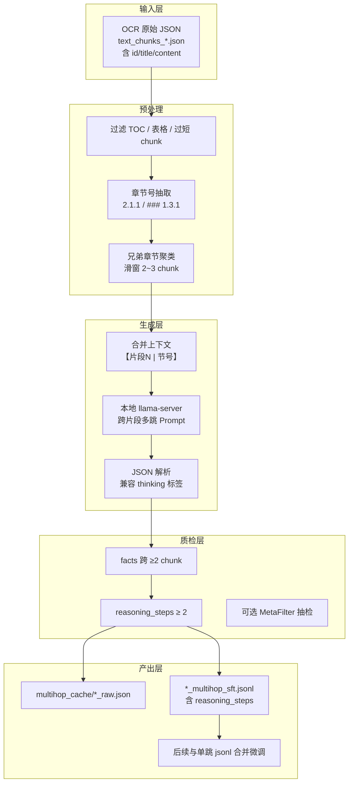
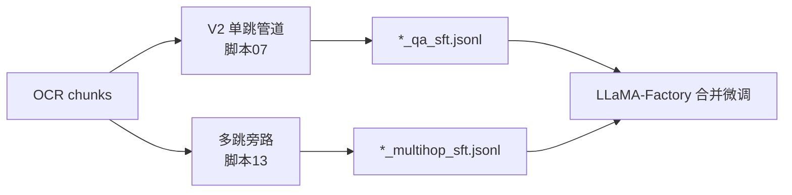

# 单文档跨 Chunk 多跳 QA 技术路线

## 1. 背景与目标

### 1.1 现状

当前主链路 [文档01_技术文档QA管道V2总体设计方案.plan.md](/home/wugk/.cursor/plans/文档01_技术文档QA管道V2总体设计方案.plan.md) 与 [脚本07_QA管道主程序_Python入口.py](/home/wugk/.cursor/plans/脚本07_QA管道主程序_Python入口.py) 产出的是**单跳 QA**：每个 OCR chunk 独立蒸馏出题 → 答案先行 → Rubric → MetaFilter，最终导出 `*_sft.jsonl`（`instruction` + `input` + `output`）。

已跑通数据集示例：

| 数据集 | 单跳规模 | 原始 OCR |
|--------|----------|----------|
| 01-01 告警处理 | 2348 条 | `text_chunks_*_converted.json` |
| DDM 开发指南 | 435 条 | 172 chunks |
| DDM 用户指南 | 已跑通 | 134 chunks |

### 1.2 目标

新增**单文档跨 chunk 多跳**能力：

- 同一 PDF/文档内，综合 **2~3 个相关章节 chunk** 才能回答
- 与 V2 **旁路并行**，不改动现有 21 步主链路
- **通用脚本**：通过环境变量指定任意文档目录，不绑定特定数据集
- 产出保留 `reasoning_steps` / `supporting_facts` 等审计字段；微调时可选择是否将推理链喂入模型

### 1.3 非目标（本阶段不做）

- 跨文档多跳（DDM + 告警处理联合出题）→ 后续「文档17」
- 改写 V2 内部算子链
- 重新 OCR 或重跑单跳管道

---

## 2. 为何不复用现有 `Text2MultiHopQAGenerator`

DataFlow 已有 [Text2MultiHopQAGenerator](/home/wugk/finetune/DataFlow/dataflow/operators/core_text/generate/text2multihopqa_generator.py) 与 [Text2MultiHopQAGeneratorPrompt](/home/wugk/finetune/DataFlow/dataflow/prompts/text2qa.py)，但**不适合直接用于技术文档跨 chunk**：

| 维度 | 现有算子 | 本方案需求 |
|------|----------|------------|
| 输入单位 | 单个 `text` 字段 | 2~3 个带章节号的 chunk 合并 |
| 事实抽取 | 按句号滑窗取 3 句三元组 | 按章节父子关系聚类 |
| 跨源约束 | 无 chunk 边界 | 强制 `supporting_facts` 来自 ≥2 片段 |
| 技术文档噪声 | 无 TOC 过滤 | 需过滤目录页、纯表格 chunk |
| Prompt | 通用多跳 | 需「片段1/片段2」显式标注 + 流程链/配置链模板 |

结论：**借鉴其 JSON 输出结构与 `APILLMServing_request` 调用方式**，新建专用脚本而非硬接 V2 或 core_text 算子。

---

## 3. 总体架构



与 V2 关系：



---

## 4. 核心技术模块设计

### 4.1 Chunk 加载与过滤

**输入**：DeepSeek-OCR 原始 `text_chunks_*.json`（`result[]` 含 `id`, `title`, `content`），**不用** `*_converted.json`（会丢失 id/章节元数据）。

**过滤规则**（与 [ocr_chunks_to_dataflow.py](/home/wugk/finetune/finetune/test/ocr_chunks_to_dataflow.py) 对齐并增强）：

- 最小字符数：默认 150（`MH_MIN_CHUNK_CHARS`）
- 纯表格 chunk：`| ` 行占比 ≥ 60% 丢弃
- 目录型 chunk：同一短文本内 ≥4 个 `x.y.z` 节号且正文极少 → 丢弃

### 4.2 章节号抽取

从 chunk 首行匹配：

```
^#{1,4}\s*(\d+(?:\.\d+)*)
^(\d+(?:\.\d+)+)\s+
^#\s*(\d+)\s+
```

得到 `section` 如 `2.1.1`、`1.3.2`。无法解析的 chunk 不参与聚类（本阶段策略，后续可改为顺序邻接聚类）。

### 4.3 聚类策略（单文档跨 chunk 核心）

**按父章节分组 + 滑窗**：

1. 对每个有 `section` 的 chunk，计算 `parent = section` 去掉末段（`2.1.1.2` → `2.1.1`）
2. 同 parent 下按节号排序
3. 滑窗生成 size=2 和 size=3 的 cluster
4. 要求 cluster 内 **≥2 个不同 section**
5. 全局上限 `MH_MAX_CLUSTERS`（默认 80），按文档顺序截断

**DDM 开发指南 dry-run 预估**：225 原始 → 150 可用 chunk → **80 组聚类**（如 `1.1+1.2`、`2.4.1+2.4.2+2.4.3`、`3.1.1+3.1.2` 等）。

**合并上下文格式**：

```
【片段1 | 节号 2.4.1】
<chunk1 正文，超长则截断>

【片段2 | 节号 2.4.2】
<chunk2 正文>
```

单 cluster 合并上限 `MH_MAX_CONTEXT`（默认 10000 字符）。

### 4.4 多跳 Prompt 设计

**System**（中文）要点：

- 必须跨 ≥2 片段才能回答
- `reasoning_steps` 每步标明「片段1」「片段2」
- `supporting_facts` 逐字摘录，不可改写
- `type` 枚举：`流程链 | 因果链 | 对比链 | 排障链 | 配置链`
- 只输出单个 JSON 对象

**User**：注入合并上下文 + 出题数量（默认每 cluster 1 条，`MH_NUM_Q=1`）。

**JSON 输出 schema**：

```json
{
  "question": "...",
  "reasoning_steps": [{"step": "..."}, {"step": "..."}],
  "answer": "...",
  "supporting_facts": ["...", "..."],
  "source_fragments": [1, 2],
  "type": "配置链"
}
```

技术文档优先模板示例：

- **配置链**：A 文件配置项 → B 文件关联 → 导入/刷新生效
- **流程链**：前提条件 → 操作步骤 → 验证方式
- **因果链**：未做 X → 导致 Y → 应执行 Z

### 4.5 质检规则（程序化，不额外耗 LLM）

| 检查项 | 规则 | 失败处理 |
|--------|------|----------|
| JSON 解析 | 支持 `<answer>` 包裹（复用 `extract_llm_answer_text`） | 丢弃 |
| 推理步数 | `len(reasoning_steps) >= 2` | 丢弃 |
| 事实数量 | `len(supporting_facts) >= 2` | 丢弃 |
| **跨 chunk** | 每条 fact 子串匹配不同 `chunk_id`（归一化空白后） | 丢弃 |
| 问题长度 | `len(question) >= 12` | 丢弃 |

后续可选增强（阶段 2）：

- LLM degeneracy test：「仅给 fact1 能否回答？」
- 接入 `MetaFilter` 对 `question + answer + context` 六维打分

### 4.6 SFT 产出格式

按用户选择：**保留推理链字段**。

每条 `*_multihop_sft.jsonl` 记录：

```json
{
  "instruction": "<多跳问题>",
  "input": "<合并后的多片段上下文>",
  "output": "<最终答案>",
  "question_type": "多跳",
  "multihop_type": "配置链",
  "reasoning_steps": [...],
  "supporting_facts": [...],
  "source_sections": ["2.4.1", "2.4.2"],
  "source_chunk_ids": ["uuid-1", "uuid-2"],
  "dataset": "<DATASET_LABEL>"
}
```

**微调使用建议**（写入文档，不在脚本内强制）：

- **方案 A（推荐起步）**：仅用 `instruction` + `input` + `output`，与单跳格式一致
- **方案 B（推理增强）**：`output` 改为 `推理步骤\n\n最终答案` 拼接，训练模型显式推理

---

## 5. 文件与脚本规划

### 5.1 新增文件

| 文件 | 说明 |
|------|------|
| [finetune/test/multihop_cross_chunk.py](/home/wugk/finetune/finetune/test/multihop_cross_chunk.py) | 主程序：聚类 → 生成 → 质检 → 导出 |
| [wugk/.cursor/plans/脚本13_后台运行_单文档多跳跨chunk_本地llama-server.sh](/home/wugk/.cursor/plans/脚本13_后台运行_单文档多跳跨chunk_本地llama-server.sh) | 通用后台启动脚本 |
| [wugk/.cursor/plans/文档16_单文档跨chunk多跳QA技术路线.plan.md](/home/wugk/.cursor/plans/文档16_单文档跨chunk多跳QA技术路线.plan.md) | 本文档（技术路线正文） |

### 5.2 环境变量约定（通用，不绑定文档）

| 变量 | 必填 | 默认值 | 说明 |
|------|:----:|--------|------|
| `OCR_SOURCE` | 是 | — | 原始 `text_chunks_*.json` 路径 |
| `QA_OUTPUT_DIR` | 否 | OCR 父目录 | 产出根目录 |
| `MH_FILE_PREFIX` | 否 | `multihop_qa` | 缓存/产出前缀 |
| `DATASET_LABEL` | 否 | 父目录名 | 写入 SFT 的 dataset 字段 |
| `MH_MAX_CLUSTERS` | 否 | 80 | 最多处理聚类数 |
| `MH_NUM_Q` | 否 | 1 | 每聚类生成条数 |
| `MH_DRY_RUN` | 否 | 0 | 1=只聚类不调 LLM |
| `DF_API_URL` | 否 | `127.0.0.1:19000` | 与 V2 一致 |
| `DF_MAX_WORKERS` | 否 | 2 | 并发生成 |

### 5.3 产出目录结构（每个文档）

```
<QA_OUTPUT_DIR>/
  multihop_cache/
    <prefix>_clusters.json    # 聚类清单（可先 dry-run 审阅）
    <prefix>_raw.json         # 含原始 LLM 响应
  <prefix>_multihop_sft.jsonl # 最终语料
  logs/
    multihop_latest.log
```

### 5.4 更新索引

在 [00_目录说明与文件索引.md](/home/wugk/.cursor/plans/00_目录说明与文件索引.md) 追加：

- 文档 16：单文档跨 chunk 多跳 QA 技术路线
- 脚本 13：通用多跳后台启动

---

## 6. 实施阶段

### 阶段 0：验证聚类（无 LLM 成本）

```bash
OCR_SOURCE=/path/to/text_chunks_*.json \
QA_OUTPUT_DIR=/path/to/doc_dir \
MH_FILE_PREFIX=my_doc_multihop \
MH_DRY_RUN=1 \
python finetune/test/multihop_cross_chunk.py
```

检查 `*_clusters.json`：章节是否合理、是否混入 TOC 组。

### 阶段 1：单文档全量生成

```bash
/home/wugk/.cursor/plans/脚本13_后台运行_单文档多跳跨chunk_本地llama-server.sh
# 通过环境变量覆盖 OCR_SOURCE / QA_OUTPUT_DIR / MH_FILE_PREFIX
```

监控：`tail -f <QA_OUTPUT_DIR>/logs/multihop_latest.log`

预期：80 clusters × 通过率 50~70% → **约 40~55 条多跳 QA/文档**（视文档而定）。

### 阶段 2：质检增强（可选）

- 增加 degeneracy LLM 校验（每条约 +1 次调用）
- 对 `type` 分布做统计，偏少的模板加权采样
- 接入 `MetaFilter` 过滤低分问答

### 阶段 3：接入微调

参考 [文档14_QA语料接入LLaMA-Factory微调指南.plan.md](/home/wugk/.cursor/plans/文档14_QA语料接入LLaMA-Factory微调指南.plan.md)：

```bash
# 合并示例（比例建议 单跳70% : 多跳30%）
cat alarm_sft.jsonl ddm_dev_sft.jsonl ddm_dev_multihop_sft.jsonl > merged_sft.jsonl
```

---

## 7. 风险与对策

| 风险 | 对策 |
|------|------|
| 假多跳（事实其实来自同一片段） | `facts_span_chunks` 硬校验 |
| 目录 chunk 误入聚类 | TOC 启发式 + 最小字数 |
| 上下文超长超窗 | 每片段独立截断 + 总上限 10k |
| reasoning 模型 JSON 包在 think 里 | `extract_llm_answer_text` + 括号提取 |
| 产出量偏少 | 调高 `MH_MAX_CLUSTERS` 或 `MH_NUM_Q` |
| 与单跳知识重复 | 多跳占比控制在 30% 以内；instruction 语义去重 |

---

## 8. 验收标准

- [ ] 通用脚本：换 `OCR_SOURCE` 即可跑任意单文档，无需改代码
- [ ] `MH_DRY_RUN=1` 可输出聚类清单供人工抽检
- [ ] 每条通过质检的 QA：`supporting_facts` 至少命中 2 个不同 chunk
- [ ] SFT 含 `reasoning_steps` / `supporting_facts` / `source_chunk_ids`
- [ ] 日志打印通过率与拒绝原因统计
- [ ] 至少 1 份文档跑通端到端（开发指南或用户指南均可）

---

## 9. 后续演进（文档17 预留）

1. **跨文档多跳**：从多份 step21 按共享实体（告警 ID、配置文件名）桥接合成
2. **聚类升级**：embedding 检索相关 chunk，突破「仅兄弟章节」限制
3. **并入 V2**：若效果稳定，可封装为 `TechDocMultiHopPipeline` 作为 Step 22 旁路算子
