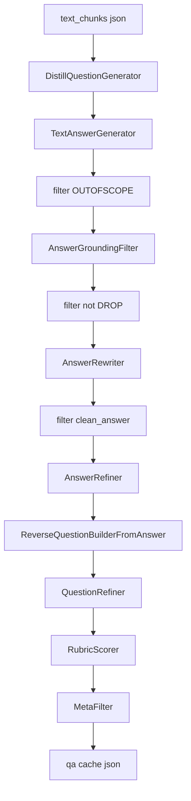

# 技术文档 QA Pipeline V2 实施计划

## 当前状态

截至 2026-04-08，front matter 中的 todos 已全部同步为 `completed`，实现已与仓库代码对齐：

- `prompts-json-utils`：已在 `DataFlow/dataflow/prompts/tech_doc_qa.py` 落地 4 个 Prompt 类与共用 `parse_json_llm_response`
- `text-answer-preserve-cols`：`TextAnswerGenerator` 已支持 `preserve_input_columns=True` 并保留输入列
- `new-operators`：4 个技术文档算子已实现并接入 `text_sft` LazyLoader，Rubric 使用 `clean_answer` 对 `refined_answer` 评分
- `pipeline-v2-test-filter`：`finetune/test/test_filter.py` 已实现 `TechDocQAPipelineV2`、显式行过滤、单次 MetaFilter 与环境变量 API Key
- `analytics-smoke`：`analyze_rubric_results` 与 `storage_apply_row_mask` 已补齐

## 与当前仓库的关键对齐点

1. **行级过滤**：[`FileStorage.step()`]( /home/wugk/finetune/DataFlow/dataflow/utils/storage.py ) 仅递增步骤并 `copy` storage，**没有** `storage.step().filter(...)`。中间过滤应实现为：`st = storage.step(); df = st.read("dataframe"); df = df[mask]; st.write(df)`，或封装一个小函数/算子 `DataframeFilter` 避免重复代码。

2. **答案生成会丢列**：[`TextAnswerGenerator.run`]( /home/wugk/finetune/DataFlow/dataflow/operators/text_sft/generate/text_answer_generator.py ) 当前用 `result_records` + `pd.DataFrame(result_records)` **丢弃**原表所有扩展列。改法（与行顺序 1:1 一致）：先 `df = storage.read(...)`，按现有循环得到 `outputs: list[str]`，再 **在原 `df` 上就地赋值**，例如 `df = df.assign(**{output_instruction_key: df[input_question_key], output_answer_key: outputs, output_content_key: df[input_content_key]})`，或 `df[output_answer_key] = outputs` 等等价写法；**不要**新建仅含三列的 DataFrame。这样 `rough_question` 等列自然保留。

3. **LLM 调用**：[`APILLMServing_request.generate_from_input`]( /home/wugk/finetune/DataFlow/dataflow/serving/api_llm_serving_request.py ) 已支持 `system_prompt`，新算子可直接使用，与现有 `TextAnswerGenerator`（仅传 user 列表、走默认 system）兼容。

4. **MetaFilter 维度数量**：[`MetaSampleEvaluator.get_score`]( /home/wugk/finetune/DataFlow/dataflow/operators/text_pt/eval/meta_sample_evaluator.py ) 硬编码 `len(parsed_scores) == 6`。你文档中的 **6 个中文维度**（原文溯源性、问题唯一性、…）满足该约束，可直接替换 [`test_filter.py`]( /home/wugk/finetune/finetune/test/test_filter.py ) 里现有的 `question_dimensions` / `answer_dimensions`（或拆成：最终 Meta 只用一套「问答对」维度，减少一次 LLM 调用——见下文可选简化）。

5. **字段名与现有 Refiner**：[`QuestionRefiner`]( /home/wugk/finetune/DataFlow/dataflow/operators/text_sft/refine/question_refiner.py ) / [`AnswerRefiner`]( /home/wugk/finetune/DataFlow/dataflow/operators/text_sft/refine/answer_refiner.py ) 默认 `input_question_key='question'`、`input_answer_key='answer'`。V2 在调用时需 **显式传入** `input_question_key='reverse_question'`（Step 7）以及 Step 5 的 `input_answer_key='clean_answer'`、`input_question_key='rough_question'`（或统一用 `instruction` 若你选择在各步对齐列名——推荐固定一套命名见下表）。

---

## 推荐列名约定（减少串线）

| 阶段 | 问题列 | 上下文列 | 答案列 |
|------|--------|----------|--------|
| 蒸馏出题 | `rough_question` | `raw_content` | — |
| 初答 | `rough_question` → 复制到 `instruction`（可选） | `raw_content` | `initial_answer`（`TextAnswerGenerator` 的 `output_answer_key`） |
| 净化后 | — | `raw_content` | `clean_answer` → `refined_answer`（AnswerRefiner） |
| 逆向题 | `reverse_question` → `refined_reverse_question`（QuestionRefiner） | `raw_content` | `refined_answer` 作为导出主答案；`clean_answer` 保留为溯源锚 |

最终写入 Alpaca / 下游时：`instruction = refined_reverse_question`，`output = refined_answer`（Rubric 已用 `clean_answer` 约束 refined 未引入偏离）。

---

## 实现任务分解

### 阶段 A：Prompt 注册（[`general_text.py`]( /home/wugk/finetune/DataFlow/dataflow/prompts/general_text.py )）

在现有 `@PROMPT_REGISTRY.register()` 风格下新增四个类（内容以你设计稿为准，注意 `build_prompt` 签名与算子一致）：

- `AnswerGroundingFilterPrompt`
- `AnswerRewriterPrompt`
- `ReverseQuestionBuilderFromAnswerPrompt`（见下「阶段 A 补充」锚句分支）
- `RubricScorerPrompt`（含 `HARD_CONSTRAINTS_BY_TYPE` 类属性）

**JSON 解析**：不要依赖链式 `.strip('```json')`；实现共用工具函数 `parse_json_llm_response(text: str) -> dict | None`（去 fence、取首尾 `{`…`}`、`json.loads`、失败返回 `None`），供四个算子复用。

**阶段 A 补充 — `ReverseQuestionBuilderFromAnswerPrompt` 锚句为空（实现级）**

- 在 `build_prompt(...)` 开头做规范化：`anchors = [s for s in (anchor_sentences or []) if isinstance(s, str) and s.strip()]`。
- **`if not anchors:`** 使用**另一段完整 user 文案**：明确写出「当前无逐字原文锚句；请仅依据下方全文参考与已验证答案设计逆向问题；约束维度必须仍可从原文与答案共同推出；不得臆造锚句；输出 JSON 结构与有锚句时一致」。**不要**渲染「答案的原文支撑句」小节或传空列表占位。
- **`else:`** 使用原设计：列出 `「...」` 逐条支撑句，再接任务说明与 JSON 格式。
- 算子侧仍传入 `anchor_sentences` 原始字段即可，分支逻辑**全部在 Prompt 类内**，避免模型面对空列表自行发挥。

### 阶段 B：新算子文件与导出

建议新建目录（避免 `general_text.py` 过大）：例如  
`DataFlow/dataflow/operators/text_sft/tech_doc/` 下：

- `answer_grounding_filter.py` — `AnswerGroundingFilter`
- `answer_rewriter.py` — `AnswerRewriter`（KEEP 分支：`clean_answer = initial_answer`，锚句从 `grounding_result.original_evidence` 构 list；REWRITE 调 LLM；DROP 置 `None`）
- `reverse_question_builder.py` — `ReverseQuestionBuilderFromAnswer`
- `rubric_scorer.py` — `RubricScorer`（`filter_on_run=True` 时 `df = df[df.rubric_verdict == 'PASS']`）

在 [`text_sft/__init__.py`]( /home/wugk/finetune/DataFlow/dataflow/operators/text_sft/__init__.py ) 的 `TYPE_CHECKING` 块中增加 lazy import 项，使 `from dataflow.operators.text_sft import AnswerGroundingFilter` 可用（与现有 LazyLoader 模式一致）。

**Rubric 标准答案 vs 待评答案（已定稿）**：`clean_answer` 是经溯源/改写后的**可信锚**；`refined_answer` 是 AnswerRefiner 再加工产物，可能重新引入扩写或越界表述。因此 **RubricScorer** 的 `build_prompt` 传入：`standard_answer=row[clean_answer 列]`，`answer`/待评字段=`row[refined_answer 列]`。算子参数建议：`input_standard_answer_key='clean_answer'`、`input_answer_key='refined_answer'`（与现有「待评分答案」命名一致，不再单独造 `candidate` 列名）。这样 SC-3、HC 可检出 Refiner 回归；PASS 后再用 `refined_answer` 进 MetaFilter / 导出。

### 阶段 C：修改 `TextAnswerGenerator`

- **具体改法**：在 `run` 内保持单行一答的索引对齐，收集 `outputs` 列表后，对 `dataframe = storage.read(...)` 先 **`df = dataframe.copy()`**（避免 `SettingWithCopyWarning` / 意外改缓冲视图），再 `df.assign(**{output_instruction_key: df[input_question_key], output_answer_key: outputs})` 或等价地 `df[output_answer_key] = outputs` 等写入三列；若 `output_content_key` 与 `input_content_key` 同名则无需重复赋值。最后 `storage.write(df)`。**禁止** `pd.DataFrame(result_records)` 重建窄表。
- **兼容（可选）**：若需与旧调用方完全一致，可增加 `preserve_input_columns: bool = True`（默认 True）；仅当为 False 且明确要三列输出时再走旧路径（一般不必）。
- `custom_prompt` 仍在 [`test_filter.py`]( /home/wugk/finetune/finetune/test/test_filter.py ) 传入「OUTOFSCOPE + 禁止边界声明」约束；类内默认值可不改。

### 阶段 D：组装 `TechDocQAPipelineV2`（[`test_filter.py`]( /home/wugk/finetune/finetune/test/test_filter.py )）

流程顺序（每步后 `storage.step()` + 必要时行过滤）：

1. `DistillQuestionGenerator`：`input_context_key='text'`，`output_question_key='rough_question'`，`output_context_key='raw_content'`。
2. **不再**在出题后立即做 QuestionFilter + MetaFilter（与你 V2 设计一致：先答后净化）。
3. `TextAnswerGenerator`：`input_question_key='rough_question'`，`output_answer_key='initial_answer'`，`output_instruction_key='instruction'`（或省略 instruction，仅保留 rough_question）。
4. 过滤 `initial_answer` 不含 `OUTOFSCOPE`（含大小写/空白 trim）。
5. `AnswerGroundingFilter` → 过滤 `grounding_verdict != 'DROP'`（注意：若希望 REWRITE 也进入改写，则仅 DROP 剔除）。
6. `AnswerRewriter` → 过滤 `clean_answer` 非空。
7. `AnswerRefiner`：`input_question_key='rough_question'`，`input_answer_key='clean_answer'`，`output_answer_key='refined_answer'`。
8. `ReverseQuestionBuilderFromAnswer`：`input_clean_answer_key` 用 **`refined_answer`**（与 Step 7 衔接；逆向问题描述的是「精炼后要教的答案」）。`anchor_sentences` 来自 AnswerRewriter；**空锚句时在 Prompt 类内走专用分支**（见阶段 A 补充），不把空列表塞进主模板。
9. `QuestionRefiner`：`input_question_key='reverse_question'`，`output_question_key='refined_reverse_question'`。
10. `RubricScorer`：`input_question_key='refined_reverse_question'`，**`input_standard_answer_key='clean_answer'`**，**`input_answer_key='refined_answer'`**（待评分 = 精炼后答案，标准 = 溯源锚，用于抓 Refiner 退化）。
11. `MetaFilter`：**单次**调用即可（输入 `refined_reverse_question` + `raw_content` + `refined_answer`），使用你提供的 6 维 `tech_doc_dimensions`；可删除原「问题 Meta + 答案 Meta」双次调用以省成本，或保留双次作为对照实验（配置开关）。

配置项：`min_soft_score`、`rubric filter_on_run`、`MetaFilter min/max_score`、API Key **改为环境变量**（勿再硬编码 `DF_API_KEY` 于脚本）。

### 阶段 E：观测与回归

- 在 pipeline 末尾或独立脚本中落地你文中的 `analyze_rubric_results`（读最终 cache json）。
- 小样本跑通：统计 OUTOFSCOPE 比例、KEEP/REWRITE/DROP、Rubric PASS 率、最终条数。

---

## 数据流示意（Mermaid）



---

## 风险与缓解

- **JSON 不稳定**：所有新算子对解析失败统一判为保守结果（如 grounding → DROP，rubric → FAIL）。
- **AnswerRefiner 可能重新引入元话术**：可在 AnswerRefiner 的 custom 约束中加强「禁止根据参考内容等套话」，或在 Rubric/Meta 中扣分；第二期再考虑改 `AnswerRefinePrompt`。
- **成本**：比 V1 增加 3～4 轮 LLM/样本；可先对 Step 3–4 做缓存或抽样验证。

---

## 建议执行顺序（与你文档阶段一致）

1. **Phase 1**：`TextAnswerGenerator` 列保留 + OUTOFSCOPE prompt + 统计。  
2. **Phase 2**：Grounding + Rewriter + 行过滤工具。  
3. **Phase 3**：ReverseQuestionBuilder + QuestionRefiner 参数对齐。  
4. **Phase 4**：RubricScorer + Meta 维度替换 + 端到端 `TechDocQAPipelineV2`。
