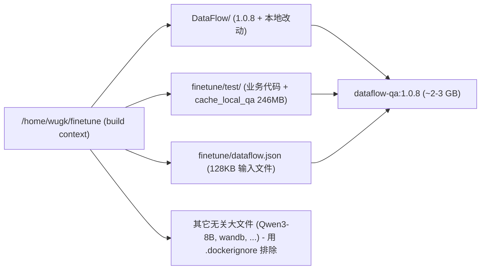

## 目标镜像规格

- 基础镜像：`python:3.11-slim`（不带 CUDA，几百 MB 级别）
- 装包方式：先装依赖再 `pip install -e . --no-deps`（editable，改 DataFlow 源码立即生效）
- 不装 `[vllm]`/`[mineru]` 等重型 extra；只装 `requirements.txt` 里的基础依赖
- 业务代码：`finetune/test/` 整个目录（含 246MB `cache_local_qa/`）打进镜像
- 默认输入：`finetune/dataflow.json`（128KB）一并打进镜像，保持脚本内硬编码路径可用
- 环境变量：`DF_API_KEY` / `DF_API_URL` / `DF_MODEL_NAME` / `TECHDOC_INPUT` **全部不烧进镜像**，运行时 `-e` 注入
- 默认行为：`WORKDIR=/home/wugk/finetune/finetune/test`，`CMD ["/bin/bash"]`

## 为什么要保留宿主机路径（/home/wugk/finetune/...）

入口脚本 [finetune/test/test_filter.py](/home/wugk/finetune/finetune/test/test_filter.py) 里有两处依赖具体路径：

```6:8:/home/wugk/finetune/finetune/test/test_filter.py
_DATAFLOW_ROOT = Path(__file__).resolve().parents[2] / "DataFlow"
if _DATAFLOW_ROOT.is_dir() and str(_DATAFLOW_ROOT) not in sys.path:
    sys.path.insert(0, str(_DATAFLOW_ROOT))
```

```724:727:/home/wugk/finetune/finetune/test/test_filter.py
default_input = os.environ.get(
    "TECHDOC_INPUT",
    "/home/wugk/finetune/finetune/dataflow.json",
)
```

所以在镜像里把目录放成跟宿主机一样的布局（`/home/wugk/finetune/DataFlow/`、`/home/wugk/finetune/finetune/test/`、`/home/wugk/finetune/finetune/dataflow.json`）最省事——`sys.path.insert` 的路径推断和 `TECHDOC_INPUT` 的默认值都不用改就能跑。

## 构建上下文与目录布局

build context 选共同父目录 `/home/wugk/finetune/`：



注意 `/home/wugk/finetune/` 下有 `Qwen3-8B/`、`wandb/`、`unsloth_training_checkpoints/`、`deepseek-ocr/` 等几十 GB 无关目录，**必须**用 `.dockerignore` 白名单方式只放行 `DataFlow/`、`finetune/test/`、`finetune/dataflow.json`，否则 docker build 打包 context 阶段就会爆。

## 新增/修改的文件

### 1. 新增 [/home/wugk/finetune/Dockerfile](/home/wugk/finetune/Dockerfile)

```dockerfile
FROM python:3.11-slim

ENV PYTHONUNBUFFERED=1 \
    PIP_NO_CACHE_DIR=1 \
    PIP_DEFAULT_TIMEOUT=180 \
    PIP_INDEX_URL=https://pypi.tuna.tsinghua.edu.cn/simple \
    PIP_TRUSTED_HOST=pypi.tuna.tsinghua.edu.cn \
    LANG=C.UTF-8 LC_ALL=C.UTF-8

RUN apt-get update && apt-get install -y --no-install-recommends \
        git build-essential pkg-config \
        ffmpeg libgl1 libglib2.0-0 \
        ca-certificates curl \
    && rm -rf /var/lib/apt/lists/*

RUN pip install --upgrade pip wheel setuptools

# 层1: 先 COPY 依赖清单装依赖，最大化 docker layer cache 命中率
COPY DataFlow/pyproject.toml DataFlow/requirements.txt /tmp/df/
RUN pip install -r /tmp/df/requirements.txt

# 层2: COPY DataFlow 源码并 editable 安装（--no-deps 避免重装）
COPY DataFlow/ /home/wugk/finetune/DataFlow/
RUN pip install -e /home/wugk/finetune/DataFlow --no-deps

# 层3: COPY 业务代码（含 cache_local_qa/ 246MB）和默认输入文件
COPY finetune/test/          /home/wugk/finetune/finetune/test/
COPY finetune/dataflow.json  /home/wugk/finetune/finetune/dataflow.json

WORKDIR /home/wugk/finetune/finetune/test
CMD ["/bin/bash"]
```

要点：

- 分层顺序 = 依赖 → DataFlow 源码 → 业务代码 → 输入文件，越靠下越易变更，命中缓存效果最好。
- `pip install -e ... --no-deps`：依赖已在上一层装过，省一次解析。
- 目录布局完全镜像宿主机，脚本里 `_DATAFLOW_ROOT` 的 `parents[2] / "DataFlow"` 推断结果正好是 `/home/wugk/finetune/DataFlow`，存在并命中；`TECHDOC_INPUT` 默认路径也直接能读到。
- 不写 `ENV DF_API_KEY=...`，用户运行时通过 `-e` 注入。

### 2. 新增 [/home/wugk/finetune/.dockerignore](/home/wugk/finetune/.dockerignore)

白名单语法，只放行需要的内容：

```
*
!DataFlow
!finetune

# DataFlow 内部无用文件
DataFlow/.git
DataFlow/.github
DataFlow/**/__pycache__
DataFlow/**/*.pyc
DataFlow/**/*.egg-info
DataFlow/dist
DataFlow/build

# finetune 下只保留 test/ 目录和 dataflow.json 一个文件
finetune/*
!finetune/test
!finetune/dataflow.json

# test/ 内部无用文件
finetune/test/__pycache__
finetune/test/.ipynb_checkpoints
finetune/test/*.log
```

这样 build context 体积压缩到约 270 MB（DataFlow 16MB + test 含 cache 约 250MB + dataflow.json 128KB），而不是几十 GB。

## 构建与使用

```bash
cd /home/wugk/finetune
DOCKER_BUILDKIT=1 docker build -t dataflow-qa:1.0.8 .

# 进 bash 交互；所有 key/url/model 运行时注入
docker run --rm -it \
  -e DF_API_KEY=sk-your-api-key \
  -e DF_API_URL=http://ai.wenmodel.com/v1/chat/completions \
  -e DF_MODEL_NAME=qwen-plus \
  dataflow-qa:1.0.8

# 进容器后：
#   python test_filter.py           # 旧版 TextQAPipeline
#   python test_filter.py v2        # 技术文档逆向链路 TechDocQAPipelineV2
```

推荐把环境变量放到 `.env` 里，用 `--env-file` 一把注入（`.env` 放在宿主机上，绝不要提交到 git）：

```bash
# /home/wugk/finetune/.env  (宿主机，git-ignored)
DF_API_KEY=sk-your-api-key
DF_API_URL=http://ai.wenmodel.com/v1/chat/completions
DF_MODEL_NAME=qwen-plus

docker run --rm -it --env-file /home/wugk/finetune/.env dataflow-qa:1.0.8
```

想把跑出来的新结果落回宿主机、或用别的输入文件时再加挂载：

```bash
docker run --rm -it \
  --env-file /home/wugk/finetune/.env \
  -e TECHDOC_INPUT=/data/my_input.json \
  -v /home/wugk/finetune/finetune/test/cache_local_qa:/home/wugk/finetune/finetune/test/cache_local_qa \
  -v /path/to/local_inputs:/data \
  dataflow-qa:1.0.8
```

## 冒烟测试步骤（build 完跑一遍）

1. `docker run --rm dataflow-qa:1.0.8 python -c "import dataflow; print(dataflow.__version__)"` → 预期输出 `1.0.8`
2. `docker run --rm dataflow-qa:1.0.8 python -c "from dataflow.operators.text_sft import DistillQuestionGenerator, AnswerGroundingFilter, AnswerCritiqueEvaluator, AnswerRewriter, ReverseQuestionBuilderFromAnswer, RubricScorer, AnswerRefiner; print('ops ok')"` → 预期输出 `ops ok`（确认 v2 pipeline 用到的新算子在本地 1.0.8 里都能 import）
3. `docker run --rm dataflow-qa:1.0.8 ls /home/wugk/finetune/finetune/dataflow.json` → 文件存在
4. 不带 key 直接起：`docker run --rm dataflow-qa:1.0.8 python -c "import os; assert os.path.exists('test_filter.py'); print('cwd ok')"` → 验证 WORKDIR

## 风险与回退

- **依赖编译失败**：`requirements.txt` 含 `presidio_analyzer[transformers]`、`vendi-score==0.0.3`、`fasttext-wheel`、`symspellpy` 等，slim 镜像缺 C++ 头文件时可能编译失败。已在 apt 里装 `build-essential pkg-config`，绝大部分能过；若仍失败，回退方案：把基础镜像从 `python:3.11-slim` 换成 `python:3.11`（非 slim，自带更多工具链，镜像大 ~200MB 但成功率高）。
- **torch CPU 版自动拉取**：`requirements.txt` 只写了 `torch`，slim 镜像会默认走 CUDA 的 manylinux wheel，体积约 800MB。如果想强制 CPU 版更小的 wheel，可在 `pip install -r` 那步加 `--extra-index-url https://download.pytorch.org/whl/cpu`；本次默认不加，保持行为跟宿主机一致。
- **镜像最终体积**：预计 2~3 GB（torch ~800MB + transformers + presidio + cache 250MB）。若嫌大，下一迭代可考虑裁剪 `requirements.txt`，但要动 DataFlow 源码，本次不做。
- **入口脚本内的 sys.path hack**：在本镜像里 `_DATAFLOW_ROOT` 会成功指向 `/home/wugk/finetune/DataFlow` 并 prepend 到 sys.path；因为 pip editable 也装了，两条路径指向同一份源码，无冲突。
