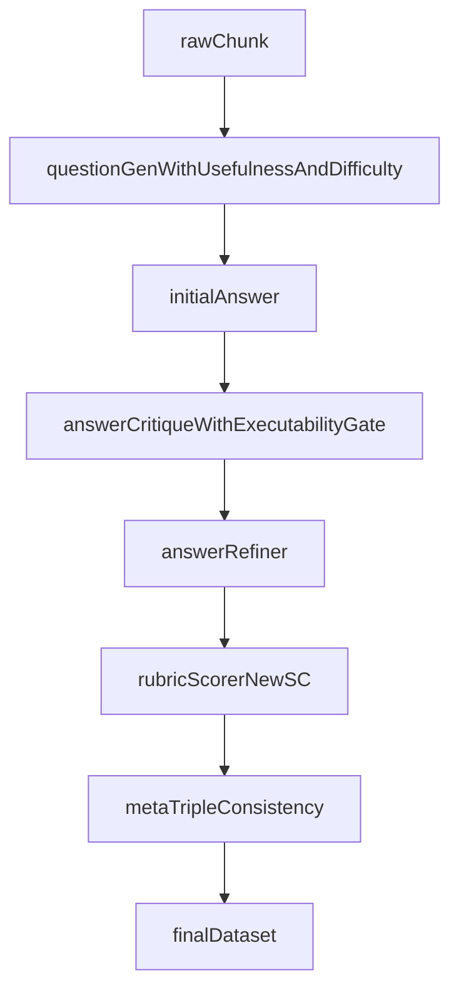

# TechDoc QA Pipeline V2 第三轮更新策略

## 核心目标

第三轮不再扩展新的问题生成范式，也不新增独立的前置过滤算子。做两件事：

- 把问题侧的质量要求一次性前移到首轮出题 prompt，让坏问题在 `DistillQuestionGenerator` 就不被生成。
- 重做 Rubric 的 SC 评分维度和阈值，让“能留下来的 QA”在新标准下接近满分，而不是在旧标准下被模型无脑打水分。

这轮要直接打掉两类最高频失分组合：

- 问题侧的 `实用价值低`、`视角偏差`、`答案嵌入问题`、`开口式提问`
- 回答侧的 `可操作性差`、`结构膨胀`

## 设计原则

1. 坏问题不再靠后置 gate 过滤，而是靠首轮 prompt 让它根本不被生成。
2. 尽量复用现有算子链路，不新增 `QuestionUsefulnessGate` 这类独立 operator。
3. 回答优化只落实可执行性和结构压缩，不追求模板多样化。
4. Rubric 评分要有区分度，拒绝“模型什么答案都能拿 3-4 分”。
5. 数据集优化由覆盖率和通过率共同驱动，不再只看样本量。

## 第三轮策略

### 1. 首轮出题强化约束（替代原前置过滤器）

方案是只在 [finetune/DataFlow/dataflow/prompts/general_text.py](/home/wugk/finetune/DataFlow/dataflow/prompts/general_text.py) 的 `DistillQuestionGeneratorPrompt.build_prompt` 里分层约束，不新增算子，也不新增数据字段。

新增三块写进 `## Constraints:` 区：

- 问题实用性硬要求（4 条都必须满足）：
  - 必须来自真实运维 / 故障 / 调优 / 迁移场景，不能是纯文档概念背诵
  - 必须从用户视角提问（“我遇到 X 现象 / 我要做 Y”），禁止文档作者视角（“本节介绍…”、“什么是…”）
  - 问题本身不得嵌入答案关键词、命令、参数值
  - 必须有明确回答边界，禁止“请介绍 / 请总结 / 有哪些”这种开口式问法

- 按任务难度等比出题（每档至少 30%）：
  - 知识记忆：定位某个参数、命令、语法的准确事实
  - 分析思考：给出深层原因、机制、权衡的解释
  - 实际应用：针对当前生产版本给出可直接落地的解决方案

- 首轮就给的负面样本清单：把“模糊开口问法、文档视角问法、答案嵌入问法”三类各写 1 条反例，要求模型避开。

原第 1 节《问题实用性前置过滤器》整节作废，不再新建 `QuestionUsefulnessGate` 算子。

### 2. AnswerCritique 里并入可操作性硬门槛

这一节不再作为独立主线，只作为 Rubric 之前的最后一道 draft 拦截。

在 [finetune/DataFlow/dataflow/prompts/general_text.py](/home/wugk/finetune/DataFlow/dataflow/prompts/general_text.py) 的 `AnswerCritique` / `AnswerRefiner` prompt 里加两个 binary 检查：

- `has_executable_step`：是否给出至少一条可执行命令 / SQL / 检查动作
- `step_is_complete`：命令是否足够完整，能直接运行或直接照做

若问题类型属于 `诊断排查`、`报错处理`、`高可用应急`，上述任一项失败都直接 `REWRITE`，但不进入独立算子，只在现有 critique/refiner 链路上拦住 draft。

### 3. 给回答加结构压缩约束

在 AnswerCritique / AnswerRefiner prompt 里并入：

- 禁止三级及以上嵌套
- 单回答只允许一种主组织形式：短段落、编号步骤、无序列表三选一
- 默认长度控制在约 300-600 字
- 只有报错处理和复杂应急场景允许适度放宽

目标是让值班人员在几十秒内扫到命令、判断点和下一步动作，而不是追求格式丰富。

### 4. Rubric SC 评分重做（本轮重点）

改 [finetune/DataFlow/dataflow/prompts/tech_doc_qa.py](/home/wugk/finetune/DataFlow/dataflow/prompts/tech_doc_qa.py) 里 `RubricScorerPrompt.build_prompt` 的软约束段（当前位于 L367-L392）。

旧 SC 维度是 `原文溯源 / 完整性 / 准确性 / 表述质量`，总分 13。这一版里 `完整性` 和 `表述质量` 很容易被模型打水分，区分度差。改为 4 个每维 0-4 分的新维度，总分 16：

- SC-1 原文溯源性（0-4）：每句话能否在原文找到明确对应，禁止编造
- SC-2 实用价值（0-4）：面向真实运维 / 故障 / 调优 / 迁移场景，能否直接用于决策或排障，纯文档背诵型一律不得高于 1 分
- SC-3 可执行性（0-4）：是否给出可直接复制执行的命令 / SQL / 参数 / 检查动作，且步骤闭合
- SC-4 精确完整性（0-4）：关键事实是否正确、是否覆盖了问题真正需要的信息，无多余水分

每个维度必须给出苛刻的 4 分锚点，3 分及以下都代表有明显瑕疵，避免模型无脑打 4 分。示例锚点：

- SC-1 4 分：每句话都可逐句对应原文，无任何超出原文的内容；3 分已经允许有个别未支撑片段。
- SC-2 4 分：对应明确生产场景，且给出的判断/决策能直接被值班人员采用；3 分表示方向正确但决策颗粒度不够。
- SC-3 4 分：至少一条命令可直接运行，步骤闭合，并给出验证方式；3 分表示命令存在但缺少验证或前置条件。
- SC-4 4 分：关键事实全部正确且无水分；3 分表示核心事实正确但包含冗余或次要偏差。

同步抬高判定阈值，写进 plan 中作为后续代码改动的契约：

- `verdict=PASS` 要求 `total_soft_score ≥ 14 / 16`
- SC-1 和 SC-3 必须 `≥ 4`（原文溯源性和可执行性不允许打折）
- SC-2 必须 `≥ 3`
- 任一 HC 失败仍然直接 `FAIL`

两处代码落点（本版 plan 不动代码，只登记）：

- [finetune/DataFlow/dataflow/operators/text_sft/tech_doc/rubric_scorer.py](/home/wugk/finetune/DataFlow/dataflow/operators/text_sft/tech_doc/rubric_scorer.py) 里 `min_soft_score` 默认值需要从当前值抬到 14，并补上 SC-1/SC-3/SC-2 的逐维阈值逻辑。
- [finetune/finetune/test/test_filter.py](/home/wugk/finetune/finetune/test/test_filter.py) 里 pipeline 构造时传入的 `min_soft_score` 参数同步调到 14。

## 数据流建议

## 重点文件

第三轮最可能落在这些位置：

- [finetune/DataFlow/dataflow/prompts/general_text.py](/home/wugk/finetune/DataFlow/dataflow/prompts/general_text.py)
- [finetune/DataFlow/dataflow/prompts/tech_doc_qa.py](/home/wugk/finetune/DataFlow/dataflow/prompts/tech_doc_qa.py)
- [finetune/DataFlow/dataflow/operators/text_sft/generate/distill_question_generator.py](/home/wugk/finetune/DataFlow/dataflow/operators/text_sft/generate/distill_question_generator.py)
- [finetune/DataFlow/dataflow/operators/text_sft/tech_doc/rubric_scorer.py](/home/wugk/finetune/DataFlow/dataflow/operators/text_sft/tech_doc/rubric_scorer.py)
- [finetune/finetune/test/test_filter.py](/home/wugk/finetune/finetune/test/test_filter.py)
- [/.cursor/plans/文档07_下一阶段_逆向出题与Critique接入计划.plan.md](/home/wugk/.cursor/plans/文档07_下一阶段_逆向出题与Critique接入计划.plan.md)
