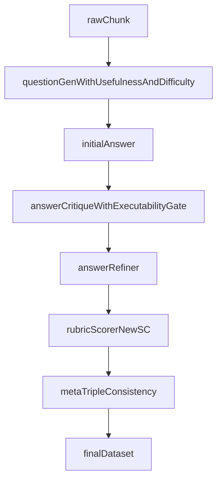

# TechDoc V2 Round3 Plan 修订方案

本次只动 [`.cursor/plans/文档03_第3轮_质量前移与Rubric评分重做.plan.md`](/home/wugk/.cursor/plans/文档03_第3轮_质量前移与Rubric评分重做.plan.md) 一个文件，把它从“前置过滤 + 可操作性硬门槛 + 结构压缩 + 数据配比”四件事，收敛成“**把质量要求前移到首轮出题** + **Rubric 评分重做**”两条主线。

## 1. 要删除的内容

- Frontmatter 中的 todo `question-usefulness-gate`（第 8-10 行）整条删掉，只保留 `question-front-gates`。
- 正文 `### 1. 新增"问题实用性前置过滤器"`（第 43-56 行）整节删除，包含 4 个二值条件和 REWRITE/DROP 说明。
- 数据流 mermaid（第 88-98 行）中的 `usefulnessGate[questionUsefulnessGate]` 节点及其连线去掉，改为 `questionGen --> initialAnswer`。
- `### 2. 把"可操作性"从软要求升级为硬门槛`整节降权/并入 AnswerCritique 的简短说明（可保留，但不再作为独立主线）。

## 2. 首轮出题要写进 [DistillQuestionGeneratorPrompt](/home/wugk/finetune/DataFlow/dataflow/prompts/general_text.py) 的新约束

方案：**只在 prompt 里分层，不新增数据字段**（与你选的 `only_prompt_label` 一致）。

新增一节 `### 1. 首轮出题强化约束（替代原前置过滤）`，要求在 `DistillQuestionGeneratorPrompt.build_prompt` 的 `## Constraints:` 区块下加三块：

- **问题实用性硬要求（4 条都必须满足）**：
  - 必须来自真实运维 / 故障 / 调优 / 迁移场景，不能是纯文档概念背诵
  - 必须从用户视角提问（"我遇到 X 现象 / 我要做 Y"），禁止文档作者视角（"本节介绍…"、"什么是…"）
  - 问题本身不得嵌入答案关键词、命令、参数值
  - 必须有明确回答边界，禁止"请介绍 / 请总结 / 有哪些"这种开口式问法

- **按任务难度等比出题**（每档至少 30%）：
  - 知识记忆：定位某个参数、命令、语法的准确事实
  - 分析思考：给出深层原因、机制、权衡的解释
  - 实际应用：针对当前生产版本给出可直接落地的解决方案

- **首轮就给的负面样本清单**：把"模糊开口问法、文档视角问法、答案嵌入问法"三类各写 1 条反例，要求模型避开。

目的是让坏问题在 `DistillQuestionGenerator` 这一步就不生成出来，而不是靠后面的独立 gate 过滤。

## 3. Rubric SC 评分标准重做（本版重点）

改 [tech_doc_qa.py L367-L392](/home/wugk/finetune/DataFlow/dataflow/prompts/tech_doc_qa.py)：SC 维度由原来的 `原文溯源 / 完整性 / 准确性 / 表述质量`（总分 13）替换为：

- SC-1 原文溯源性（0-4）：每句话是否能在原文找到明确对应
- SC-2 实用价值（0-4）：面向真实运维/故障/调优/迁移场景，能否直接用于决策或排障
- SC-3 可执行性（0-4）：是否给出可直接复制执行的命令 / SQL / 参数 / 检查动作，且步骤闭合
- SC-4 精确完整性（0-4）：关键事实是否正确、是否覆盖了问题真正需要的信息，无多余水分

总分 16，去掉"表述质量"与"完整性"这类容易被打水分的维度。

plan 中要写明：每个维度的 4 档评分锚点必须给**苛刻的 4 分判例**，例如 SC-3 的 4 分必须"至少一条命令可直接运行 + 步骤闭合 + 给出验证方式"，3 分已经代表有明显瑕疵，让模型不再无脑打 4 分。

同步抬高判定阈值：

- `verdict=PASS` 要求 `total_soft_score ≥ 14 / 16`
- SC-1 和 SC-3 必须 `≥ 4`（原文溯源和可执行性不允许打折）
- SC-2 必须 `≥ 3`
- 任一 HC 失败仍然直接 FAIL

注意 [rubric_scorer.py](/home/wugk/finetune/DataFlow/dataflow/operators/text_sft/tech_doc/rubric_scorer.py) 里的 `min_soft_score` 默认值和 [test_filter.py](/home/wugk/finetune/finetune/test/test_filter.py) 里的 pipeline 参数也要跟着调，plan 中要列出这两个落点作为后续改码指引。

## 4. 新的数据流图

## 5. 修订后的 plan 骨架

- 核心目标：把质量要求前移到首轮出题，同时靠新的 Rubric SC + 更严阈值筛满分。
- 第三轮策略：
  - 1. 首轮出题强化约束（替代原前置过滤器）
  - 2. AnswerCritique 里保留可操作性硬门槛（原第 2 节压缩成一小段）
  - 3. 结构压缩约束（保留原第 3 节）
  - 4. Rubric SC 重做 + 阈值抬高（新主线）
- Todos 收敛为 4 条：`question-front-gates`（in_progress）、`answer-hard-constraints`、`rubric-sc-redesign`、`dataset-rebalance`。
- 重点文件段增补 [tech_doc_qa.py](/home/wugk/finetune/DataFlow/dataflow/prompts/tech_doc_qa.py)、[rubric_scorer.py](/home/wugk/finetune/DataFlow/dataflow/operators/text_sft/tech_doc/rubric_scorer.py)。
