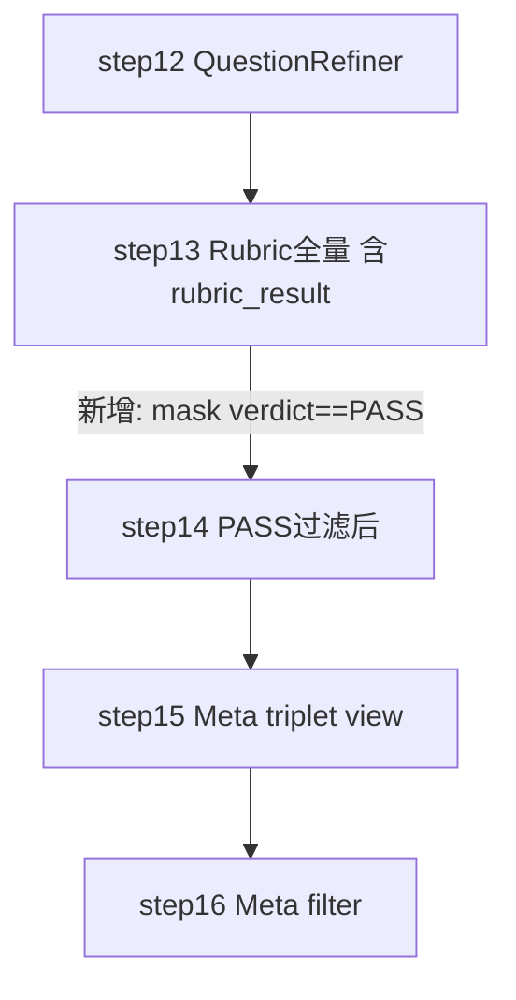

# Rubric 通过率低问题的修复方案（今日变更记录）

## 背景与诊断

使用 `cache_local_qa/qa_pipeline_v2_step_step{12..15}.json` 交叉比对后确认：

- 各阶段留存量：Distill 184 → Grounding 133 → Rewriter 128 → …（中段不过滤）128 → **Rubric 19（−85%）** → MetaFilter 17
- step13 幸存的 19 条 `total_soft_score` 全部 ≥15（分布 `{15: 6, 16: 13}`），上周把 `min_soft_score` 从 14 放宽到 12 实际上一条都没救回——**真正的瓶颈不是阈值，是 LLM Rubric 对"原文溯源性 SC-1"的一票否决**
- FAIL 池 (n=109) 的 `refined_answer / clean_answer` 长度中位 **5.3x**、最大 **31x**；PASS 池中位只有 **3.1x**
- FAIL 池 100% 被 `AnswerRefiner` 重写过；PASS 池里反而有 3 条未走 refine 直接透传 `clean_answer`

结论：**上游 `AnswerRefine` 答案膨胀 → `ReverseQuestionBuilder` 按大颗粒出问题 → Rubric 查原文溯源判大量句子无 anchor → SC-1 低分 → `total_soft < 12` → FAIL**。去年加的 prompt 级 fact-set closure 和 `max(2×clean, 400)` 长度上限 **LLM 没遵守**，靠 prompt 自律兜不住。

## 修复策略

1. 事实集封闭约束从 prompt 下沉到 **代码层硬兜底**（超长或低字符覆盖率自动 fallback 回 `clean_answer`）
2. Rubric SC-1 评分刻度**放宽**（同义改写/结构重组/术语替换/物理结构细化不再扣分；只有"编造具体命令/参数/阈值/机制"才扣）
3. `RubricScorer.filter_on_run` 默认从 True 改为 False，保留 FAIL 行及 `rubric_result` 供审计；在 pipeline 里显式加一步 PASS 过滤

## 代码改动清单

### A. [finetune/DataFlow/dataflow/operators/text_sft/refine/answer_refiner.py](/home/wugk/finetune/DataFlow/dataflow/operators/text_sft/refine/answer_refiner.py)

新增两个静态/实例方法，在 `generate_refined_answer` 的 LLM 抽取之后追加一步事实集封闭兜底：

- `_char_overlap_ratio(refined, anchor) -> float`：对 anchor（去空白）逐字符统计在 refined 中是否出现，估算字符面覆盖率
- `_enforce_fact_closure(refined, anchor) -> (final_answer, reason)`：
  - 空响应 → reason=`empty` → fallback anchor
  - `len(refined) > max(len(anchor)*2, 400)` → reason=`oversize` → fallback anchor
  - 覆盖率 < 0.55 → reason=`low_overlap` → fallback anchor
  - 否则 → reason=`ok` → 保留 refined

`generate_refined_answer` 每批打印 `{ok, oversize, low_overlap, empty}` 分布日志，便于观察拒绝率。

### B. [finetune/DataFlow/dataflow/prompts/general_text.py](/home/wugk/finetune/DataFlow/dataflow/prompts/general_text.py) → `AnswerRefinePrompt`

在"第一优先级：事实集封闭约束"区补两条并新增一节：

- 第 6 条：显式告知"代码层面会统计字符面覆盖率，过低会被自动退回为事实锚答案原文"（让 LLM 提前收敛）
- 第 8 条：禁止"整段换皮重写"，尤其不得把短事实陈述重写为长篇解释
- 新增 "**最小代价原则（Least-Change Principle）**"：事实锚答案本身干净时，refined 应与之几乎一致，仅排版差异

### C. [finetune/DataFlow/dataflow/prompts/tech_doc_qa.py](/home/wugk/finetune/DataFlow/dataflow/prompts/tech_doc_qa.py) → `RubricScorerPrompt`

重写 SC-1 的 0-4 分刻度：

- 顶部加一句宽松方向声明："本维度只惩罚'编造新事实'或'与原文矛盾'；同义改写 / 术语替换 / 分点重排 / 合并同义句 / 适度精简 / 物理结构细化都不得视为原文不支持"
- 4 分：允许同义改写和结构重组；没有原文无法直接推出的新事实
- 3 分：允许若干同义改写；最多 1-2 处"轻度合理化补充"（非矛盾、非伪造阈值的操作常识补全）
- 2 分：出现原文**没有**的**具体**命令/数值/版本号/时长阈值/根因机制链
- 尾部加"判分流程提示"：先判断是否引入**具体**新事实；若没有**至少给 3 分**；只有出现具体编造才扣到 2 分及以下

`min_sc1_score=3.0` 阈值不改（已放宽过一轮）。

### D. [finetune/DataFlow/dataflow/operators/text_sft/tech_doc/rubric_scorer.py](/home/wugk/finetune/DataFlow/dataflow/operators/text_sft/tech_doc/rubric_scorer.py)

- `__init__` 默认 `filter_on_run: bool = True → False`
- `run` 尾部新增 verdict 分布日志：`PASS=x/n, FAIL=y/n, filter_on_run=…`
- `filter_on_run=False` 分支追加提示日志："保留 FAIL 行及完整 rubric_result / verdict，下游请显式按 verdict 过滤"

### E. [finetune/finetune/test/test_filter.py](/home/wugk/finetune/finetune/test/test_filter.py) → `TechDocQAPipelineV2`

- `__init__` 参数 `rubric_filter: bool = True → False`
- V2 Step 9（Rubric）之后新增一步显式 PASS 过滤：

```python
def _rubric_pass(row) -> bool:
    v = row.get("rubric_verdict")
    return isinstance(v, str) and v.strip().upper() == "PASS"

storage_apply_row_mask(s.step(), _rubric_pass)
```

## 数据流变化



- step13 从此变成 **Rubric 审计快照**（全量 128 条 + 每条完整的 `rubric_result` / `rubric_score` / `rubric_verdict`）
- step14 只剩 PASS 行进入 Meta，不浪费 Meta 阶段的 LLM 预算
- FAIL 原因分析不再需要"step12 ∖ step13 差集反推"

## 预期影响（基于 step12 模拟）

对现有 128 条 step12 数据执行 `_enforce_fact_closure` 的模拟：

- **99 条（77%）命中 oversize**（`len(refined) > max(2×clean, 400)`）→ fallback 回 `clean_answer`
- 1 条命中 `low_overlap`
- 29 条（23%）保持原 `refined_answer`

99 条 fallback 后 `refined_answer == clean_answer`（事实锚），Rubric SC-1 基本在 3-4 分档；叠加 SC-1 刻度放宽后，预计整体 Rubric PASS 率从 **14.8% → 60-80%** 区间。

## 验证计划

1. 重跑 `python finetune/finetune/test/test_filter.py v2`
2. 读 `cache_local_qa/qa_pipeline_v2_step_step13.json`（全量审计）：
   - 统计 `rubric_verdict` PASS/FAIL 分布
   - FAIL 行按 `main_issue` / SC-1..SC-4 最低分分桶，定位残余失败原因
3. 读 `qa_pipeline_v2_step_step14.json`（PASS-only）行数，确认 ≥ 70 条
4. 对比 `AnswerRefiner` 日志里的 `fact-closure: ok / oversize / low_overlap` 比例，验证硬兜底是否按预期命中

## 回滚路径

- 若发现代码层硬兜底过于激进（大量 `clean_answer` 过短、SC-2/SC-3 反而扣分）：把 `_enforce_fact_closure` 的 `len_cap` 从 `max(2*anchor, 400)` 放宽到 `max(3*anchor, 600)`，把覆盖率阈值从 0.55 降到 0.40
- 若 SC-1 放宽后出现评分漂浮（LLM 随意给 4 分）：在判分流程提示里补"**具体**新事实的定义列表"，并把 `min_sc1_score` 临时升回 3.5
- 所有改动均为单文件级，可直接 `git revert` 对应 hunk 回退