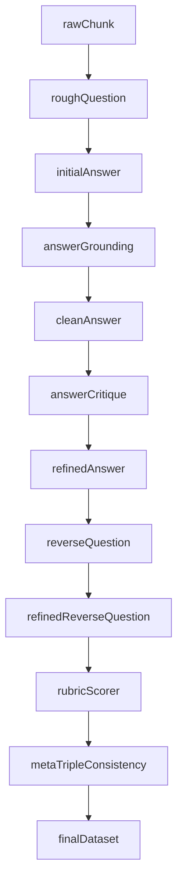

# TechDoc QA Pipeline V2 下一阶段优化计划

## 目标

把当前“已跑通”的 V2，升级为“评分更可信、逆向漂移更可控、诊断链更完整”的版本。重点解决你总结的四类问题：逆向出题后验漂移、AnswerCritique 未接入、Rubric HC 设计过粗、MetaFilter 无法检查 `rough_question -> final_question -> final_answer` 的三方一致性。

## 当前实现基线

现有 V2 主链路已经在 [finetune/finetune/test/test_filter.py](/home/wugk/finetune/finetune/test/test_filter.py) 中串起：`rough_question -> initial_answer -> grounding -> clean_answer -> refined_answer -> reverse_question -> refined_reverse_question -> rubric -> meta`。

关键落点：

- V2 专用 prompt 在 [finetune/DataFlow/dataflow/prompts/tech_doc_qa.py](/home/wugk/finetune/DataFlow/dataflow/prompts/tech_doc_qa.py)
- 通用答案批评/精炼 prompt 在 [finetune/DataFlow/dataflow/prompts/general_text.py](/home/wugk/finetune/DataFlow/dataflow/prompts/general_text.py)
- 逆向出题算子在 [finetune/DataFlow/dataflow/operators/text_sft/tech_doc/reverse_question_builder.py](/home/wugk/finetune/DataFlow/dataflow/operators/text_sft/tech_doc/reverse_question_builder.py)
- Rubric 算子在 [finetune/DataFlow/dataflow/operators/text_sft/tech_doc/rubric_scorer.py](/home/wugk/finetune/DataFlow/dataflow/operators/text_sft/tech_doc/rubric_scorer.py)
- Meta 评分器当前仍是“单文本输入 -> 固定 6 维列表解析”模式，见 [finetune/DataFlow/dataflow/operators/text_pt/eval/meta_sample_evaluator.py](/home/wugk/finetune/DataFlow/dataflow/operators/text_pt/eval/meta_sample_evaluator.py)

## 拟调整方向

### 1. 收紧逆向出题的事实源

把 `ReverseQuestionBuilderFromAnswer` 的主事实源从“`refined_answer` 单独承载”改成“`clean_answer + anchor_sentences` 为主，`refined_answer` 仅作语言风格参考”。

调整点：

- 更新 [finetune/DataFlow/dataflow/prompts/tech_doc_qa.py](/home/wugk/finetune/DataFlow/dataflow/prompts/tech_doc_qa.py) 中 `ReverseQuestionBuilderFromAnswerPrompt.build_prompt()`
- 明确在 prompt 中区分：
  - `clean_answer`: 事实锚
  - `anchor_sentences`: 逐字证据
  - `refined_answer`: 只允许用于措辞风格，不作为新增约束来源
- 更新 [finetune/DataFlow/dataflow/operators/text_sft/tech_doc/reverse_question_builder.py](/home/wugk/finetune/DataFlow/dataflow/operators/text_sft/tech_doc/reverse_question_builder.py) 的输入参数命名，避免继续用 `input_clean_answer_key="refined_answer"` 这种语义混淆
- 在 [finetune/finetune/test/test_filter.py](/home/wugk/finetune/finetune/test/test_filter.py) 中把逆向出题阶段显式改为同时传 `clean_answer` 与 `refined_answer`

### 2. 在 Refiner 前接入 AnswerCritique

把 [finetune/DataFlow/dataflow/prompts/general_text.py](/home/wugk/finetune/DataFlow/dataflow/prompts/general_text.py) 里的 `AnswerCritiquePrompt` 从“仅被 `AnswerRefiner` 内部消费”升级为 V2 中的独立诊断关卡。

调整点：

- 复用现有 `AnswerCritiquePrompt` 的 6 维输出：完整性、准确性、针对性、结构、原文支撑、元信息
- 新增一个轻量算子，或在现有 `AnswerGroundingFilter` / `AnswerRewriter` 之间插入独立步骤：
  - 读取 `rough_question + raw_content + clean_answer`
  - 输出 `answer_critique` 与结构化诊断标签
- 在 [finetune/finetune/test/test_filter.py](/home/wugk/finetune/finetune/test/test_filter.py) 中把顺序改为：`grounding -> rewrite/clean_answer -> answer_critique -> answer_refiner`
- 诊断结果至少要支持：
  - 标记明显“答非所问”
  - 标记元信息污染
  - 标记结构过度冗余
- 第一阶段先作为“诊断与统计”使用，不直接替代 Grounding；第二阶段再决定是否把 Critique 结论并入 KEEP/REWRITE/DROP 路由

### 3. 重构 RubricScorer 的硬约束设计

重写 [finetune/DataFlow/dataflow/prompts/tech_doc_qa.py](/home/wugk/finetune/DataFlow/dataflow/prompts/tech_doc_qa.py) 里的 `RubricScorerPrompt.HARD_CONSTRAINTS_BY_TYPE` 与评分文案，把当前“每条 HC 含多个判断点”的设计拆成单职责约束。

调整点：

- 每条 HC 只检查一件事，避免 `pass: true/false` 无法解释复合失败原因
- 让 HC 与 SC 职责分离：
  - HC 只保留一票否决项
  - SC-1 专门承担“忠于原文”的梯度打分
- 新增“适用性判断”字段，允许某些 HC 对当前题目返回 `N/A`
- 可选加分项 `OC` 按题型拆分，不再所有题型共用一套
- 同步更新 [finetune/DataFlow/dataflow/operators/text_sft/tech_doc/rubric_scorer.py](/home/wugk/finetune/DataFlow/dataflow/operators/text_sft/tech_doc/rubric_scorer.py) 的解析逻辑：
  - 接受 `N/A`
  - 重新计算 `hard_pass`
  - 重新汇总 `total_soft_score` / `final_score`
- 明确把 prompt 结构改造与 parser 改造视为**同一个实现任务**：不允许只修改 [finetune/DataFlow/dataflow/prompts/tech_doc_qa.py](/home/wugk/finetune/DataFlow/dataflow/prompts/tech_doc_qa.py) 而不更新 [finetune/DataFlow/dataflow/operators/text_sft/tech_doc/rubric_scorer.py](/home/wugk/finetune/DataFlow/dataflow/operators/text_sft/tech_doc/rubric_scorer.py)，否则 `N/A` 会被现有 `_infer_hard_pass()` 保守判成失败
- 解析层需要显式定义 `N/A` 语义：`applicable = false` 的 HC 不参与一票否决，也不计入 `hard_pass` 的 fail 条件；只有 `applicable = true and pass = false` 才触发 HC fail

建议先落一个更明确的 JSON 结构，例如：

- `hard_constraints.applicability`
- `hard_constraints.checks`
- `soft_scores`
- `optional_scores_by_type`

### 4. 给 MetaFilter 增加三方一致性检查

当前 Meta 只看最终 `question + context + answer`，无法发现“`rough_question` 已偏，但最终被包装成自洽 QA”的情况。下一阶段需要把 Meta 变成三方一致性检查。

调整点：

- 不在现有 6 维基础上“加维”，而是**重定义一套新的 6 维**，以适配 `MetaSampleEvaluator` 固定解析长度为 6 的约束
- 新的 6 维确定为：
  - `原文溯源性`：最终答案是否仍完全受 `raw_content` 支撑
  - `原始问题一致性`：`refined_reverse_question` 是否仍保留 `rough_question` 的核心信息需求，不把任务悄悄改题
  - `问题唯一性`：最终问题是否能在原文中唯一定位到当前答案
  - `核心信息需求一致性`：`refined_answer` 是否仍覆盖 `rough_question` 的核心信息需求，即使最终问题在措辞或约束上做了纠偏与收紧
  - `技术准确性`：最终问答中的术语、事实、约束是否准确
  - `表述清晰度`：最终问答是否清晰、无冗余、无歧义
- 该第 4 维采用“信息需求层面”而不是“字面双题同时作答”标准：
  - 允许 `refined_reverse_question` 比 `rough_question` 更精确、更收敛
  - 不要求一个答案机械地逐字同时覆盖两个问句
  - 只检查最终答案是否仍回应了 `rough_question` 背后的核心信息需求，避免把合理的逆向纠偏误判为不一致
- 这意味着旧版 V2 Meta 6 维中的 `答案完整性` 与 `问题实用性` 将从 Meta 阶段移出：
  - `答案完整性` 主要交给 `AnswerCritique` 与 `Rubric SC`
  - `问题实用性` 主要交给逆向出题 prompt 和 Rubric/QuestionCritique 约束
- 如果复用现有 [finetune/DataFlow/dataflow/operators/text_pt/eval/meta_sample_evaluator.py](/home/wugk/finetune/DataFlow/dataflow/operators/text_pt/eval/meta_sample_evaluator.py)，则需要把三方内容先拼成单个输入文本，再喂给现有 `MetaPrompt`
- 若现有 `MetaPrompt` 表达力不足，再考虑新建一个 V2 专用 `MetaTripleConsistencyPrompt`
- 保持 6 维输出约束，因为 `MetaSampleEvaluator` 当前固定解析长度为 6

### 5. 增加统计回归指标

在 [finetune/finetune/test/test_filter.py](/home/wugk/finetune/finetune/test/test_filter.py) 的分析函数基础上，补充下一轮调参最需要的统计：

- grounding 解析失败率
- `anchor_sentences` 非空率
- AnswerCritique 各类失败分布
- Rubric HC fail 分布
- Rubric `PASS` 率
- Meta 最终保留率
- `rough_question -> refined_reverse_question` 的平均长度变化与题型分布

## 推荐实施顺序

1. 先重构 Rubric HC/SC 设计，因为这是当前评分可信度的基础。
2. 再把 `AnswerCritique` 接入主链路，先作为诊断关卡，不直接改路由。
3. 然后收紧 `ReverseQuestionBuilder` 的事实源，把 `clean_answer + anchor_sentences` 提升为主锚。
4. 最后给 Meta 加三方一致性检查，并用新增统计验证阈值与收益。

## 影响文件

重点会改这些文件：

- [finetune/.cursor/plans/文档01_技术文档QA管道V2总体设计方案.plan.md](/home/wugk/.cursor/plans/文档01_技术文档QA管道V2总体设计方案.plan.md)
- [finetune/DataFlow/dataflow/prompts/tech_doc_qa.py](/home/wugk/finetune/DataFlow/dataflow/prompts/tech_doc_qa.py)
- [finetune/DataFlow/dataflow/prompts/general_text.py](/home/wugk/finetune/DataFlow/dataflow/prompts/general_text.py)
- [finetune/DataFlow/dataflow/operators/text_sft/tech_doc/reverse_question_builder.py](/home/wugk/finetune/DataFlow/dataflow/operators/text_sft/tech_doc/reverse_question_builder.py)
- [finetune/DataFlow/dataflow/operators/text_sft/tech_doc/rubric_scorer.py](/home/wugk/finetune/DataFlow/dataflow/operators/text_sft/tech_doc/rubric_scorer.py)
- [finetune/finetune/test/test_filter.py](/home/wugk/finetune/finetune/test/test_filter.py)

## 数据流变化示意

## 实际流程代码导航

如果你现在要整体看这条数据生成链路，建议从实际入口开始，顺着每一步对应的 operator 和 prompt 往下看。

### 0. 总控入口

- [test_filter.py](../../finetune/finetune/test/test_filter.py) — `TechDocQAPipelineV2` 把整条链串起来
- [文档07_下一阶段_逆向出题与Critique接入计划.plan.md](./文档07_下一阶段_逆向出题与Critique接入计划.plan.md) — 当前这版优化计划

### 1. 原文 -> rough_question

- [distill_question_generator.py](../../finetune/DataFlow/dataflow/operators/text_sft/generate/distill_question_generator.py)
- [general_text.py](../../finetune/DataFlow/dataflow/prompts/general_text.py) — 看 `DistillQuestionGeneratorPrompt`

### 2. rough_question + raw_content -> initial_answer

- [text_answer_generator.py](../../finetune/DataFlow/dataflow/operators/text_sft/generate/text_answer_generator.py)
- [general_text.py](../../finetune/DataFlow/dataflow/prompts/general_text.py) — 看 `TextAnswerGeneratorPrompt`
- [test_filter.py](../../finetune/finetune/test/test_filter.py) — 看 `TECH_DOC_V2_ANSWER_PROMPT`

### 3. initial_answer -> grounding 判定

- [answer_grounding_filter.py](../../finetune/DataFlow/dataflow/operators/text_sft/tech_doc/answer_grounding_filter.py)
- [tech_doc_qa.py](../../finetune/DataFlow/dataflow/prompts/tech_doc_qa.py) — 看 `AnswerGroundingFilterPrompt`

### 4. grounding 后改写 -> clean_answer + anchor_sentences

- [answer_rewriter.py](../../finetune/DataFlow/dataflow/operators/text_sft/tech_doc/answer_rewriter.py)
- [tech_doc_qa.py](../../finetune/DataFlow/dataflow/prompts/tech_doc_qa.py) — 看 `AnswerRewriterPrompt`

### 5. clean_answer 诊断 -> answer_critique

- [answer_critique_evaluator.py](../../finetune/DataFlow/dataflow/operators/text_sft/tech_doc/answer_critique_evaluator.py)
- [general_text.py](../../finetune/DataFlow/dataflow/prompts/general_text.py) — 看 `AnswerCritiquePrompt`

### 6. clean_answer + critique -> refined_answer

- [answer_refiner.py](../../finetune/DataFlow/dataflow/operators/text_sft/refine/answer_refiner.py)
- [general_text.py](../../finetune/DataFlow/dataflow/prompts/general_text.py) — 看 `AnswerCritiquePrompt` 和 `AnswerRefinePrompt`

### 7. clean_answer + refined_answer + anchor_sentences -> reverse_question

- [reverse_question_builder.py](../../finetune/DataFlow/dataflow/operators/text_sft/tech_doc/reverse_question_builder.py)
- [tech_doc_qa.py](../../finetune/DataFlow/dataflow/prompts/tech_doc_qa.py) — 看 `ReverseQuestionBuilderFromAnswerPrompt`

### 8. reverse_question -> refined_reverse_question

- [question_refiner.py](../../finetune/DataFlow/dataflow/operators/text_sft/refine/question_refiner.py)
- [general_text.py](../../finetune/DataFlow/dataflow/prompts/general_text.py) — 看 `QuestionCritiquePrompt` 和 `QuestionRefinePrompt`

### 9. refined_reverse_question + clean_answer + refined_answer -> rubric

- [rubric_scorer.py](../../finetune/DataFlow/dataflow/operators/text_sft/tech_doc/rubric_scorer.py)
- [tech_doc_qa.py](../../finetune/DataFlow/dataflow/prompts/tech_doc_qa.py) — 看 `RubricScorerPrompt`

### 10. 三方一致性 Meta 过滤

- [meta_filter.py](../../finetune/DataFlow/dataflow/operators/text_pt/filter/meta_filter.py)
- [meta_sample_evaluator.py](../../finetune/DataFlow/dataflow/operators/text_pt/eval/meta_sample_evaluator.py)
- [general_text.py](../../finetune/DataFlow/dataflow/prompts/general_text.py) — 看 `MetaPrompt`
- [test_filter.py](../../finetune/finetune/test/test_filter.py) — 看 `tech_doc_qa_meta_dimensions` 和 `storage_prepare_meta_triplet_view()`

## 推荐阅读顺序

1. 先看 [test_filter.py](../../finetune/finetune/test/test_filter.py)，理解 10 个 step 的串联关系。
2. 再看 [tech_doc_qa.py](../../finetune/DataFlow/dataflow/prompts/tech_doc_qa.py)，这是 V2 最关键的专用 prompt 文件。
3. 然后重点看 4 个核心 operator：
   - [answer_grounding_filter.py](../../finetune/DataFlow/dataflow/operators/text_sft/tech_doc/answer_grounding_filter.py)
   - [answer_rewriter.py](../../finetune/DataFlow/dataflow/operators/text_sft/tech_doc/answer_rewriter.py)
   - [reverse_question_builder.py](../../finetune/DataFlow/dataflow/operators/text_sft/tech_doc/reverse_question_builder.py)
   - [rubric_scorer.py](../../finetune/DataFlow/dataflow/operators/text_sft/tech_doc/rubric_scorer.py)
4. 最后补看 [general_text.py](../../finetune/DataFlow/dataflow/prompts/general_text.py)，这里承载了初答、问题精炼、答案批评/精炼、Meta 等通用 prompt。

## 一眼看字段流转

`text -> rough_question -> initial_answer -> grounding_verdict/grounding_result -> clean_answer/anchor_sentences -> answer_critique -> refined_answer -> reverse_question -> refined_reverse_question -> rubric_result -> MetaScore`