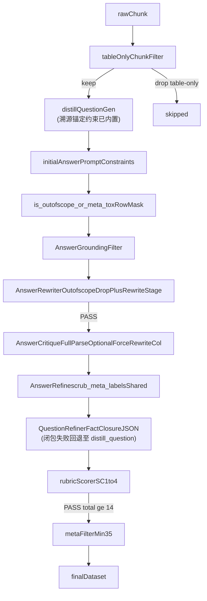

# TechDoc QA Pipeline V2 第四轮更新策略

## 第四轮目标

Round 3 产出在 `finetune/finetune/test/cache_local_qa/qa_pipeline_v2_step_step16.json` 里留下 4 类残留问题(共 13 条点名缺陷 + 若干纯查表低价值题),根因定位在 4 处:grounding 漏 drop、QuestionRefine 没有"事实闭包"、AnswerRefine 元信息禁词不全、上游纯表格 chunk 直接进入生成阶段产出价值偏低的"X 记录什么"题。第四轮做且只做这些定点修复,不扩展新算子,**不动 MetaFilter 阈值**,**不动 Rubric 维度**。

## 残留问题归因

- `#51 内部术语泄漏`:`initial_answer` 自行生成 `OUTOFSCOPE` + "根据参考内容..." 复合污染,grounding 未 drop;`AnswerRefinePrompt` 把内部变量命名为"事实锚答案/Target Answer",模型直接把这些术语搬进 `refined_answer`
- `#48 #73 #75 题-答粒度错位`:`QuestionRefinePrompt` 允许"问题过于细节就提升粒度"、"转向可操作场景"、"补维护窗口/RPO 等显式约束",但**没有**"不得引入 answer 之外新事实"的闭包约束,导致 refine 阶段伪造字段名、替换文件路径、窄化成数值题
- `#79 答案保留场景推断`:`initial_answer` 生成时带入了 `rough_question` 里的"在执行系统升级后"场景,answer refine 时未剥离;AnswerCritique 未把"答案含问题未要求的场景推断段"列为不通过项
- `#3 #8 #22 #38 元信息残留`:`AnswerRefinePrompt` 第 6 原则只列了 3 个关键词样例,未覆盖"参考内容明确指出"、"原文指出"、"原文要求"、"应检查并重新确认...是否正确"等高频变体;上游 `TextAnswerGeneratorPrompt` 源头就在用"根据参考内容..."开头
- `纯查表低价值题`:纯表格 chunk(日志路径对照表)会进入生成阶段,只能出"X 记录什么"这类题——根因在上游 chunk 选择,不在下游打分;靠抬高 MetaFilter 阈值会顺带误杀正常事实题,因此本轮选择从源头 chunk 入口拦截

## 第四轮策略

### 1. 拦截 OUTOFSCOPE 与内部术语泄漏(#51)

三层防御,缺一不可。

**第一层:AnswerRewriter 产出 `clean_answer` 时硬 drop(实现落点)**

计划初稿写在 grounding 算子;**实际实现**放在 [`answer_rewriter.py`](finetune/DataFlow/dataflow/operators/text_sft/tech_doc/answer_rewriter.py),与 `clean_answer` 同源,逻辑与共享工具一致(见下文「工程化去重」)。判定:

- 答案含 `OUTOFSCOPE` token → 该行 `rewrite_stage` 为 DROP,`clean_answer` 置空
- 开头匹配元信息托词前缀且整段 < 80 字 → 同上 DROP
- 统计日志 `outofscope` / `meta_tox_prefix` 计数

**Pipeline 侧提前过滤**:[`test_filter.py`](finetune/finetune/test/test_filter.py) 在 grounding **之前**对 `initial_answer` 行 mask:复用 [`is_outofscope_or_meta_tox`](finetune/DataFlow/dataflow/utils/meta_label_filters.py),早于 LLM grounding,省 token。

**第二层:AnswerRefinePrompt 术语去标签化**

改 [`finetune/DataFlow/dataflow/prompts/general_text.py`](/home/wugk/finetune/DataFlow/dataflow/prompts/general_text.py) L2307-2438 `AnswerRefinePrompt.build_prompt`:

- 把 prompt 里面向模型可见的标签"事实锚答案"、"Target Answer"、"精炼答案 (Target Answer)"、"事实集封闭"、"Fact-Set Closure"全部替换为中性标签"参考答案"、"可用信息集"(docstring/注释不需要动)
- 在输出格式约束里新增一条硬禁:
  

```
  禁止在 [Improved Answer Start]/[End] 区块内出现以下内部标签词:
  事实锚 / 事实锚答案 / 事实基准 / Fact Baseline / Target Answer /
  精炼答案 / 事实集封闭 / Fact-Set Closure / OUTOFSCOPE / 参考答案 /
  可用信息集 / 批评反馈 / Critique。
  若答案确实需要表达"原文未提及 X",必须改写成直接陈述"根据当前信息无法确认 X",
  且该整条记录应由上游 DROP,不应走到本步。
  

```

**第三层:轻量 post-processor 正则扫尾**

在 `AnswerRefiner` 算子调用完 LLM 之后、写回 dataframe 前,加一段正则清洗(非阻断式,但命中即告警 + 记录到 dropped 指标):

- 精确匹配下列短语的整句(句号/分号到下一个句号/分号)直接剔除:`事实锚答案(明确)?指出[:：]`、`根据事实锚答案[,，:：]`、`Target Answer 要求`、`OUTOFSCOPE`
- 若剔除后 `refined_answer` 字符数 < 原 `clean_answer` 字符数的 50%,直接 fall back 为 `clean_answer` 原文并打 warning
- 实现落点:`refine/answer_refiner.py` 在 fact-closure 之后调用 **`dataflow.utils.meta_label_filters.scrub_meta_labels`**(与 rewriter 共用禁词正则);剔除后长度小于 `clean_answer` 长度的 50% 则 fallback `clean_answer`

### 2. QuestionRefine 补事实闭包约束(#48 #73 #75)

用户确认:不加算子,只改 `QuestionRefinePrompt`。改 [`finetune/DataFlow/dataflow/prompts/general_text.py`](/home/wugk/finetune/DataFlow/dataflow/prompts/general_text.py) L1952-2136。

**新增维度 9 + 维度 10**(在原 8 条改进原则之后追加):

- `### 9. 事实闭包(与 Target Answer 对齐,最高优先级,冲突时本条压倒其他)`
  - 精炼后的问题所有限定条件(实体 / 参数 / 文件名 / 字段名 / 数值 / 场景现象)**必须全部出现在当前 answer 文本或提供的 context 中**;不得引入 answer 未涉及的新事实
  - 禁止在问题里新增**占位式具体值示例**(例如 `event="vote_timeout" AND node_id="0x1234"`)当作"更具体"的装饰,任何带引号/反引号的具体值都必须来自 answer/context 原文
  - 禁止替换 answer 中提到的路径/文件/命令为其他路径/文件/命令;refine 只允许保留或删除 answer 里已有的,不允许替换
  - 自检:把精炼后的 Q 给只看 answer 的人,他能不能从 answer 文本直接得出结论?不能则 refine 无效,回退到原问题
- `### 10. 粒度一致性`
  - 若 answer 是单句事实陈述(≤ 2 句),Q 必须是"事实确认型",禁止抬高为"字段级/步骤级/验证方案"
  - 若 answer 是路径对照表枚举,Q 的回答边界应为"列出哪些路径",不得下钻到"字段名/值模式/关键字"
  - 若 answer 是多步操作/脚本框架,Q 必须覆盖所有步骤,不得窄化为只问其中一两个数值(直接命中 #48 场景)

**输出 JSON 新增字段**(让模型显式证明闭包):

```json
{
  "fact_closure_check": {
    "all_constraints_in_answer_or_context": true,
    "new_facts_introduced": [],
    "replaced_facts": []
  },
  "granularity_match": "事实陈述 / 路径枚举 / 多步操作 / 机制解释 / 根因分析",
  "refined_question": "..."
}
```

若 `new_facts_introduced` 非空或 `replaced_facts` 非空,算子层面直接回退到原始 `distill_question`（`DistillQuestionGenerator` 的直接输出列）,不使用 refine 结果；`reverse_question` 列已不再存在(代码落点:`operators/text_sft/refine/question_refiner.py`)。

**补反例到 `self.examples`**:在现有 10 个 example 后追加 3 条负面案例,直接用 round 3 产出中的 #48/#73/#75:

- 反例 A(#48 风格):Q="脚本应包含哪些关键检查点和超时控制逻辑?",A=5 步脚本 → 错误 refine="内存不低于多少?等多久?"(丢弃 3/4/5 步);正确 refine=保持原粒度或仅删元信息
- 反例 B(#73 风格):Q="检查哪些日志路径",A=4 条路径枚举 → 错误 refine="检索哪些字段组合,列出字段名及典型值模式如 event=vote_timeout";正确 refine=保持"优先检查哪些日志路径及功能描述"
- 反例 C(#75 风格):Q="检查 Other\\clock 和 Other\\devm_log",A=这两个路径 → 错误 refine="检查 Messages\\message_euler 和 Messages\\sys_logs_indisk";正确 refine=保留原路径

### 3. AnswerCritique 补"场景推断段"禁项(#79)

改 [`finetune/DataFlow/dataflow/prompts/general_text.py`](/home/wugk/finetune/DataFlow/dataflow/prompts/general_text.py) L2137-2303 `AnswerCritiquePrompt`:

- 在 `### 3. 针对性` 下新增一条子项:
  - `❌ 场景推断溢出`:问题是"X 和 Y 分别记录什么信息"这类纯事实查询,但答案末尾追加"升级后二者异常,表明 XX 可能中断... 这直接影响 YY"这类自行扩写的场景推断段 → 不通过,要求 REWRITE 时删除推断段
- 对应在 `AnswerRefinePrompt` 的"### 8. 结构压缩约束"末尾加一条:
  - `❌ 禁止保留问题未要求的场景推断段`:若 answer 包含问题未询问的因果推断 / 影响分析 / 后续风险判断段落,必须删除,仅保留问题明确询问的信息

### 4. AnswerRefine 扩元信息禁词 + 反向表述规范(#3 #8 #22 #38)

同文件 `AnswerRefinePrompt` 第 6 条"去除元信息引用"扩展为强制列表:

- 必须删除的禁词(任意匹配到即整句删除或重写):
  - `根据参考内容 / 参考内容明确指出 / 参考内容要求 / 参考内容显示 / 根据参考`
  - `原文指出 / 原文明确指出 / 原文要求 / 原文提到 / 原文中 / 根据原文 / 按照原文`
  - `根据文档 / 文档中 / 根据提供的参考 / 根据给定的参考内容`
  - `在步骤X / 根据步骤 / 按照步骤 / 根据流程图 / 根据表格 / 在第X节`
- 新增原则 9:反向表述规范(命中 #38)
  - 当问题问"需要填哪些参数 / 包含哪些字段 / 记录哪些信息"这种**枚举型**问题,答案必须采用直接陈述语气
  - ❌ 禁止:"应检查并重新确认 XX 是否正确 / 应关注 XX / 需要注意 XX"
  - ✅ 要求:"需要填写的参数包括:XX、YY、ZZ"
- 同时修改 `TextAnswerGeneratorPrompt`(同文件 L1707-1789) 让源头 `initial_answer` 就不要写"根据参考内容..."开头,在 prompt 里加一条:`禁止以"根据参考内容"、"原文指出"、"参考内容显示"等元信息短语开头,直接给出答案。`

**post-processor 正则扫尾扩展**(与策略 1 第三层复用同一个 `_scrub_meta_labels()`):

- 扩展禁词列表:把以上所有变体都作为 regex 模式,命中整句剔除
- 若发现 `"应检查并重新确认.*是否正确"` 这类反向表述,不直接删除,改为打 warning + 标记该记录需人工复审(先不 drop,统计后再决定)

### 5. 表格 chunk 入口预过滤(不动 MetaFilter 阈值)

**说明**:用户决定本轮不抬高 MetaFilter 阈值,保留 round 3 的 `min_score=3.5`。低价值题从源头 chunk 入口拦截,而不是事后通过分数 kill。

新增一个轻量启发式过滤器(放在 chunk 读取后、`DistillQuestionGenerator` 前),判定标准:

- chunk 内连续 `\t`/`</td>` 对照行占比 > 60% 且字符总数 < 600 → 判定为"纯表格 chunk",跳过不生成问题
- chunk 内 70% 以上字符是"路径 + 描述"对照(正则 `[\w\\\/._]+\s*\t\s*[^\n]+`)→ 跳过
- 代码落点建议:在 `finetune/finetune/test/test_filter.py` 的 pipeline 构造入口加一个 `_is_table_only_chunk(text) -> bool` 工具函数,在喂给 `DistillQuestionGenerator` 前先过滤;不改 DataFlow 包内部
- 统计:打印被跳过的 chunk 数量,确认是否命中

### 6. 工程化去重(实现后补充,不改变 round 4 业务目标)

为消除散落重复逻辑与环境依赖,在 round 4 主逻辑之外增加以下内容:

**共享模块** [`finetune/DataFlow/dataflow/utils/meta_label_filters.py`](finetune/DataFlow/dataflow/utils/meta_label_filters.py):

- `is_outofscope_or_meta_tox(text)`：`OUTOFSCOPE` 子串 + 元信息托词短开头且全文短于 80 字,供 `AnswerRewriter` 与 [`test_filter.py`](finetune/finetune/test/test_filter.py) 行过滤共用
- `scrub_meta_labels(text)` / `has_reverse_phrasing(text)`：句级禁词剔除与反向表述告警,供 `AnswerRefiner` 复用
- **注意**：`text_sft` 包经 LazyLoader 包裹,公用代码放在 `dataflow.utils` 以避免 `tech_doc` 子包深路径 import 失败

**AnswerRewriter 列语义分离**：[默认 `output_stage_key="rewrite_stage"`](finetune/DataFlow/dataflow/operators/text_sft/tech_doc/answer_rewriter.py),不再写入同名列覆盖上游 `AnswerGroundingFilter` 产出的 `grounding_verdict`(`KEEP/DROP/REWRITE`),便于审计两阶段 verdict

**V2 pipeline 行过滤集中化**：[`test_filter.py`](finetune/finetune/test/test_filter.py) 将 `_not_outofscope` 等 lambda 提升为模块级 `_initial_answer_valid` / `_grounding_not_drop` / `_has_clean_answer` / `_has_reverse_question` / `_rubric_pass`,与 `storage_apply_row_mask` 并列,避免 `forward()` 内重复定义

**AnswerCritique 解析与 prompt 对齐**：[parse_answer_critique](finetune/DataFlow/dataflow/operators/text_sft/tech_doc/answer_critique_evaluator.py) 补充解析 round 3 已有的 `[Executability Check]`、`[Structure Check2]`、总体 `[Overall Assessment]` 内 **强制重写(Force Rewrite)**;`_extract_field` 支持 `强制重写（Force Rewrite）：是` 等带英文别名的字段行。新增列 `answer_critique_force_rewrite`(布尔)。**暂未**在行级据此新增 DROP mask——若启用会改变留存样本量,按需再开

**校验脚本**：[`finetune/finetune/test/check_round4_diff.py`](finetune/finetune/test/check_round4_diff.py) 对比 round 3 缓存与最新的 `qa_pipeline_v2_step_stepN.json`(自动取目录下最大 N)

### 7. 提示词去冗与术语对齐（收尾迭代，不改变业务判定逻辑）

为解决 critique / refine / 逆向出题三处重复宣讲「禁止元信息套话」、以及中英混用的「Fact Baseline / Target Answer」与用户可见文案不一致问题，增加轻量共享片段并收敛术语。

**共享片段** [`finetune/DataFlow/dataflow/prompts/tech_doc_prompt_snippets.py`](finetune/DataFlow/dataflow/prompts/tech_doc_prompt_snippets.py)：

- `META_FORBIDDEN_ZH_REFINE_BLOCK`：精炼阶段完整 regex 级禁词列表（与 `AnswerRefinePrompt` §6 一致，供单点维护）
- `META_FORBIDDEN_ZH_CRITIQUE_BRIEF`：批评阶段短说明，指向与精炼相同的删改口径，避免在 `AnswerCritiquePrompt` §6 重复整表

**`general_text.py`**：

- `AnswerCritiquePrompt`：开场与类文档说明改为 **8 个维度**；§6「元信息检查」改为引用 `META_FORBIDDEN_ZH_CRITIQUE_BRIEF`（并修正此前误写为「检查问题」的表述，改为检查**答案**）
- `AnswerRefinePrompt`：§6 正文由 `META_FORBIDDEN_ZH_REFINE_BLOCK` 注入，与 critique 口径同源
- `QuestionCritiquePrompt`：类文档与开场 **8 个维度**（与正文 §1–§8 一致）；`QuestionRefinePrompt` 类文档改为指引见 `build_prompt` 正文（10+ 条维度与第 11 条题型保留），避免编号与正文错位

**~~逆向出题~~ → 溯源约束前置至 `DistillQuestionGeneratorPrompt`**（`reverseQuestionBuilder` 步骤已移除）：

原 `ReverseQuestionBuilderFromAnswerPrompt`（`tech_doc_qa.py`）与算子 `reverse_question_builder.py` 不再使用，其核心"溯源锚定"语义直接合并进 `DistillQuestionGeneratorPrompt`（`general_text.py`）：

- 在出题约束中新增 **溯源锚定硬规则**：
  - 问题所有限定条件（实体 / 参数 / 文件名 / 字段名 / 数值 / 场景现象）**必须全部出现在所提供的 chunk 文本中**；不得引入 chunk 未提及的新事实
  - 禁止在问题里写入占位式具体值示例（如 `event="vote_timeout"`），任何带引号的具体值都必须来自原文
  - 禁止替换原文提到的路径 / 文件 / 命令；不可将原文场景窄化或抬高粒度
  - 生成的问题须能让"只看本段 chunk"的人直接得出结论；否则视为越界问题，不应生成
- `question_refiner.py` 事实闭包失败（`new_facts_introduced` / `replaced_facts` 非空）时，回退对象由 `reverse_question` 改为原始的 `distill_question`（即 `DistillQuestionGenerator` 的直接输出列），无需额外算子介入

### 8. 训练集污染专项治理（step17 QA 导出复盘后追加）

用户复盘 `qa_pipeline_v2_step_step17_qa_pairs*.json(l)` 后指出：虽然 Rubric/Meta 侧 PASS，但用于 SFT/RAG 训练仍存在高风险污染：

- **answer-as-quote 反模式**：答案把 `input` 中相关段落整段 dump 出来，不先针对问题作答（典型：现场只有乙醇和医用棉签能否清洁光纤接头，却罗列完整清洁工具、眼睛防护、防尘帽等未问内容）
- **答非所问 / 视角错位**：问「分别应执行什么防护操作」却答「当前维护流程中可能存在以下违反」；问「应避免哪项操作」却答「优先操作」；问「必须对哪类连接执行何种操作」却以无指代的「该操作违反了…」开头
- **格式标注未清理**：`✅ 优先操作：`、`✅ 验证方法：`、`⚠️ 局限说明：` 等 UI/评测标记进入训练答案
- **越界 shell 脚本**：参考答案只有一条命令，模型扩写出 `for ...; do`、`awk`、`grep -E` 等多行脚本骨架
- **模糊总结 / 索引型空问题**：例如「应重点确认哪两类状态」这类脱离 `input` 后不可独立回答的问题
- **Meta drift / 评估腔泄漏**：`最可能`、`应优先检查以下`、`当前维护流程中可能存在以下违反...` 等评分/排序口吻进入 output

本次追加采取「prompt 前置约束 + 代码后处理兜底 + 离线导出审计」三层处理。

**Prompt 层（`general_text.py`）**：

- `AnswerCritiquePrompt`：
  - `### 2. 准确性` 新增「Shell/命令扩写编造」禁项：参考答案仅含简单命令或说明，答案却出现多行 `for`/`while`、`awk`、`grep -E` 等组合脚本，判不准确
  - `### 3. 针对性` 新增 answer-as-quote、问防/问禁却答反、评判/排序语言泄漏、答案不可独立成立、演练剧本灌水等不通过规则
  - `### 5. 原文支撑` 新增「复杂 shell 仅出现在答案中」判无支撑
  - `### 6. 元信息检查` 新增行首 `✅`/`⚠️` +「优先操作 / 验证方法 / 局限说明」伪栏目未清理判不通过
- `AnswerRefinePrompt`：
  - 新增 `### 11. 直接应答、抗「整段抄 input」与问答题极性对齐（RAG 训练友好）`
  - 明确禁止 answer-as-quote；要求先用一两句直接回应问题，再只保留必要支撑句
  - 明确问什么答什么：防护题答防护动作，禁止反向改成违规清单；「能否」题首句给出可否判断；「避免/禁止」题必须体现禁止对象
  - 禁止评估腔、伪栏目、emoji 装饰符、演练剧本、越界 shell 扩写
  - 硬性约束新增 10–12：禁止 `✅/⚠️` 与伪栏目；问「避免/禁止/能否」必须极性一致；参考答案没有复杂 shell 时不得新增 `for`/`while`、`awk`、`grep -E`
- `DistillQuestionGeneratorPrompt`：
  - 在问题实用性硬要求中新增：禁止「应重点确认哪两类/哪几项」这类**索引型空问题**，除非参考上下文已显式列出可数类别或条目名称

**共享规则层（`dataflow/utils/meta_label_filters.py`）**：

- `strip_training_decorators(text)`：
  - 去除行首 `✅`/`⚠️`/`✔` 等装饰符
  - 去掉「优先操作：」「验证方法：」「局限说明：」「应急处置流程：」「备注：」等伪栏目前缀，保留冒号后的实质内容
- `looks_like_fabricated_shell_block(answer, anchor)`：
  - 若答案出现 `for`/`while`/`; do` 复杂 shell，而参考答案无同类结构 → 疑似编造
  - 若答案出现 `awk` 或 `grep -E` 而参考答案无对应 token → 疑似编造
- `looks_like_answer_as_quote(answer, context)`：
  - 对答案分句/分隔符/Markdown 连写 bullet 做紧凑化切分
  - 多个长片段逐字出现在上下文中且复制覆盖率超过阈值时，判为 `quote_dump`
  - 已调整以覆盖 `- A- B- C` 这种被 chunk 拼接后的列表复制
- `detect_question_answer_polarity_issue(question, answer)`：
  - 检测「应避免/禁止/请勿」题却未出现否定/禁止对象
  - 检测「能否/是否可以/可否」题却没有 `可以/不能/不可以/不得/禁止/请勿/无法/不建议` 等可否判断
  - `请勿` 已纳入否定判断，避免把「设备上电时，请勿佩戴防静电腕带」误报为能否题未作答
- `detect_evaluator_tone(answer)`：
  - 命中 `最可能`、`最应优先`、`应优先检查以下`、`应优先执行以下`、`应优先收集以下`、`当前维护流程中可能存在以下违反`、`评分/不通过/需要改进`
  - 移除裸 `评估` 泛词，避免误伤「评估影响范围」这类正常运维动作

**AnswerRefiner 后处理（`refine/answer_refiner.py`）**：

- 在 fact-closure 与 `scrub_meta_labels` 后追加训练污染扫尾：
  - `strip_training_decorators` 命中后清理并计数 `decor_stripped`
  - `looks_like_fabricated_shell_block(final_ans, clean_answer)` 命中后直接 fallback 到 `clean_answer`，计数 `shell_anchor_fallback`
  - `looks_like_answer_as_quote(final_ans, context)` 命中后打 warning，计数 `quote_dump_warn`
  - `detect_question_answer_polarity_issue(question, final_ans)` 命中后打 warning，计数 `polarity_warn`
  - `detect_evaluator_tone(final_ans)` 命中后打 warning，计数 `evaluator_tone_warn`
- 说明：quote dump / 极性错位 / 评估腔目前作为**高风险告警**，不在 refiner 内自动删除整条，避免规则误杀；shell 编造为高置信编造，直接回退

**离线导出清洗（`finetune/finetune/test/sanitize_qa_pairs.py`）**：

- 新增独立脚本，不依赖完整 `dataflow` 包 import，使用 `importlib` 直接加载 `meta_label_filters.py`，避免缺 `colorlog` 等环境依赖
- 支持 JSONL 与 JSON array：
  - 默认清洗字段：`output,answer,refined_answer`
  - 默认问题字段：`instruction`
  - 默认上下文字段：`input`
- 输出行为：
  - 始终对答案做 `scrub_meta_labels` + `strip_training_decorators`
  - 命中 quote/polarity/evaluator-tone 时，在样本上写入 `sanitize_warnings`
  - 加 `--drop-suspect` 时，直接丢弃命中任一 warning 的样本

示例：

```bash
python3 finetune/test/sanitize_qa_pairs.py \
  -i finetune/test/cache_local_qa/qa_pipeline_v2_step_step17_qa_pairs.jsonl \
  -o finetune/test/cache_local_qa/qa_pipeline_v2_step_step17_qa_pairs.clean.jsonl

python3 finetune/test/sanitize_qa_pairs.py \
  --drop-suspect \
  -i finetune/test/cache_local_qa/qa_pipeline_v2_step_step17_qa_pairs.jsonl \
  -o finetune/test/cache_local_qa/qa_pipeline_v2_step_step17_qa_pairs.filtered.jsonl
```

**本轮已生成的 step17 导出**：

- `finetune/finetune/test/cache_local_qa/qa_pipeline_v2_step_step17_qa_pairs.clean.jsonl`
- `finetune/finetune/test/cache_local_qa/qa_pipeline_v2_step_step17_qa_pairs_min.clean.json`
- `finetune/finetune/test/cache_local_qa/qa_pipeline_v2_step_step17_qa_pairs.filtered.jsonl`
- `finetune/finetune/test/cache_local_qa/qa_pipeline_v2_step_step17_qa_pairs_min.filtered.json`

最终统计：

```text
read=84
written(clean)=84
written(filtered)=74
dropped=10

quote_dump=1
avoid_question_without_negative_answer=1
evaluator_tone:
  最应优先=1
  当前维护流程中可能存在以下违反=1
  最可能=3
  应优先检查以下=2
  应优先执行以下=1
  应优先收集以下=1
```

最终 warning 样本索引（1-based，对应原 jsonl 行号）：

- 2：`evaluator_tone:最应优先`
- 3：`avoid_question_without_negative_answer` + `evaluator_tone:当前维护流程中可能存在以下违反`
- 6：`quote_dump`
- 8：`evaluator_tone:最可能`
- 15：`evaluator_tone:应优先检查以下`
- 18：`evaluator_tone:应优先执行以下`
- 24：`evaluator_tone:最可能`
- 32：`evaluator_tone:应优先收集以下`
- 55：`evaluator_tone:最可能`
- 79：`evaluator_tone:应优先检查以下`

验证：

- `python3 -m py_compile` 已覆盖 `meta_label_filters.py`、`answer_refiner.py`、`sanitize_qa_pairs.py`
- 新增启发式小样例验证通过（quote dump、极性错位、评估腔、decor strip）
- sanitizer 小样例验证通过
- `ReadLints` 对改动文件无新增问题

## 数据流



## 重点文件

- [finetune/DataFlow/dataflow/prompts/general_text.py](finetune/DataFlow/dataflow/prompts/general_text.py):改 `QuestionRefinePrompt`、`AnswerCritiquePrompt`、`AnswerRefinePrompt`、`TextAnswerGeneratorPrompt`；收尾迭代中 `QuestionCritiquePrompt` / `AnswerCritiquePrompt` 维度数量与 §6 元信息段引用共享片段；**`DistillQuestionGeneratorPrompt` 新增溯源锚定硬规则（替代原 reverseQuestionBuilder）**
- [finetune/DataFlow/dataflow/prompts/tech_doc_prompt_snippets.py](finetune/DataFlow/dataflow/prompts/tech_doc_prompt_snippets.py):元信息禁词 Brief + 精炼完整块（critique/refine 共用）
- ~~[finetune/DataFlow/dataflow/prompts/tech_doc_qa.py](finetune/DataFlow/dataflow/prompts/tech_doc_qa.py)~~:原 `ReverseQuestionBuilderFromAnswerPrompt` **已废弃，不再使用**；文件可保留但算子不再调用
- [finetune/DataFlow/dataflow/utils/meta_label_filters.py](finetune/DataFlow/dataflow/utils/meta_label_filters.py):共享 `is_outofscope_or_meta_tox` / `scrub_meta_labels` / `has_reverse_phrasing`；训练污染专项新增 `strip_training_decorators` / `looks_like_fabricated_shell_block` / `looks_like_answer_as_quote` / `detect_question_answer_polarity_issue` / `detect_evaluator_tone`(规避 `text_sft` LazyLoader 深层 import)
- [finetune/DataFlow/dataflow/operators/text_sft/tech_doc/answer_grounding_filter.py](finetune/DataFlow/dataflow/operators/text_sft/tech_doc/answer_grounding_filter.py):LLM grounding(逻辑未在本次用硬规则替换)
- [finetune/DataFlow/dataflow/operators/text_sft/tech_doc/answer_rewriter.py](finetune/DataFlow/dataflow/operators/text_sft/tech_doc/answer_rewriter.py):OUTOFSCOPE / 元信息托词 DROP;默认 `rewrite_stage` 列(**不覆盖** `grounding_verdict`)
- [finetune/DataFlow/dataflow/operators/text_sft/refine/answer_refiner.py](finetune/DataFlow/dataflow/operators/text_sft/refine/answer_refiner.py):`scrub_meta_labels` + 反向表述 warning(fact-closure 之后)；训练污染专项接入 decor strip、疑似 shell 编造回退、quote/polarity/evaluator-tone 告警统计
- [finetune/DataFlow/dataflow/operators/text_sft/refine/question_refiner.py](finetune/DataFlow/dataflow/operators/text_sft/refine/question_refiner.py):`fact_closure_check` JSON 解析 + **事实闭包失败时回退 `distill_question`**（不再读取 `reverse_question` 列）
- [finetune/DataFlow/dataflow/operators/text_sft/tech_doc/answer_critique_evaluator.py](finetune/DataFlow/dataflow/operators/text_sft/tech_doc/answer_critique_evaluator.py):`parse_answer_critique` 对齐 Executability / Structure2 / Force Rewrite;列 `answer_critique_force_rewrite`
- [finetune/finetune/test/test_filter.py](finetune/finetune/test/test_filter.py):V2 Step 0 `_is_table_only_chunk`;行 mask 谓词模块级;`META` 仍为 3.5
- [finetune/finetune/test/check_round4_diff.py](finetune/finetune/test/check_round4_diff.py):round 3 与最新 `qa_pipeline_v2_step_stepN.json` 关键词对比
- [finetune/finetune/test/sanitize_qa_pairs.py](finetune/finetune/test/sanitize_qa_pairs.py):离线清洗/审计 QA 导出；支持 JSONL / JSON array，写入 `sanitize_warnings`，可用 `--drop-suspect` 生成过滤版
- `cache_local_qa/qa_pipeline_v2_step_step17_qa_pairs.clean.jsonl` / `qa_pipeline_v2_step_step17_qa_pairs_min.clean.json`:保留全部 84 条并标注 warning
- `cache_local_qa/qa_pipeline_v2_step_step17_qa_pairs.filtered.jsonl` / `qa_pipeline_v2_step_step17_qa_pairs_min.filtered.json`:丢弃 10 条可疑样本，保留 74 条

## 验证口径

跑完后对比 round 3 / round 4 的产物:一般为 `cache_local_qa/qa_pipeline_v2_step_step16.json`(旧) vs **含 Step 0 时为 `step17.json`** 等最新 step;也可用 [check_round4_diff.py](finetune/finetune/test/check_round4_diff.py):

- 必须 0 条:包含 `事实锚`、`Target Answer`、`OUTOFSCOPE`、`参考内容明确指出`、`原文指出`、`应检查并重新确认` 的答案
- 必须 0 条:问题里出现 answer/context 未提及的字段名/路径/占位值
- 原 #48/#73/#75 场景的新样本:要么被 drop,要么 Q-A 粒度对齐
- MetaFilter 阈值维持 3.5(不变),Rubric 维持 SC-1~SC-4 / `min_soft_score=14`(不变)
- 预期效果:#51 / #48 / #73 / #75 / #79 / #3 / #8 / #22 / #38 这 9 条直接被修复或被 drop;纯表格 chunk 在入口被跳过,对应"X 记录什么"低价值题不再出现
- 预期总数:从 82 略降(主要来自表格 chunk 入口拦截 + `initial_answer`/AnswerRewriter 侧 OUTOFSCOPE 与托词 DROP + question refine 闭包回退),具体降幅由实际跑数决定
