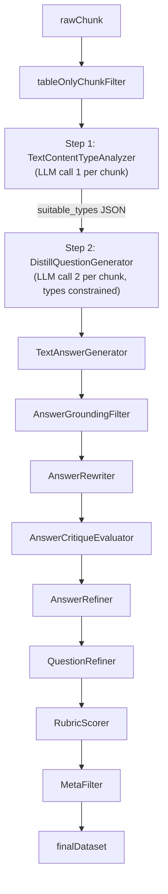

# Round 5: 种子问题 + 客观题型 + 文本驱动题型选择

## 目标

1. 轴 B 新增 `FillBlank`（完形/填空）和 `MultipleChoice`（单选题）两种客观题型
2. 在 `DistillQuestionGeneratorPrompt` 内置 xlsx 优质问题作为 few-shot 种子示例
3. 新增 `TextContentTypeAnalyzerPrompt`，让 LLM 先分析文本信号，再约束题型出题（两步调用）
4. 输出 JSON 含答案字段：填空题含 `blank_answer`，单选题含 `options` 和 `correct_answer`

## 数据流（新增两步调用）



## 实际变更（已完成）

### 1. [`dataflow/prompts/general_text.py`](finetune/DataFlow/dataflow/prompts/general_text.py) — `DistillQuestionGeneratorPrompt`

**Axis B 由 9 类扩展为 11 类**（追加在 ComplianceSecurity 之后）：

- `FillBlank`（完形/填空型）：从 context 中抽取唯一可验证的关键事实（参数值/取值范围/错误码含义/操作结果/限制条件），将核心信息以 `___` 挖空；题干须提供足够定向线索；答案必须在 context 中有明确文字依据且唯一；output JSON 必须含 `blank_answer` 字段（多处挖空以"；"分隔）
- `MultipleChoice`（单选题）：基于 context 中一个具体事实/规则，设计 1 个正确选项和 3 个与主题相关但事实有误的干扰项；禁止"以上都对/不对"等万能选项；output JSON 必须含 `options`（4 元素列表，格式 `"A. 选项文本"`）和 `correct_answer`（`"A"`/`"B"`/`"C"`/`"D"`）字段

**内置 `_SEED_EXAMPLES` 类变量**（13 条，hardcoded few-shot 示例）：

覆盖 8 个轴A场景（Incident/Problem/Change/Configuration/Security/Continuity/Capacity/Availability）× 8 个轴B题型（Diagnostic/RootCause/Procedural/ComplianceSecurity/ConfigExample/Factoid/FillBlank/MultipleChoice）

| 编号 | scenario | question_type | 来源 |
|------|----------|---------------|------|
| 1 | Incident | Diagnostic | Q0（xlsx A评分）：GAUSS-20775 报错定位题 |
| 2 | Problem | Diagnostic | Q184（xlsx A评分）：idle in transaction 连接堆积定位题 |
| 3 | Problem | RootCause | Q51（xlsx A评分）：VACUUM reltuples 偏差 + vm_scan_skipped 根因题 |
| 4 | Change | RootCause | Q2（xlsx A评分）：三个 CPU 绑定参数对比差异题 |
| 5 | Incident | Procedural | Q5（xlsx A评分）：AUTOCOMMIT 状态确认与调整题 |
| 6 | Continuity | Procedural | Q180（xlsx A评分）：RPO=0 前置条件验证题 |
| 7 | Security | ComplianceSecurity | Q165（xlsx A评分）：视图权限与底层元数据泄露题 |
| 8 | Capacity | ConfigExample | Q266（xlsx A评分）：bgwriter/pagewriter 参数协同调整题 |
| 9 | Incident | Factoid | Q286（xlsx A评分）：llvm_max_memory vs llvm_used_memory 差异题 |
| 10 | Configuration | FillBlank | 新构造：walwriteraux_bind_cpu 参数填空（含 `blank_answer`） |
| 11 | Change | FillBlank | 新构造（基于Q3）：索引 TDE 参数限制填空（含 `blank_answer`） |
| 12 | Incident | MultipleChoice | 新构造（基于Q3）：GAUSS-81700 处理方式选择题（含 `options`+`correct_answer`） |
| 13 | Availability | MultipleChoice | 新构造（基于Q337）：prefer-standby 回退行为选择题（含 `options`+`correct_answer`） |

**`build_prompt()` 签名变更**：

```python
# 新增 allowed_types 参数
def build_prompt(
    self,
    current_tag: str,
    tag_path: str = "",
    context: str = "",
    allowed_types: list | None = None,   # 新增
) -> str:
```

若 `allowed_types` 非 None，在 Workflow 步骤 3 和 Constraints §5 末尾注入：
```
本批题型约束（文本信号分析结果）：本批仅允许使用以下题型：{types}。其余题型禁止出现。
```

**Workflow 新增步骤 2**（文本信号识别引导）：
```
识别文本信号：错误码（GAUSS-/ALM-）→ 优先 Diagnostic/FillBlank；
参数表（含数值/范围）→ FillBlank/ConfigExample；
并列选项/策略 → MultipleChoice/RootCause；操作步骤 → Procedural；
对比概念 → RootCause；安全关键词 → ComplianceSecurity
```

**Constraints §6 占比契约新增规则**：
```
FillBlank + MultipleChoice 合计 ≤ 30%；FillBlank 单独 ≤ 20%；MultipleChoice 单独 ≤ 15%；
二者每条须有 context 唯一可验证答案，无明确数值/条件可挖空/区分则不得出此类题
```

**Constraints §7 负面样本清单新增**：
- 无唯一答案填空：FillBlank 若挖空内容存在多个合理答案，或答案为通用词汇，一律不合格
- 万能选项：MultipleChoice 中出现"以上都对"/"以上都不对"等排列组合选项，一律不合格

**Output Format 更新**：FillBlank 题必须含 `blank_answer`；MultipleChoice 题必须含 `options` 和 `correct_answer`；其他题型这三个字段可省略。输出示例新增两类客观题格式。

---

### 2. [`dataflow/prompts/general_text.py`](finetune/DataFlow/dataflow/prompts/general_text.py) — 新增 `TextContentTypeAnalyzerPrompt`

注册为 `@PROMPT_REGISTRY.register()` 的新 Prompt 类，位于 `DistillQuestionGeneratorPrompt` 和 `EvolInstructPrompt` 之间。

**接口**：
```python
def build_prompt(self, context: str) -> str
```

**信号 → 题型映射规则**（内嵌于 prompt 正文）：

| 文本信号 | 适合题型 |
|----------|----------|
| GAUSS-/ALM- 错误码及 ACTION/CAUSE 字段 | Diagnostic、FillBlank |
| 具名参数 + 明确数值/取值范围/默认值 | FillBlank、ConfigExample、Factoid |
| 多个并列策略/模式/选项（3个以上） | MultipleChoice、RootCause |
| 操作步骤序列或命令行示例 | Procedural、ScriptCommand |
| 两个以上对比概念/机制差异 | RootCause（差异型）、Factoid |
| 权限/加密/审计/TDE/SSL/角色等安全关键词 | ComplianceSecurity |
| 监控指标/视图字段/查询语句 | Diagnostic、Factoid |

**输出格式**：
```json
{
    "text_signals": ["error_code", "parameter_with_value", ...],
    "suitable_types": ["Diagnostic", "FillBlank", "RootCause", ...]
}
```

约束：`suitable_types` 最多 5 个，至少含 2 个主观题型（Diagnostic/Procedural/RootCause 中至少 1 个）；若文本信号不足以支撑 FillBlank/MultipleChoice，则不选。

可选 `text_signals` 枚举值：`error_code`、`parameter_with_value`、`enumerated_options`、`step_sequence`、`comparison_concepts`、`security_keywords`、`monitoring_metrics`、`command_examples`

---

### 3. [`dataflow/operators/text_sft/generate/distill_question_generator.py`](finetune/DataFlow/dataflow/operators/text_sft/generate/distill_question_generator.py)

**`__init__` 新增参数**：
```python
two_step_type_selection: bool = False
```
当 `True` 时额外初始化 `self.type_analyzer_prompt = TextContentTypeAnalyzerPrompt()`。

**新增 `_analyze_context_types(contexts: list) -> list[list]` 方法**：
- 批量构建 `TextContentTypeAnalyzerPrompt` prompts
- 调用 `llm_serving.generate_from_input()` 得到分析结果
- 用 `extract_json_object()` 解析，取 `suitable_types` 字段
- 解析失败时返回 `None`（不约束），打 warning 日志

**`run()` 两步模式**：
1. 若 `two_step_type_selection=True`：调用 `_analyze_context_types()` 得到 `allowed_types_per_context`
2. 每个 context 以对应的 `allowed_types` 调用 `DistillQuestionGeneratorPrompt.build_prompt()`
3. 正常调用 LLM 生成问题

**新增 `extract_json_object()` 工具函数**（解析文本信号分析结果）：
```python
def extract_json_object(model_output: str) -> dict:
    # 先尝试直接 json.loads，再 regex 提取 {...} 块
```

**输出 JSON 新字段解析**（在 `run()` 的问题展开循环中）：

| JSON 字段 | DataFrame 列 | 说明 |
|-----------|-------------|------|
| `blank_answer` | `distill_blank_answer` | 填空题正确答案 |
| `options` | `distill_options` | 单选题选项（JSON 字符串） |
| `correct_answer` | `distill_correct_answer` | 单选题正确答案键 |

`distill_options` 存储为 `json.dumps(options, ensure_ascii=False)` 格式字符串，便于 DataFrame 持久化。

**`get_desc()` 同步更新**：说明新增客观题型和两步模式。

---

### 4. [`finetune/test/test_filter.py`](finetune/finetune/test/test_filter.py) — `TechDocQAPipelineV2`

```python
# 变更前
self.distill_question_generator = DistillQuestionGenerator(
    llm_serving=llm_serving,
    current_tag=distill_tag,
    count=num_questions,
)

# 变更后
self.distill_question_generator = DistillQuestionGenerator(
    llm_serving=llm_serving,
    current_tag=distill_tag,
    count=num_questions,
    two_step_type_selection=True,   # 新增
)
```

---

## 重点文件

- [`finetune/DataFlow/dataflow/prompts/general_text.py`](finetune/DataFlow/dataflow/prompts/general_text.py)：`DistillQuestionGeneratorPrompt`（扩展至11类题型、种子问题、allowed_types 参数）；新增 `TextContentTypeAnalyzerPrompt`
- [`finetune/DataFlow/dataflow/operators/text_sft/generate/distill_question_generator.py`](finetune/DataFlow/dataflow/operators/text_sft/generate/distill_question_generator.py)：两步调用逻辑、新字段解析、`extract_json_object` 工具函数
- [`finetune/finetune/test/test_filter.py`](finetune/finetune/test/test_filter.py)：`TechDocQAPipelineV2` 启用 `two_step_type_selection=True`

## 验证口径

- `python3 -m py_compile dataflow/operators/text_sft/generate/distill_question_generator.py` → 无语法错误
- `ast.parse(open('dataflow/prompts/general_text.py').read())` → 无语法错误
- prompt 字符串检查：`FillBlank`、`MultipleChoice`、`blank_answer`、`correct_answer`、`_SEED_EXAMPLES`、`allowed_types`、`TextContentTypeAnalyzerPrompt`、`suitable_types`、`text_signals`、`十一类题型`、`FillBlank + MultipleChoice 合计` 均存在
- operator 字符串检查：`two_step_type_selection`、`TextContentTypeAnalyzerPrompt`、`_analyze_context_types`、`allowed_types_per_context`、`blank_answer`、`distill_blank_answer`、`distill_options`、`distill_correct_answer`、`extract_json_object` 均存在
- ReadLints：仅 `test_filter.py` 的 5 条预存 basedpyright import 警告，无新增错误
