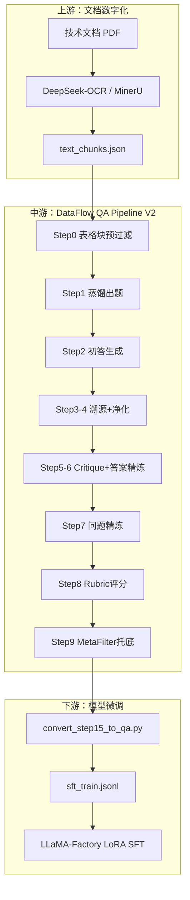
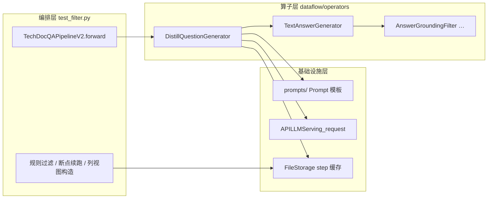
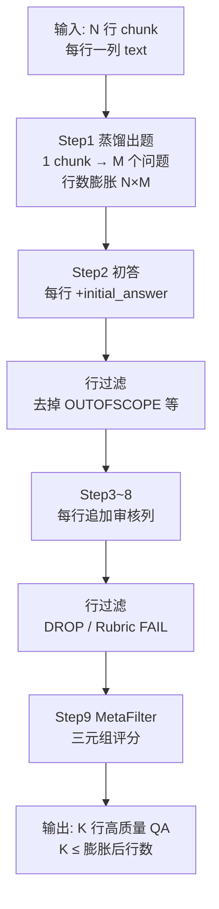
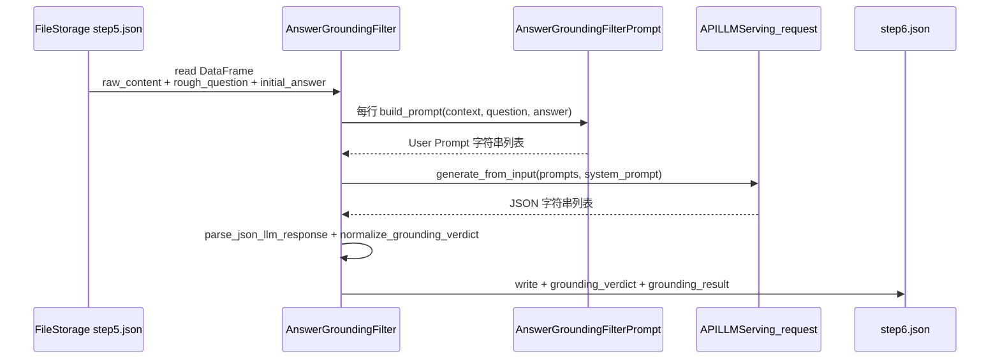
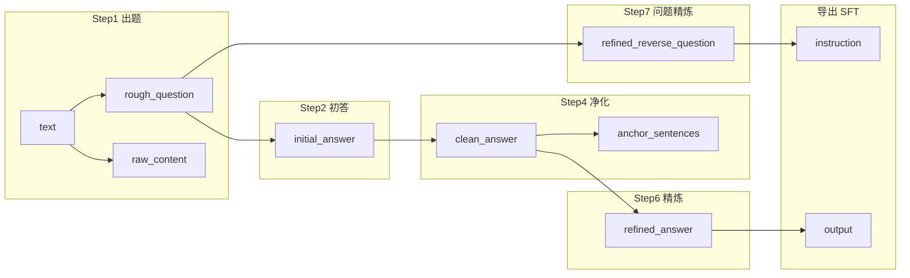
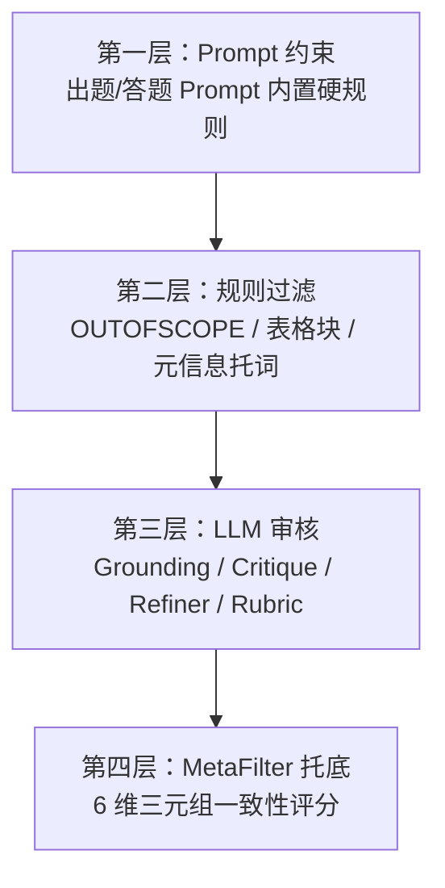
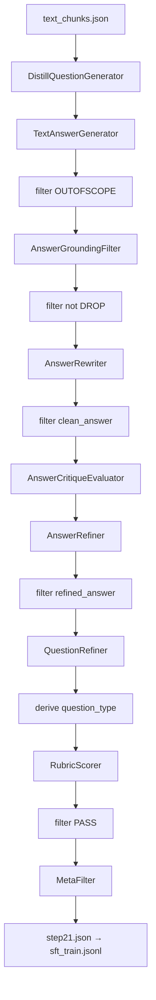

# DataFlow 技术文档 QA 流水线 — 完整技术报告

> **文档性质**：面向技术管理与项目汇报的综合性技术报告  
> **编写日期**：2026-06-18  
> **主入口代码**：`/home/wugk/finetune/finetune/test/test_filter.py` → `TechDocQAPipelineV2`  
> **相关文档索引**：见 [`00_目录说明与文件索引.md`](00_目录说明与文件索引.md)

---

## 摘要

本项目基于开源 **DataFlow** 框架，自研 **TechDoc QA Pipeline V2**，实现从企业技术文档（PDF/OCR 文本块）到高质量问答微调语料的端到端自动化生产。

**核心设计**：「答案先行 + 溯源约束 + 问题/答案双向精炼 + Rubric 结构化评分 + MetaFilter 托底」。

**已落地成果（故障管理数据集）**：

| 指标 | 数值 |
|------|------|
| 输入 OCR 文本块 | 584 chunks |
| 最终 SFT 语料 | **1544 条**（`sft_train.jsonl`） |
| Pipeline 步骤 | 21 个可审计 step 缓存 |
| 下游 | 已接入 LLaMA-Factory Qwen3 LoRA 微调 |

**一句话总结**：形成「文档数字化 → 多算子 QA 流水线 → SFT 语料 → 领域模型微调」的完整闭环，质量可控、过程可审计、支持断点续跑与 Docker 部署。

**完整 Prompt 模板**：[附录 C](#附录-c各阶段完整-prompt-模板)（11 个 LLM 步骤的 `build_prompt()` 全文，由源码渲染）；第 4 章各 Step 含约束摘要与附录链接。

**DataFlow 原理**：[第 3.4 节 利用 DataFlow 生成数据集的原理](#34-利用-dataflow-生成数据集的原理)（算子链、Storage step、行膨胀/收缩与编排层分工）。

---

## 1. 项目背景与目标

### 1.1 业务背景

企业拥有大量运维/存储/数据库等技术 PDF 文档，一线运维人员需要基于这些文档进行排障与操作。通用大模型缺乏领域知识，直接微调又缺少高质量标注语料。

### 1.2 项目目标

1. **自动化**：将 OCR 后的文档文本块自动转化为问答对，减少人工标注成本。
2. **高质量**：语料必须忠实原文、符合运维提问习惯、无训练污染（元信息托词、答案泄漏等）。
3. **可复现**：每步落盘，支持断点续跑、失败重试、质量审计。
4. **可扩展**：同一套 Pipeline 可复用于故障管理、用户指南、性能监控指南等多份文档。
5. **可微调**：产出直接对接 LLaMA-Factory，训练领域运维助手。

### 1.3 V1 与 V2 的设计差异

| 维度 | V1（TextQAPipeline） | V2（TechDocQAPipelineV2） |
|------|----------------------|---------------------------|
| 流程 | 出题 → 答题 → MetaFilter | 出题 → 答题 → **溯源** → 净化 → Critique → 精炼 → Rubric → Meta |
| 问题质量 | 出题后即进入下游，难以及时纠正 | 答案先行验证，问题在答案确认后再精炼 |
| 质量控制 | 单层 MetaFilter | 四层防线（Prompt / 规则 / LLM 审核 / Meta 托底） |
| 适用场景 | 简单 QA 生成 | 企业技术文档、运维手册等高质量 SFT 语料 |

详细 V2 设计方案见 [`文档01_技术文档QA管道V2总体设计方案.plan.md`](文档01_技术文档QA管道V2总体设计方案.plan.md)。

---

## 2. 整体架构

### 2.1 端到端数据流



### 2.2 代码仓库结构

```
/home/wugk/finetune/
├── DataFlow/                          # DataFlow 框架 + 自扩展算子
│   ├── dataflow/operators/text_sft/   # SFT 相关算子
│   │   ├── generate/                  # 出题、答题
│   │   ├── refine/                    # 问题/答案精炼
│   │   └── tech_doc/                  # 技术文档专用算子
│   ├── dataflow/prompts/              # 全部 Prompt 模板
│   └── dataflow/serving/              # LLM API 调用层
├── finetune/
│   ├── test/
│   │   ├── test_filter.py             # ★ Pipeline V2 主程序
│   │   └── convert_step15_to_qa.py    # SFT 语料导出
│   ├── data/                          # 各数据集 OCR + 缓存 + 产出
│   └── LLaMA-Factory/                 # 微调框架
└── .cursor/plans/                     # 设计文档、运行脚本
```

### 2.3 运行入口

| 入口 | 路径 | 说明 |
|------|------|------|
| Python 主程序 | `脚本07_QA管道主程序_Python入口.py` | 通用入口，环境变量区分数据集 |
| 管道类 | `test_filter.py` → `TechDocQAPipelineV2` | 21 步编排逻辑 |
| 后台脚本 | `脚本05/06/08_*.sh` | 本地 llama-server 或阿里云 API |
| 进度监控 | `脚本02_查看QA管道运行进度.sh` | step 缓存、日志、健康检查 |

---

## 3. 技术底座：DataFlow 框架

### 3.1 核心抽象

| 组件 | 代码位置 | 作用 |
|------|----------|------|
| **Operator（算子）** | `dataflow/operators/` | 单一处理单元：读 DataFrame → 调 LLM → 写回 |
| **FileStorage** | `dataflow/utils/storage.py` | 步骤间持久化；`step()` 递增并复制上一步缓存 |
| **APILLMServing_request** | `dataflow/serving/api_llm_serving_request.py` | OpenAI 兼容 API，并发 + 重试 + 超时 |
| **Prompt 注册** | `dataflow/prompts/` | 提示词与算子解耦，便于迭代 |

### 3.2 LLM 服务配置

Pipeline 通过环境变量配置 LLM，不写死在代码中：

```bash
export DF_API_KEY=sk-xxx
export DF_API_URL=https://token-plan.cn-beijing.maas.aliyuncs.com/compatible-mode/v1/chat/completions
export DF_MODEL_NAME=qwen3.6-plus
export DF_MAX_WORKERS=20          # 云端 API；本地 35B 建议 2~4
export TECHDOC_INPUT=/path/to/text_chunks.json
export QA_OUTPUT_DIR=/path/to/output
export QA_CACHE_DIR=/path/to/qa_pipeline_cache
export QA_FILE_PREFIX=fault_mgmt_converted_qa
```

**APILLMServing_request 关键参数**：

| 参数 | 值 | 说明 |
|------|-----|------|
| 单次超时 | 1800 秒 | 长文本 + reasoning 模型需较大超时 |
| 失败重试 | 5 次 | 指数退避（2^i 秒） |
| 并发 | `max_workers` | ThreadPoolExecutor 并行请求 |
| Thinking 解析 | `format_response()` | 自动包装/解析 `reasoning_content` 与 `` 标签 |

### 3.3 部署方式

| 方式 | 说明 | 文档 |
|------|------|------|
| Conda | `dataflow` 环境直接运行 | 文档12/13 运行手册 |
| Docker | `dataflow-qa:1.0.8` 纯 Python 镜像 | [`文档02`](文档02_DataFlow_QA_Docker镜像打包与部署.plan.md) |
| 本地模型 | llama-server / Ollama OpenAI 兼容接口 | [`文档11`](文档11_第6轮_thinking标签解析与本地llama部署.plan.md) |

### 3.4 利用 DataFlow 生成数据集的原理

DataFlow 本身是一个**面向 LLM 数据处理的可组合框架**：把「读数据 → 调模型 → 写回数据」封装成可复用的**算子（Operator）**，再用**存储（Storage）**在步骤之间传递表格化样本，由业务脚本**编排（Orchestration）**成完整流水线。本项目没有改框架内核，而是在其之上扩展了技术文档专用算子，并用 `test_filter.py` 组装成 QA 语料生产线。

#### 3.4.1 核心理念：表格行 = 一条训练样本候选

DataFlow 内部统一用 **pandas DataFrame** 表示数据集：

- **一行** = 一条待处理或已处理的样本（例如：一个 chunk 对应的多条 QA 之一）
- **一列** = 某个阶段的字段（问题、原文、初答、溯源结果、精炼答案……）
- 算子只做三件事：**读表 → 变换（常含 LLM 调用）→ 写表**

这与最终 SFT 语料「一条 JSON = 一问一答」一致，区别是 Pipeline 中间会保留大量**审计列**（`grounding_result`、`rubric_result`、`answer_critique` 等），便于质量追溯，导出时再精简为 `instruction` + `output`。

#### 3.4.2 三层分工



| 层次 | 职责 | 本项目中的体现 |
|------|------|----------------|
| **Prompt 层** | 把业务规则写成可版本化的提示词模板 | `general_text.py`、`tech_doc_qa.py`、`TECH_DOC_V2_ANSWER_PROMPT` |
| **算子层** | 固定「读哪些列、写哪些列、如何调 LLM」 | `DistillQuestionGenerator`、`RubricScorer` 等 9 个 LLM 算子 |
| **编排层** | 决定算子顺序、何时行过滤、何时跳过步骤 | `TechDocQAPipelineV2.forward()` + `storage_apply_row_mask` 等 |

Prompt 与算子通过 `@prompt_restrict(PromptClass)` 绑定：算子只负责组参和解析，**质量规则集中在 Prompt 文件**里迭代，无需改算子逻辑。

#### 3.4.3 FileStorage 与 `step()`：步骤间如何传数据

`FileStorage` 是本项目使用的存储后端（`dataflow/utils/storage.py`）：

```python
storage = FileStorage(
    first_entry_file_name="text_chunks.json",   # step0 读原始 OCR
    cache_path="./qa_pipeline_cache",
    file_name_prefix="fault_mgmt_converted_qa",
    cache_type="json",
)
```

**`step()` 机制**（每次调用 `storage.step()`，`operator_step += 1`）：

| step 编号 | 实际读写的文件 |
|-----------|----------------|
| step 0 | `first_entry_file_name`（原始 `text_chunks.json`） |
| step 1 | `{prefix}_step1.json` |
| step 2 | `{prefix}_step2.json` |
| … | … |
| step 21 | `{prefix}_step21.json`（最终 MetaFilter 输出） |

每个算子执行前的典型模式：

```python
st = storage.step()           # 进入下一步，读写新文件
df = st.read("dataframe")     # 读上一步产出
# … 算子 run() 内部：调 LLM、追加列 …
st.write(df)                  # 落盘到 stepN.json
```

**要点**：

1. **一步一文件**：每步结果持久化，崩溃后可从任意 step 续跑（`resume=True` 检测已有 `{prefix}_step{N}.json` 则跳过）。
2. **浅拷贝传递**：`step()` 返回 `copy.copy(self)`，同一份逻辑 Storage 对象，仅 step 计数递增。
3. **首步特殊**：step 0 始终读原始 OCR JSON，不经过 cache 目录。

#### 3.4.4 单个算子的标准执行循环

所有 LLM 算子继承 `OperatorABC`，共享同一套模式（以 `TextAnswerGenerator` 为例）：

```
1. storage.read("dataframe")     → 读入当前 step 的全表
2. 按行构造 Prompt 列表          → prompts.build_prompt(…)
3. llm_serving.generate_from_input(prompts)  → 并发请求 LLM（ThreadPoolExecutor）
4. 解析模型输出                  → 纯文本 / JSON / Critique 块
5. 写回 DataFrame 新列           → 保留原有列（V2 要求 preserve_input_columns）
6. storage.write(df)             → 持久化
```

**LLM 服务注入**：Pipeline 初始化时创建**一个** `APILLMServing_request` 实例，注入所有算子，保证 API 地址、模型名、并发数全局一致：

```python
llm_serving = APILLMServing_request(
    api_url=..., model_name=..., max_workers=...
)
self.distill_question_generator = DistillQuestionGenerator(llm_serving=llm_serving, ...)
self.answer_generator = TextAnswerGenerator(llm_serving=llm_serving, ...)
# … 其余算子共用同一 llm_serving
```

算子**不持有模型**，只持有「如何调 API、如何解析响应」的接口 `LLMServingABC`，因此同一套算子可切换阿里云 API、本地 llama-server 或 Docker 内远程 endpoint。

#### 3.4.5 数据形态在流水线中的演变

这是理解「如何从 584 个 chunk 变成 1544 条 QA」的关键：



| 阶段 | 行数变化 | 列变化 |
|------|----------|--------|
| 输入 OCR JSON | N 行（chunk 数） | `text` |
| 蒸馏出题 | **N → N×M**（每 chunk 约 4 题） | +`rough_question`, `raw_content`, `distill_*` |
| 初答及之后 | 行过滤逐批减少 | +`initial_answer` → `clean_answer` → `refined_answer` → `refined_reverse_question` → `rubric_*` → `MetaScore` |
| 导出 SFT | 列投影为 2 列 | `instruction`, `output` |

**行膨胀**发生在 `DistillQuestionGenerator`：一个 context 对应 LLM 返回 JSON 数组，算子将其**展开为多行**，每行一个问题、共享同一 `raw_content`。

**行收缩**发生在编排层的 `storage_apply_row_mask()`：不是 DataFlow 内置算子，而是 `test_filter.py` 中的谓词过滤（OUTOFSCOPE、grounding DROP、Rubric 非 PASS 等），不合格样本从 DataFrame 中删除后再写回下一步。

#### 3.4.6 算子注册与扩展方式

新算子通过装饰器注册到全局表，支持 LazyLoader 按需导入：

```python
@prompt_restrict(AnswerGroundingFilterPrompt)
@OPERATOR_REGISTRY.register()
class AnswerGroundingFilter(OperatorABC):
    def run(self, storage: DataFlowStorage, input_context_key="raw_content", ...):
        ...
```

**本项目扩展了哪些算子**（框架原有 + 自研）：

| 类型 | 算子 | 作用 |
|------|------|------|
| 框架通用 | `TextAnswerGenerator`、`QuestionRefiner`、`AnswerRefiner`、`MetaFilter` | 答题、精炼、Meta 评分 |
| 自研 tech_doc | `AnswerGroundingFilter`、`AnswerRewriter`、`AnswerCritiqueEvaluator`、`RubricScorer` | 溯源、净化、Rubric |
| 自研 generate | `DistillQuestionGenerator`（增强两步题型） | 运维向蒸馏出题 |

业务脚本 `from dataflow.operators.text_sft import …` 即可使用，**无需修改 DataFlow 安装包入口**。

#### 3.4.7 编排层相对框架的「增值逻辑」

DataFlow 算子负责**单步变换**；`TechDocQAPipelineV2` 额外承担框架未内置的能力：

| 能力 | 实现位置 | 原因 |
|------|----------|------|
| 表格块预过滤 | `_is_table_only_chunk()` | 纯规则，不值得单独算子 |
| Thinking 标签剥离 | `storage_strip_llm_answer_columns()` | reasoning 模型适配 |
| 行级过滤 | `storage_apply_row_mask()` | `FileStorage` 无内置 filter API |
| 题型映射 | `storage_derive_question_type()` | 蒸馏题型 → Rubric 题型 |
| Meta 输入视图 | `storage_prepare_meta_triplet_view()` | 拼接 question+锚句供 Meta 评估 |
| 断点续跑 | `_step_output_ready()` / `_find_latest_cached_step()` | 长任务容错 |

因此完整链路 = **DataFlow 算子链（LLM 能力）** + **编排层 glue 代码（规则与工程化）**。

#### 3.4.8 从 Pipeline 到微调语料的最后一跳

DataFlow 产出的是**带宽表结构的 step21.json**（含全部审计字段）。导出脚本 `convert_step15_to_qa.py` 不在 DataFlow 框架内，负责：

1. 读取 `{prefix}_step21.json`
2. 列映射：`refined_reverse_question` → `instruction`，`refined_answer` → `output`
3. 写出 Alpaca / JSONL，供 LLaMA-Factory 注册

**DataFlow 负责「生成与质检」；LLaMA-Factory 负责「训练」**——二者通过 JSONL 文件衔接。

#### 3.4.9 原理小结（汇报用一段话）

> 我们把 OCR 文本块当作 DataFlow 的初始表格，用**蒸馏算子**把每个 chunk 扩成多条问题行，再经**答题、溯源、改写、双向精炼、Rubric、MetaFilter** 等算子逐步追加列并过滤行；每一步结果写入 `stepN.json` 以便审计和断点续跑。框架提供的是**算子 + Prompt + LLM 服务 + 分步存储**的通用机制，领域知识则体现在 Prompt 约束和自研 tech_doc 算子中。最终从宽表投影为纯 Q&A 的 SFT 语料，完成从文档到可微调数据的闭环。

---

## 4. Pipeline V2 逐步详解

> **完整提示词**：各 LLM 步骤的 Prompt **全文**见 [附录 C](#附录-c各阶段完整-prompt-模板)（非摘要）；本章每步「Prompt 规范」为便于阅读的要点提炼。

主类：`TechDocQAPipelineV2`（`test_filter.py`）

- **输入**：JSON 数组，每项含 `"text"` 字段（OCR 文本块）
- **输出**：`step21.json`，含 `refined_reverse_question` + `refined_answer` 及完整审计字段
- **断点续跑**：`resume=True`，检测已有 step 缓存自动跳过

### 4.1 步骤总览

| Step | 名称 | 算子/逻辑 | LLM | 缓存文件 |
|:----:|------|-----------|:---:|:--------:|
| 0 | 表格块预过滤 | `_is_table_only_chunk()` | ✗ | step1 |
| 1 | 蒸馏出题 | `DistillQuestionGenerator` | ✓ | step2 |
| 2 | 初答生成 | `TextAnswerGenerator` | ✓ | step3 |
| 2.5 | Thinking 剥离 | `storage_strip_llm_answer_columns` | ✗ | step4 |
| 2.6 | 初答过滤 | OUTOFSCOPE / 元信息托词 | ✗ | step5 |
| 3 | 答案溯源 | `AnswerGroundingFilter` | ✓ | step6 |
| 3.5 | 过滤 DROP | 规则 | ✗ | step7 |
| 4 | 答案净化 | `AnswerRewriter` | ✓* | step8 |
| 4.5~4.6 | 净化后过滤 | 剥离 + 空答案过滤 | ✗ | step10 |
| 5 | 答案 Critique | `AnswerCritiqueEvaluator` | ✓ | step11 |
| 6 | 答案精炼 | `AnswerRefiner` | ✓ | step12 |
| 6.5~6.6 | 精炼后过滤 | 剥离 + OUTOFSCOPE 过滤 | ✗ | step14 |
| 7 | 问题精炼 | `QuestionRefiner` | ✓ | step15 |
| 7.5 | 题型映射 | `storage_derive_question_type` | ✗ | step16 |
| 7.6 | 答案再剥离 | thinking 清理 | ✗ | step17 |
| 8 | Rubric 评分 | `RubricScorer` | ✓ | step18 |
| 8.5 | PASS 过滤 | 规则 | ✗ | step19 |
| 9.0 | Meta 视图构造 | `storage_prepare_meta_triplet_view` | ✗ | step20 |
| 9 | MetaFilter | `MetaFilter` | ✓ | step21 |

\* AnswerRewriter 仅对 REWRITE 判决行调用 LLM，KEEP/DROP 走规则分支。

**Prompt 与步骤对照**（源码：`general_text.py` / `tech_doc_qa.py` / `test_filter.py`；System 默认 `You are a helpful assistant`，溯源步骤覆盖为审核专家）：

| Pipeline Step | Prompt 类 | 源文件 | 输出格式 |
|:-------------:|-----------|--------|----------|
| 1a | `TextContentTypeAnalyzerPrompt` | `general_text.py` | JSON 对象 |
| 1b | `DistillQuestionGeneratorPrompt` | `general_text.py` | JSON 数组 |
| 2 | `TextAnswerGeneratorPrompt` + `TECH_DOC_V2_ANSWER_PROMPT` | `general_text.py` + `test_filter.py` | 纯文本 |
| 3 | `AnswerGroundingFilterPrompt` | `tech_doc_qa.py` | JSON 对象 |
| 4 | `AnswerRewriterPrompt` | `tech_doc_qa.py` | JSON 对象 |
| 5 | `AnswerCritiquePrompt` | `general_text.py` | Critique 块 |
| 6 | `AnswerCritiquePrompt` + `AnswerRefinePrompt` | `general_text.py` | `[Improved Answer Start]…` |
| 7 | `QuestionCritiquePrompt` + `QuestionRefinePrompt` | `general_text.py` | `[Improved Question Start]…` |
| 8 | `RubricScorerPrompt` | `tech_doc_qa.py` | JSON 对象 |
| 9 | `MetaPrompt` + `tech_doc_qa_meta_dimensions` | `general_text.py` + `test_filter.py` | 6 段 + `[s1,…,s6]` |

---

### 4.2 Step 0：表格块预过滤

**代码**：`test_filter.py` → `_is_table_only_chunk()`

**原理**：纯表格、路径对照表、目录页无法生成有训练价值的问答，规则提前剔除，节省 LLM 成本。

**规则（任一命中即跳过）**：

- tab 或 `</td>` 行占比 > 60%，且总字符 < 600
- 路径+描述对照行（`[\w\/._-]+\t[^\n]+`）占比 > 70%
- Markdown pipe 表格行占比 > 60%，有分隔行，且 < 1200 字

---

### 4.3 Step 1：蒸馏出题（DistillQuestionGenerator）

**算子**：`DataFlow/dataflow/operators/text_sft/generate/distill_question_generator.py`

**原理**：基于文档 chunk + 领域标签（如「存储运维」「故障管理」），LLM 批量生成运维向问题。

**双轴分类体系**（详见 [`文档06`](文档06_蒸馏出题_ITIL运维过程与九类题型.plan.md)）：

**轴 A — 10 类 ITIL/运维场景**：

Incident、Problem、Change、Configuration、Release、Capacity、Availability、Continuity、Security、DevOpsSRE

**轴 B — 9+ 类题型**：

| 题型 ID | 中文 | 要点 |
|---------|------|------|
| Factoid | 运维事实型 | 禁止裸「什么是 X」，必须带场景/现象 |
| Diagnostic | 诊断型 | 现象 + 日志线索 + 问原因/先查什么 |
| Procedural | 操作步骤型 | 环境约束 + 可验收目标 |
| RootCause | 根因分析型 | 反复故障模式 + 机制层根因 |
| BestPractice | 最佳实践型 | 必须带 RPO/RTO/版本等约束 |
| ConfigExample | 配置示例型 | 问改哪些参数，不写死目标值 |
| ScriptCommand | 脚本/命令型 | 可复用命令骨架，敏感信息占位 |
| FaultReproFix | 故障复现与修复 | 强制测试/演练环境措辞 |
| ComplianceSecurity | 合规/安全 | 权限、加密、审计 |
| FillBlank / MultipleChoice | 客观题 | 填空/单选，含标准答案字段 |

**完整 Prompt 模板**：[附录 C.1](#c1-step-1a--textcontenttypeanalyzerprompt)（Step 1a）、[附录 C.2](#c2-step-1b--distillquestiongeneratorprompt)（Step 1b）

**Prompt 规范摘要**（`general_text.py`，算子通过 `@prompt_restrict` 绑定）：

**Step 1a — `TextContentTypeAnalyzerPrompt`**（两步模式第一步，`two_step_type_selection=True` 时启用）

- **角色**：运维知识问答题型分析师，判断哪些题型适合从文档片段出题
- **输入**：`{context}` — OCR 文本块原文
- **规则**：从 13 类轴 B 题型中选最多 5 个 `suitable_types`，至少含 2 个主观题型；存在 error_code / parameter_with_value 等信号时**必须**含 FillBlank 或 MultipleChoice
- **输出 JSON**：

```json
{
  "text_signals": ["error_code", "parameter_with_value"],
  "suitable_types": ["Diagnostic", "FillBlank", "RootCause"]
}
```

**Step 1b — `DistillQuestionGeneratorPrompt`**（参数：`count`=4、`current_tag`、`allowed_types` 来自 1a）

- **角色**：`# Role: 领域问题蒸馏专家` — 为标签生成 `count` 个高质量多样化问题
- **Constraints 核心（9 组）**：

| # | 约束组 | 要点 |
|---|--------|------|
| 1 | 实用性 | 真实运维场景；用户视角；题干不得泄漏答案 |
| 2 | 上下文相关 | 问题必须能从 Reference Context 找到答案 |
| 3 | 主题相关 | 与 `current_tag` 紧密相关 |
| 4 | 轴 A · 10 类场景 | Incident/Problem/Change/…；丰富 chunk 时 Incident+Problem+Change+Availability ≥50% |
| 5 | 轴 B · 13 类题型 | 各题型合格问法模板（见上表） |
| 6 | 占比契约 | 排障+变更+根因 ≥50%；Factoid+Config ≤35% |
| 7 | 负面样本 | 禁止「什么是 X」「本节介绍…」、无约束 BestPractice |
| 8 | 质量 | 避免是/否题（客观题除外）、重复题 |
| 9 | 溯源锚定 | 题干实体/数值必须来自 Reference Context |

- **Few-shot**：内置 `_SEED_EXAMPLES`（各题型 1 条），仅作格式参考，禁止照搬实体
- **输出 JSON 数组**：

```json
[
  {"scenario": "Incident", "question_type": "Diagnostic", "question": "当存储池 I/O 响应时间持续超过阈值三倍时，应优先排查哪些对象层级的指标？"},
  {"scenario": "Configuration", "question_type": "FillBlank", "question": "OLTP 业务推荐将平均 I/O 响应时间告警触发条件设为要求时延的___倍。", "blank_answer": "三"}
]
```

**输入/输出**：

| 方向 | 字段 |
|------|------|
| 输入 | `text` |
| 输出 | `rough_question`, `raw_content`, `distill_question_type`, `distill_scenario`, `distill_blank_answer`, `distill_options` 等 |

---

### 4.4 Step 2：初答生成（TextAnswerGenerator）

**算子**：`DataFlow/dataflow/operators/text_sft/generate/text_answer_generator.py`  
**完整 Prompt 模板**：[附录 C.3](#c3-step-2--textanswergeneratorprompt--tech_doc_v2)

**Prompt 规范摘要**：

**`TextAnswerGeneratorPrompt`**（`general_text.py` L1711）+ 业务追加 **`TECH_DOC_V2_ANSWER_PROMPT`**（`test_filter.py` L361，Pipeline 注入 `custom_prompt`）

```text
# 角色：IT 运维 QA 数据集专家（SRE/DBA）
## 能力要求：
1. 答案必须严格基于给定内容，不得编造
2. 优先提取路径、命令、指标和现象等可操作信息
## 参考内容：{text}
## 问题：{question}
```

**基础约束（节选）**：不得引入参考内容之外的信息；语言与参考内容一致；**禁止元信息开篇**（「根据参考内容」「原文指出」「在步骤X」等）；枚举型问题须直接列举。

**业务追加 `TECH_DOC_V2_ANSWER_PROMPT`**：

```text
严格要求：
1. 只使用参考内容中明确存在的信息作答
2. 不得添加参考内容中没有的任何具体信息
3. 不得出现"参考内容未提供"/"无法回答"/"文档未提及"等声明
4. 如果问题超出参考内容范围，仅输出 OUTOFSCOPE 四个大写字母（不要其它文字）
```

**输出**：纯文本答案（或 `OUTOFSCOPE`），字段 `initial_answer`

**列保留**：`preserve_input_columns=True`，在原 DataFrame 上追加列，保留出题阶段全部扩展字段。

---

### 4.5 Step 2.5 ~ 2.6：Thinking 剥离 + 初答过滤

**代码**：

- `storage_strip_llm_answer_columns(st, ["initial_answer"])`
- `storage_apply_row_mask(st, _initial_answer_valid)`

**原理**：

- Qwen3 reasoning 模型输出含 ``，需用 `extract_llm_answer_text()` 剥离
- 含 OUTOFSCOPE token 或元信息托词的答案在溯源前丢弃，**节省后续 6~8 次 LLM 调用/条**

---

### 4.6 Step 3：答案溯源审核（AnswerGroundingFilter）

**算子**：`DataFlow/dataflow/operators/text_sft/tech_doc/answer_grounding_filter.py`  
**完整 Prompt 模板**：[附录 C.4](#c4-step-3--answergroundingfilterprompt)

**Prompt 规范摘要 — `AnswerGroundingFilterPrompt`**（`tech_doc_qa.py` L72）

- **System**：`你是一个严格的技术文档QA质量审核专家。`
- **审核三档**：

| 判决 | 条件 |
|------|------|
| **DROP** | 「参考内容未提供」「无法回答」等托词；与原文矛盾；核心概念原文不存在 |
| **REWRITE** | 方向正确但有多余细节或过度扩写 |
| **KEEP** | 可在原文找到明确对应，无添加信息 |

- **输出 JSON**：

```json
{
  "verdict": "KEEP / REWRITE / DROP",
  "reason": "一句话说明",
  "problematic_parts": ["..."],
  "groundable_parts": ["..."],
  "anchor_sentences": ["原文逐字支撑句1", "支撑句2"]
}
```

**三档判决与后续处理**：

| 判决 | 含义 | 后续处理 |
|------|------|----------|
| KEEP | 答案已忠实原文 | 直接作为 clean_answer |
| REWRITE | 有偏离但可修正 | AnswerRewriter 严格改写 |
| DROP | 无法溯源 | 丢弃 |

**输出**：`grounding_verdict`, `grounding_result`（含 `anchor_sentences` 原文锚句列表）

#### 4.6.1 算子实现剖析：Prompt 如何驱动 `AnswerGroundingFilter`

本节以 **Step 3 答案溯源** 为例，说明 DataFlow 中「Prompt 模板 → 算子 `run()` → 编排层调用」的完整写法。其余 LLM 算子（出题、初答、Rubric 等）结构相同，差异主要在 Prompt 内容与输出解析逻辑。

**1. 本步在流水线中的位置**



**2. 三层分工（本例）**

| 层次 | 文件 | 职责 |
|------|------|------|
| Prompt | `tech_doc_qa.py` → `AnswerGroundingFilterPrompt` | 把 `{context}`/`{question}`/`{answer}` 填进审核模板，规定 KEEP/REWRITE/DROP 与 JSON 输出格式（[附录 C.4](#c4-step-3--answergroundingfilterprompt)） |
| 算子 | `answer_grounding_filter.py` → `AnswerGroundingFilter` | 读表 → 批量组 Prompt → 调 LLM → 解析 JSON → 写回两列 |
| 编排 | `test_filter.py` → `TechDocQAPipelineV2.forward()` | `storage.step()`、`answer_grounding_filter.run(...)`、Step 3.5 行过滤 DROP |

**3. Prompt 类：只负责「拼字符串」**

Prompt 与算子通过 `@prompt_restrict(AnswerGroundingFilterPrompt)` 绑定，编译期约束「这个算子只能用这个 Prompt 类」。`build_prompt()` 接收三个字符串参数，返回发给 LLM 的 **User 消息**：

```python
# tech_doc_qa.py — 核心结构
class AnswerGroundingFilterPrompt(PromptABC):
    def build_prompt(self, context: str, question: str, answer: str) -> str:
        return f"""你是一个严格的技术文档QA质量审核专家。
...
## 参考原文：{context}
## 问题：{question}
## 待审核答案：{answer}
...
{{ "verdict": "KEEP / REWRITE / DROP", "anchor_sentences": [...] }}"""
```

注意：System 消息不在 Prompt 类里，而在算子调用 LLM 时单独传入（与 User 消息分离），便于同一 Prompt 类在不同场景复用。

**4. 算子类：标准五步循环**

算子继承 `OperatorABC`，在 `__init__` 注入共享的 `llm_serving`，在 `run()` 里完成 DataFlow 规定的「读 → 调 → 写」：

```15:63:/home/wugk/finetune/DataFlow/dataflow/operators/text_sft/tech_doc/answer_grounding_filter.py
@prompt_restrict(AnswerGroundingFilterPrompt)
@OPERATOR_REGISTRY.register()
class AnswerGroundingFilter(OperatorABC):
    def __init__(self, llm_serving: LLMServingABC):
        self.llm_serving = llm_serving
        self.prompt = AnswerGroundingFilterPrompt()

    def run(self, storage, input_context_key="raw_content",
            input_question_key="rough_question", input_answer_key="initial_answer",
            output_verdict_key="grounding_verdict", output_grounding_key="grounding_result"):
        df = storage.read("dataframe")
        # ① 按行从 DataFrame 取列，组装 Prompt 列表
        prompts = [
            self.prompt.build_prompt(
                context=str(row.get(input_context_key, "") or ""),
                question=str(row.get(input_question_key, "") or ""),
                answer=str(row.get(input_answer_key, "") or ""),
            )
            for _, row in df.iterrows()
        ]
        # ② 批量并发调 LLM（System + User 双消息）
        responses = self.llm_serving.generate_from_input(
            user_inputs=prompts,
            system_prompt="你是一个严格的技术文档QA质量审核专家。",
        )
        # ③ 解析每行响应，写入新列
        verdicts, groundings = [], []
        for resp in responses:
            result = parse_json_llm_response(resp)
            if not result:
                verdicts.append("DROP"); groundings.append({}); continue
            verdicts.append(normalize_grounding_verdict(result.get("verdict")))
            groundings.append(result)
        df = df.copy()
        df[output_verdict_key] = verdicts
        df[output_grounding_key] = groundings
        storage.write(df)
        return [output_verdict_key, output_grounding_key]
```

**列名映射（本步）**：

| DataFrame 列（输入） | Prompt 占位符 | 来源阶段 |
|---------------------|---------------|----------|
| `raw_content` | `{context}` | Step 1 蒸馏出题时从 chunk 复制 |
| `rough_question` | `{question}` | Step 1 生成 |
| `initial_answer` | `{answer}` | Step 2 初答 |

| DataFrame 列（输出） | JSON 字段 | 下游用途 |
|---------------------|-----------|----------|
| `grounding_verdict` | `verdict` | Step 3.5 过滤 DROP；Step 4 分支 KEEP/REWRITE |
| `grounding_result` | 完整 JSON | `anchor_sentences` 供 Rubric / Meta / 问题精炼 |

**5. LLM 调用层：并发与消息格式**

`APILLMServing_request.generate_from_input()` 对每行 Prompt 构造 OpenAI 兼容请求，并用 `ThreadPoolExecutor(max_workers=DF_MAX_WORKERS)` 并行：

```python
# 每条样本的请求体等价于：
{"role": "system", "content": "你是一个严格的技术文档QA质量审核专家。"}
{"role": "user",   "content": "<AnswerGroundingFilterPrompt.build_prompt() 的返回值>"}
```

**6. 响应解析：Prompt 约定与代码兜底**

Prompt 要求模型输出严格 JSON，但 reasoning 模型可能在 `` 里夹带 `{`/`}`，导致直接 `json.loads` 失败。`parse_json_llm_response()` 会依次尝试：剥离 thinking 标签 → 去 markdown 围栏 → 截取 `{...}` 再解析。解析失败时算子**保守降级为 DROP**，避免幻觉答案进入下游：

```python
# tech_doc_qa.py
def normalize_grounding_verdict(raw):  # 非法值统一 → "DROP"
    return _norm_verdict(raw, {"KEEP", "REWRITE", "DROP"}, "DROP")
```

**7. 编排层：算子之外的两步**

算子只追加列，**不做行删除**。Pipeline 在 Step 3.5 用编排函数过滤：

```python
# test_filter.py — Pipeline 初始化时注入 llm_serving
self.answer_grounding_filter = AnswerGroundingFilter(llm_serving=llm_serving)

# forward() 中 Step 3
st = s.step()
self.answer_grounding_filter.run(
    storage=st,
    input_context_key="raw_content",
    input_question_key="rough_question",
    input_answer_key="initial_answer",
)

# Step 3.5 — 编排层行过滤（非 DataFlow 内置算子）
st = s.step()
storage_apply_row_mask(st, _grounding_not_drop)  # verdict == "DROP" 的行删除
```

`storage_apply_row_mask` 读取当前 step 的 DataFrame，按行谓词过滤后写回——这是 V2 相对「纯 DataFlow」的编排增值逻辑（见 [§3.4.7](#347-编排层相对框架的增值逻辑)）。

**8. Prompt 判决如何驱动下一步**

| `grounding_verdict` | Step 4 `AnswerRewriter` 行为 |
|---------------------|------------------------------|
| KEEP | **不调 LLM**，规则复制 `initial_answer` → `clean_answer` |
| REWRITE | 调 `AnswerRewriterPrompt`，把 `grounding_result` 中的 problematic/anchor 信息传入改写 |
| DROP | 行已在 3.5 删除；若漏网则 `clean_answer = None` |

**9. 小结（写新算子时可复用的模板）**

1. 在 `prompts/` 写 `XxxPrompt.build_prompt(...)`，只拼 User 文本、约定输出格式  
2. 在 `operators/` 写 `class Xxx(OperatorABC)`：`read → build_prompt 列表 → generate_from_input → 解析 → write`  
3. 加 `@prompt_restrict` + `@OPERATOR_REGISTRY.register()`  
4. 在 `test_filter.py` 的 `__init__` 注入 `llm_serving`，在 `forward()` 里 `storage.step()` + `run()` + 必要的行过滤  

---

### 4.7 Step 4：答案净化改写（AnswerRewriter）

**算子**：`DataFlow/dataflow/operators/text_sft/tech_doc/answer_rewriter.py`  
**完整 Prompt 模板**：[附录 C.5](#c5-step-4--answerrewriterprompt)

**Prompt 规范摘要 — `AnswerRewriterPrompt`**（`tech_doc_qa.py` L120；仅 `grounding_verdict=REWRITE` 的行调用 LLM）

- **改写规则**：每句必须有原文依据；长度不超过原文对应内容 1.5 倍；禁止边界声明、禁止添加原文没有的命令/数字/步骤；原文完全无依据 → `verdict: "DROP"`
- **输出 JSON**：

```json
{
  "verdict": "REWRITTEN / DROP",
  "rewritten_answer": "…",
  "anchor_sentences": ["…"],
  "dropped_content": "删除了什么"
}
```

**分支逻辑**：

| 输入判决 | 处理 |
|----------|------|
| KEEP | `clean_answer = initial_answer`，提取 anchor_sentences |
| REWRITE | 调 LLM 严格按原文重写 |
| DROP / OUTOFSCOPE | `clean_answer = None` |

**`clean_answer` 定位**：经溯源验证的**可信锚答案**，后续 Rubric 以此为评分标准。

---

### 4.8 Step 5：答案质量 Critique（AnswerCritiqueEvaluator）

**算子**：`DataFlow/dataflow/operators/text_sft/tech_doc/answer_critique_evaluator.py`  
**完整 Prompt 模板**：[附录 C.6](#c6-step-5--answercritiqueprompt)

**Prompt 规范摘要 — `AnswerCritiquePrompt`**（`general_text.py` L2202）

**8 个评估维度**：

| 维度 | 检查要点 |
|------|----------|
| Completeness | 关键步骤/要点是否齐全 |
| Accuracy | 事实错误、编造固定值、捏造 shell 脚本 |
| Relevance | 答非所问、整段抄原文、问禁答优先、极性反转 |
| Structure | 分点分段、逻辑层次 |
| Source Fidelity | 每要点是否有原文支撑 |
| Meta Info | 元信息引用、emoji 装饰标签 |
| Executability | 排障类须有可执行步骤（原文有支撑时） |
| Structure Compression | 禁止三级嵌套、多种组织形式混用 |

**输出格式**：`[Critique Start]…[Critique End]`，内含各维度 `[Xxx Check Start/End]`、`[Overall Assessment]`（含 **Force Rewrite: 是/否**）、`[Suggestion]`

**输出**：`answer_critique`（结构化文本，供 AnswerRefiner 复用）

---

### 4.9 Step 6：答案精炼（AnswerRefiner）

**算子**：`DataFlow/dataflow/operators/text_sft/refine/answer_refiner.py`  
**完整 Prompt 模板**：[附录 C.7](#c7-step-6--answerrefineprompt)

**Prompt 规范摘要**：

**`AnswerRefinePrompt`**（`general_text.py` L2383；可复用 Step 5 的 `answer_critique`，`reuse_existing_critique=True` 时跳过重复 Critique）

**优先级**：① 原文封闭（`refined_answer` ⊆ 参考上下文）→ ② 最小代价原则 → ③ 对齐 Critique（拒绝引入上下文外内容的建议）

**改进原则（节选）**：去除元信息引用；禁止 answer-as-quote；问「应避免」时不得只答「应优先」；禁止内部标签词泄漏（`OUTOFSCOPE`/`Critique` 等）；删除问题未要求的场景推断段

**输出格式**：

```text
[Analysis Start]…[Analysis End]
[Improved Answer Start]改进后的答案正文[Improved Answer End]
```

**两阶段**：

1. Critique：7 维结构化评审（可复用 Step 5 结果，`reuse_existing_critique=True`）
2. Refine：基于 Critique 反馈改写答案

**启发式兜底**（代码内规则，不额外调 LLM）：

- 评估者口吻检测与剥离
- 答案当引用检测
- 捏造命令块检测
- 问答题极性反转检测
- 训练装饰符剥离

**输出**：`refined_answer`（导出主答案）

---

### 4.10 Step 7：问题精炼（QuestionRefiner）

**算子**：`DataFlow/dataflow/operators/text_sft/refine/question_refiner.py`  
**完整 Prompt 模板**：[附录 C.8](#c8-step-7a--questioncritiqueprompt)、[附录 C.9](#c9-step-7b--questionrefineprompt)

**Prompt 规范摘要**：

**`QuestionCritiquePrompt`**（`general_text.py` L1797）— 8 维：Meta-info / Specificity / Operator Perspective / Clarity / Practical Value / Source Alignment / Answerable Boundary / Answer Leakage

**`QuestionRefinePrompt`**（L1961）— **最高优先级：事实闭包（§9）**

- 精炼后问题所有限定条件必须出现在 **answer 或 context** 中
- 禁止替换 answer 中的路径/命令为其他路径
- 闭包失败时代码层回退 `rough_question`（`QuestionRefiner._parse_fact_closure_check`）

**Refine 原则（节选）**：去除「步骤X」「第X章」元信息；BestPractice 须补 RPO 等约束；FaultReproFix 须带测试/演练环境；粒度与 answer 一致

**输出格式**：

```text
[Improved Question Start]精炼后的问题[Improved Question End]
```

可选 `[Fact Closure Check Start]…{"new_facts_introduced": false}…[End]` JSON 块供代码解析。

**原理**：

- 以 `rough_question` 为输入，对照 `refined_answer` 做**事实闭包检查**
- 闭包失败（问题引入答案/原文之外的新事实）→ **自动回退**到 `rough_question`
- 避免精炼后问题超出可回答边界

**输出**：`refined_reverse_question`

---

### 4.11 Step 7.5：题型映射

**代码**：`storage_derive_question_type()` + `_DISTILL_TO_RUBRIC_QUESTION_TYPE`

将蒸馏阶段 13 种轴 B 题型映射为 Rubric 可识别的 5+1 题型：

| 蒸馏题型 | Rubric 题型 |
|----------|-------------|
| ScriptCommand | 命令查询 |
| ConfigExample / Factoid / FillBlank | 参数确认 |
| Diagnostic / Procedural / FaultReproFix / RootCause / BestPractice | 故障处理 |
| DifferenceComparison | 差异对比 |
| VersionFeature | 版本特性 |
| 其他 | default |

---

### 4.12 Step 8：Rubric 结构化评分（RubricScorer）

**算子**：`DataFlow/dataflow/operators/text_sft/tech_doc/rubric_scorer.py`  
**完整 Prompt 模板**：[附录 C.10](#c10-step-8--rubricscorerprompt)

**Prompt 规范摘要 — `RubricScorerPrompt`**（`tech_doc_qa.py` L177）

**输入**：`standard_answer` = `clean_answer`（溯源锚）；`answer` = `refined_answer`（待评）；`question_type`；`anchor_sentences`（可选）

**Hard Constraints（HC）— 按题型一票否决**：

| 题型 | HC 示例 |
|------|---------|
| 命令查询 | 命令字符串正确；不答非所问；无虚构命令 |
| 参数确认 | 参数值正确；单位/条件说明；无 unsupported 固定值 |
| 故障处理 | 处理路径正确；对应故障场景；无虚构方法 |
| default | 核心事实一致；直接回应；无虚构信息 |

**Soft Constraints（SC）— 满分 16**：SC-1 原文溯源性 / SC-2 实用价值 / SC-3 可执行性 / SC-4 精确完整性（各 0~4 分）

**Optional Checks（OC）— 按题型加分，满分 3**

**PASS 条件**：全部 applicable 的 HC 通过 + `total_soft_score` ≥ 阈值（Pipeline 默认 `min_soft_score=12.0`）

**输出 JSON（节选）**：

```json
{
  "hard_constraints": {"HC-1": {"applicable": true, "pass": true, "reason": "…"}},
  "hard_pass": true,
  "soft_scores": {"SC-1": {"score": 4, "reason": "…"}},
  "total_soft_score": 15,
  "verdict": "PASS",
  "main_issue": "…"
}
```

**评分结构**：

| 类型 | 说明 | 作用 |
|------|------|------|
| HC（Hard Constraints） | 硬约束，一票否决 | 按题型检查命令格式、参数范围等 |
| SC（Soft Constraints） | 软约束，加分项 | 完整性、可执行性等 |
| OC（Optional Constraints） | 可选项 | 额外加分 |

**关键对比逻辑**：

- **标准答案** = `clean_answer`（溯源锚，可信）
- **待评答案** = `refined_answer`（Refiner 产物，可能引入偏离）

目的：检测 Refiner 是否引入扩写、越界或退化。

**输出**：`rubric_verdict`（PASS/FAIL）, `rubric_result`, `rubric_score`

---

### 4.13 Step 9：MetaFilter 托底

**算子**：`DataFlow/operators/text_pt/` → `MetaFilter`  
**完整 Prompt 模板**：[附录 C.11](#c11-step-9--metaprompt)

**Prompt 规范摘要**：

**`MetaPrompt`**（`general_text.py` L109）+ **`tech_doc_qa_meta_dimensions`**（`test_filter.py` L249）

**System Prompt（英文，动态注入 6 维）**：

```text
You are an expert evaluator of text content. You will be given a single piece of text
and must evaluate it across six specific dimensions listed below…
Each evaluation should be one short paragraph.
End with: [score1, score2, score3, score4, score5, score6]
```

**6 个中文评估维度**：

| # | 维度 | 评估内容 |
|---|------|----------|
| 1 | 问答语义一致性 | 答案是否直接回应问题，无问 A 答 B |
| 2 | 问题精准度与唯一性 | 约束是否足够精确，答案是否唯一可定位 |
| 3 | 答案完整性 | 关键步骤/前置条件/验证方法是否齐全 |
| 4 | 训练污染风险 | 元信息托词、答案泄漏、过度推断 |
| 5 | 技术准确性 | 命令、参数、数值与原文一致 |
| 6 | 运维训练价值 | 对真实排障/变更是否有可落地收益 |

**输入视图**（Step 9.0 构造）：

```text
Question: {refined_reverse_question + anchor_sentences}
Context:  {raw_content}
Answer:   {refined_answer}
```

**过滤阈值**：6 维均值 `MetaScore` ∈ [3.5, 5.0]（`MetaFilter min_score/max_score`）

**输出示例**：

```text
（6 段维度分析段落…）
[4, 5, 4, 5, 4, 5]
```

---

## 5. 数据流与列名演变



| 阶段 | 问题列 | 上下文列 | 答案列 | 用途 |
|------|--------|----------|--------|------|
| 蒸馏出题 | `rough_question` | `raw_content` | — | 初版问题 |
| 初答 | `rough_question` | `raw_content` | `initial_answer` | 第一版答案 |
| 净化后 | — | `raw_content` | `clean_answer` | **溯源锚**（Rubric 标准） |
| 精炼后 | `refined_reverse_question` | `raw_content` | `refined_answer` | **导出主答案** |
| SFT 导出 | `instruction` | —（纯 Q&A） | `output` | LLaMA-Factory 训练 |

---

## 6. 质量控制体系

### 6.1 四层防线



### 6.2 漏斗效应（故障管理实测）

```
584 chunks × 4 题/chunk ≈ 2336 条初始 QA
        ↓ OUTOFSCOPE / 溯源 DROP / Rubric FAIL / Meta 低分
     1544 条最终语料（通过率 ~66%）
```

### 6.3 关键质量机制说明

| 机制 | 原理 | 解决的问题 |
|------|------|------------|
| OUTOFSCOPE | 原文无法回答时模型只输出固定 token | 防止编造、托词答案进入语料 |
| Grounding KEEP/REWRITE/DROP | LLM 判断答案是否有原文支撑 | 防止幻觉答案 |
| clean_answer 锚定 | Rubric 以 clean 为标准评 refined | 防止 Refiner 引入偏离 |
| 事实闭包检查 | QuestionRefiner 检测新问题事实 | 防止问题超出可回答边界 |
| MetaFilter 6 维 | 三元组最终一致性评分 | 托底拦截漏网低质样本 |

---

## 7. 关键代码文件索引

| 层级 | 文件 | 说明 |
|------|------|------|
| 管道编排 | `finetune/test/test_filter.py` | V2 主流程，21 步 + 断点续跑 |
| Python 入口 | `.cursor/plans/脚本07_QA管道主程序_Python入口.py` | 环境变量 + 自动导出 |
| SFT 导出 | `finetune/test/convert_step15_to_qa.py` | step21 → Alpaca JSONL |
| 出题算子 | `DataFlow/.../distill_question_generator.py` | 蒸馏出题 + 两步题型选择 |
| 答题算子 | `DataFlow/.../text_answer_generator.py` | 初答生成 |
| 溯源算子 | `DataFlow/.../answer_grounding_filter.py` | KEEP/REWRITE/DROP |
| 改写算子 | `DataFlow/.../answer_rewriter.py` | clean_answer 生成 |
| Critique | `DataFlow/.../answer_critique_evaluator.py` | 7 维答案评审 |
| 答案精炼 | `DataFlow/.../refine/answer_refiner.py` | Critique + Refine |
| 问题精炼 | `DataFlow/.../refine/question_refiner.py` | 事实闭包 + Refine |
| Rubric | `DataFlow/.../tech_doc/rubric_scorer.py` | HC/SC/OC 结构化评分 |
| Meta 过滤 | `DataFlow/operators/text_pt/` → MetaFilter | 6 维托底 |
| LLM 服务 | `DataFlow/.../api_llm_serving_request.py` | API 并发调用 |
| Prompt 库 | `DataFlow/prompts/general_text.py` + `tech_doc_qa.py` | 全部 LLM Prompt（详见第 4 章各 Step） |
| 业务 Prompt | `finetune/test/test_filter.py` | `TECH_DOC_V2_ANSWER_PROMPT`、`tech_doc_qa_meta_dimensions` |
| 微调接入 | `LLaMA-Factory/import_techdoc_sft.sh` | 软链接 + dataset 注册 |

---

## 8. 运行与运维

### 8.1 快速启动

```bash
# 后台跑故障管理（阿里云 API）
/home/wugk/.cursor/plans/脚本08_后台运行_故障管理_阿里云API.sh

# 查看进度
/home/wugk/.cursor/plans/脚本02_查看QA管道运行进度.sh --once

# 导出 SFT 语料（纯 Q&A）
cd /home/wugk/finetune/finetune/test
python convert_step15_to_qa.py 21
```

### 8.2 环境变量一览

| 变量 | 默认值 | 说明 |
|------|--------|------|
| `DF_API_KEY` | — | **必填**，API 密钥 |
| `DF_API_URL` | 阿里云 token-plan | OpenAI 兼容 endpoint |
| `DF_MODEL_NAME` | `qwen3.6-plus` | 模型名 |
| `DF_MAX_WORKERS` | `100`（建议云端 10~20，本地 2~4） | 并发数 |
| `TECHDOC_INPUT` | 各数据集 chunks.json | 输入文件 |
| `QA_OUTPUT_DIR` | 数据集目录 | 输出根目录 |
| `QA_CACHE_DIR` | `{OUTPUT}/qa_pipeline_cache` | step 缓存 |
| `QA_FILE_PREFIX` | `fault_mgmt_converted_qa` | 缓存文件前缀 |
| `NUM_QUESTIONS` | `4` | 每 chunk 出题数 |

### 8.3 断点续跑

- 每步产出 `{prefix}_step{N}.json`
- `resume=True` 时检测最新 step，跳过已完成步骤
- 崩溃/超时后直接重跑，不丢进度

### 8.4 资源消耗估算

| 项 | 数值 |
|----|------|
| 每条约 LLM 调用次数 | 8~12 次 |
| 584 chunks × 4 题 | 预计数小时 ~ 十余小时 |
| 云端并发建议 | 10~20 |
| 本地 35B 并发建议 | 2~4 |

详细运行手册见 [`文档12`](文档12_故障管理数据集_QA管道运行手册.plan.md)、[`文档13`](文档13_用户指南数据集_QA管道运行手册.plan.md)。

### 8.5 Prompt 维护说明

| 事项 | 说明 |
|------|------|
| 修改 Prompt | 改 `general_text.py` / `tech_doc_qa.py` 后无需改算子，重启 Pipeline 即可 |
| 业务约束 | `TECH_DOC_V2_ANSWER_PROMPT`、`tech_doc_qa_meta_dimensions` 在 `test_filter.py`，改后影响全部 V2 运行 |
| Reasoning 模型 | qwen3.6 输出 ``，各步后须 `storage_strip_llm_answer_columns` |
| 详细出题策略 | 见 [`文档06_蒸馏出题_ITIL运维过程与九类题型.plan.md`](文档06_蒸馏出题_ITIL运维过程与九类题型.plan.md) |
| Prompt 全文 | 以仓库源码为准；第 4 章为汇报用摘要，完整字符串见上述文件行号 |

---

## 9. 下游：LLaMA-Factory 微调接入

### 9.1 导出格式

Pipeline 完成后，`convert_step15_to_qa.py` 将 step21 转为 Alpaca 格式：

```json
{"instruction": "精炼后的问题", "output": "精炼后的答案"}
```

当前采用**纯 Q&A 模式**（无 `input` 原文字段），适合闭卷领域专家微调。

### 9.2 接入流程

```
step21.json
    ↓ convert_step15_to_qa.py
sft_train.jsonl
    ↓ import_techdoc_sft.sh（软链接）
LLaMA-Factory/data/sft_train.jsonl
    ↓ qwen3_lora_sft_techdoc.yaml
LoRA 微调 → saves/qwen3-8b/lora/sft_techdoc
```

### 9.3 已产出数据集

| 数据集 | 文件 | 条数 |
|--------|------|------|
| 故障管理 | `data/故障管理/sft_train.jsonl` | 1544 |
| 用户指南 | Pipeline 跑完后生成 | — |

详细微调指南见 [`文档14`](文档14_QA语料接入LLaMA-Factory微调指南.plan.md)。

---

## 10. 项目演进历程

| 轮次 | 主题 | 关键改进 | 文档 |
|------|------|----------|------|
| 第 1 轮 | V2 总体设计 | 答案先行 + 溯源 + Rubric + Meta 架构 | 文档01 |
| 第 2 轮 | Docker 打包 | dataflow-qa 镜像 | 文档02 |
| 第 3 轮 | 质量前移 | 删除前置过滤器，Prompt 硬约束，Rubric 重做 | 文档03/04/05 |
| 第 4 轮 | OUTOFSCOPE | 元信息托词、训练污染修复 | 文档08 |
| 第 5 轮 | 客观题型 | 填空/单选 + 种子题 + 两步题型选择 | 文档09/10 |
| 第 6 轮 | Thinking 解析 | qwen3.6 thinking 全链路修复 + 本地 llama | 文档11 |
| 生产跑通 | 故障管理 | 584 chunks → 1544 条 SFT | 文档12/13/14 |

---

## 11. 风险与应对

| 风险 | 影响 | 应对措施 |
|------|------|----------|
| LLM API 超时 | Pipeline 中断 | 断点续跑；降低并发；增大 timeout |
| JSON 解析失败 | 单条样本丢失 | 算子内保守降级（grounding→DROP，rubric→FAIL） |
| Refiner 引入偏离 | 答案质量下降 | Rubric 以 clean_answer 为标准对比 refined |
| 训练污染 | 模型学到坏模式 | MetaFilter 6 维 + OUTOFSCOPE + 元信息托词规则 |
| Docker 旧代码 | NoneType 崩溃 | 挂载新版 DataFlow 并 `pip install -e .` |
| 本地 35B 并发过高 | 请求排队超时 | `DF_MAX_WORKERS=2~4` |

---

## 12. 结论与后续规划

### 12.1 已完成

- [x] TechDoc QA Pipeline V2 完整实现（9 算子 + 21 step）
- [x] 故障管理数据集全量跑通（1544 条 SFT 语料）
- [ ] LLaMA-Factory 微调接入
- [ ] Docker 镜像打包方案
- [ ] 本地 llama-server / 阿里云 API 双模式部署

### 12.2 后续可扩展方向

1. **多文档批量生产**：性能监控指南、OceanStor 系列等 OCR 结果批量接入
2. **RAG 模式语料**：保留 `input` 原文字段，训练检索增强问答能力
3. **人工抽检平台**：基于 step 缓存 + rubric_result 做可视化审核
4. **模型效果评估**：微调后在运维测试集上对比 base vs LoRA 准确率
5. **Pipeline 性能优化**：Step 5 Critique 与 Step 6 Refiner 合并减少 LLM 调用

---

## 附录 A：Pipeline 数据流 Mermaid 详图



## 附录 C：各阶段完整 Prompt 模板

> 由源码 `build_prompt()` 渲染（示例占位：`{context}`/`{text}`/`{question}`/`{answer}` 等）。Pipeline 运行时算子传入每行 DataFrame 真实字段。

### C.1 Step 1a — TextContentTypeAnalyzerPrompt

```text
你是一名专业的运维知识问答题型分析师。请分析以下文档片段，判断哪些题型最适合从中出题。

## 待分析文档片段：
【示例原文】存储池 I/O 响应时间超过阈值三倍时应检查对象层级指标。

## 轴B题型完整列表（共13类）：
- Factoid：运维事实型（参数默认值/版本行为/现象关联）
- Diagnostic：诊断型（现象+日志线索→原因/排查路径）
- Procedural：操作步骤型（环境约束下的变更/操作流程）
- RootCause：根因分析型（机制层根因与验证思路）
- BestPractice：最佳实践型（带显式约束的优化建议）
- ConfigExample：配置示例型（参数修改场景与前后检查）
- ScriptCommand：脚本/命令型（可复用的命令骨架）
- FaultReproFix：故障复现与修复（测试/演练环境中）
- ComplianceSecurity：合规/安全咨询（权限/加密/审计）
- DifferenceComparison：差异对比型（两个或以上方案/模式/版本的核心区别，题干须明确被对比对象）
- VersionFeature：版本特性型（特定版本新增/变更/废弃的特性，题干须写明版本约束）
- FillBlank：完形/填空型（挖空参数值/错误码含义/操作结果）
- MultipleChoice：单选题（1个正确选项+3个合理干扰项）

## 信号→题型映射规则：
- 文本含 GAUSS-/ALM- 等错误码及 ACTION/CAUSE 字段 → 适合 Diagnostic、FillBlank
- 文本含具名参数 + 明确数值/取值范围/默认值 → 适合 FillBlank、ConfigExample、Factoid
- 文本含多个并列策略/模式/选项（3个以上） → 适合 MultipleChoice、RootCause
- 文本含操作步骤序列或命令行示例 → 适合 Procedural、ScriptCommand
- 文本含两个以上对比概念/机制差异或明确"A vs B"结构 → 适合 DifferenceComparison、RootCause
- 文本含明确版本号/版本区间及对应行为差异 → 适合 VersionFeature、Factoid
- 文本含权限/加密/审计/TDE/SSL/角色等安全关键词 → 适合 ComplianceSecurity
- 文本含监控指标/视图字段/查询语句 → 适合 Diagnostic、Factoid

## 输出要求：
1. 从文档片段中识别存在的信号类型，填入 text_signals 列表
2. 根据信号映射选出最适合的题型，填入 suitable_types 列表
3. suitable_types 最多 5 个，至少包含 2 个主观题型（Diagnostic/Procedural/RootCause 中至少 1 个）
4. **当 text_signals 含 error_code、parameter_with_value、enumerated_options、comparison_concepts 或 monitoring_metrics 中的任一项时，suitable_types 必须包含 FillBlank 或 MultipleChoice 中的至少一个**（二者可同在列表中，仍计为最多 5 个类型之一），除非全文极短且无表格/无数值/无错误码等可核验事实
5. 若除上述情况外文本信号不足以支撑客观题，可不选 FillBlank/MultipleChoice
6. 仅输出 JSON，不包含任何解释或额外文字

## 输出格式：
{
    "text_signals": ["error_code", "parameter_with_value", ...],
    "suitable_types": ["Diagnostic", "FillBlank", "RootCause", ...]
}

可选的 text_signals 枚举值：error_code（错误码）、parameter_with_value（参数+数值）、enumerated_options（并列选项/策略）、step_sequence（操作步骤）、comparison_concepts（对比概念）、security_keywords（安全关键词）、monitoring_metrics（监控指标/视图）、command_examples（命令示例）

请输出分析结果 JSON：
```

### C.2 Step 1b — DistillQuestionGeneratorPrompt

```text
# Role: 领域问题蒸馏专家

        ## Profile:
        - Description: 你是一个专业的知识问题生成助手，精通存储运维领域的知识。
        - Task: 为标签"存储运维"生成4个高质量、多样化的问题。
        - Context: 标签完整链路是：存储运维

        ## Reference Context:
        以下是与"存储运维"相关的参考资料，请基于这些内容生成问题：
        【示例原文】存储池 I/O 响应时间超过阈值三倍时应检查对象层级指标。

        ## Skills:
        1. 深入理解领域知识，能够识别和提取核心概念与关键知识点
        2. 设计多样化的问题类型，覆盖不同难度和认知层次（含填空题、单选题等客观题）
        3. 确保问题的准确性、清晰性和专业性
        4. 避免重复或高度相似的问题，保证问题集的多样性

        ## Seed Question Examples（格式与风格参考，内容必须完全来自上方 Reference Context）:
        【重要提示】以下示例仅展示「问题结构、措辞风格、题型格式」，
        其中涉及的参数名（如 walwriteraux_bind_cpu）、错误码（如 GAUSS-81700）、
        视图名（如 pg_stat_activity）等具体内容与当前 Reference Context 无关，
        禁止将示例中的任何实体、数值、路径照搬进最终输出。
        每一条生成的问题必须且只能使用上方 Reference Context 中出现的内容。
        [
    {"scenario": "Incident", "question_type": "Diagnostic", "question": "GAUSS-20775 报错提示 "the function or procedure with exception can't be pushed down …"},
    {"scenario": "Problem", "question_type": "RootCause", "question": "当 VACUUM 执行后 pg_class.reltuples 统计值显著偏离实际数据量（如通过 COUNT(*) 验证），且 pg_stat_progress…"},
    {"scenario": "Incident", "question_type": "Procedural", "question": "GaussDB 中，若应用连接会话的 AUTOCOMMIT=ON，执行多条 DML 后未显式 COMMIT，但业务出现数据不一致或部分语句被意外提交，应如何快速…"},
    {"scenario": "Security", "question_type": "ComplianceSecurity", "question": "当仅授予用户对视图的 SELECT 权限时，该用户能否通过查询 information_schema.columns 或执行 \d+ view_name 获取其…"},
    {"scenario": "Capacity", "question_type": "ConfigExample", "question": "GaussDB 集群出现 XLOG 回收延迟告警，同时 pg_stat_bgwriter 显示 buffers_clean 持续偏低、dirty_page_pe…"},
    {"scenario": "Incident", "question_type": "Factoid", "question": "llvm_max_memory 参数与系统内存视图 GS_TOTAL_MEMORY_DETAIL 中的 llvm_used_memory 字段在运维层面存在哪些…"},
    {"scenario": "Configuration", "question_type": "FillBlank", "question": "walwriteraux_bind_cpu 参数类型为___，属于___类参数（修改后须___生效）；其实际有效上限为___，超过该值将导致___。", "blank_answer": "整型；POSTMASTER；重启数据库；CPU 核数减 1；数据库无法启动"},
    {"scenario": "Incident", "question_type": "MultipleChoice", "question": "执行 CREATE INDEX 时触发 GAUSS-81700 报错，以下处理方式正确的是？", "options": ["A. 在 WITH 子句中同时保留 enable_tde=on 和 encrypt_algo 参数", "B. 只设置 enable_tde=on，删除 encrypt_algo、key_type 等其他 TDE 参数", "C. 改用 GRANT 命令为索引单独授权 TDE 访问权限", "D. 将 enable_tde=on 替换为 key_type 参数单独使用"], "correct_answer": "B"}
        ]

        ## Workflow:
        1. 仔细阅读参考上下文，识别其中可被运维化的现象、参数、命令、配置、故障模式、具体数值
        2. 识别文本信号：错误码（GAUSS-/ALM-）→ 优先 Diagnostic/FillBlank；参数表（含数值/范围）→ FillBlank/ConfigExample；并列选项/策略 → MultipleChoice/RootCause；操作步骤 → Procedural；对比概念 → RootCause
        3. 在「运维过程场景轴」与「题型轴」上各选定 1 个（见 Constraints 第 4、5 条），并选定 1 个主标签用于自检
        - **本批题型约束（文本信号分析结果）**：本批仅允许使用以下题型：Diagnostic、FillBlank。其余题型禁止出现，违反即视为无效题目。
        4. 按占比契约（Constraints 第 6 条）平衡场景与题型分布，核心排障/变更类必须过半
        5. 逐题复核：是否命中 4 条实用性硬要求、是否落入负面样本清单、是否与已有问题重复；客观题额外检查答案是否唯一可验证
        6. 输出最终的问题集，仅保留通过自检的问题，格式符合要求

        ## Constraints:
        1. 问题实用性硬要求（以下 4 条必须全部满足，任一违反即视为低质量问题，不得生成）：
        - 必须来自真实的运维 / 故障 / 调优 / 迁移 / 升级等生产场景，不能是纯文档概念背诵
        - 必须从用户视角提问（例如"我遇到 X 现象 / 我需要做 Y / 线上 Z 报错"），禁止文档作者视角（例如"本节介绍…"、"什么是 X"、"X 有哪些功能"）
        - 问题本身不得嵌入答案关键词、命令、参数值或结论（不能把标准答案泄露在题干里）；FillBlank 题除外——挖空处可以是"___"占位
        - 必须有明确的回答边界与可验证的目标，禁止"请介绍 / 请总结 / 有哪些 / 如何评价"这种开口式、无落点问法
        - 禁止「应重点确认哪两类/哪几项」这类**索引型空问题**：除非参考上下文中已**显式列出**可数的类别或条目名称，否则不得生成

        2. 上下文相关性：
        - 生成的问题必须能够从参考上下文中找到答案或相关信息
        - 问题应该覆盖上下文中的关键知识点
        - 不要生成上下文中没有涉及的问题

        3. 问题主题相关性：
        - 生成的问题必须与"存储运维"主题紧密相关
        - 确保全面覆盖该主题的核心知识点和关键概念

        4. 轴 A · 运维过程场景（每题必须先选定 1 类，整批至少覆盖 4 类不同场景）：
        - Incident（事件）：线上服务中断、宕机、连接失败、慢骤增等一线告警场景
        - Problem（问题）：反复发生的类故障、慢性症状、需要根因分析的长期问题
        - Change（变更）：升级、打补丁、参数调整、结构变更、迁移等计划性变动
        - Configuration（配置/CMDB）：参数、初始化项、实例属性、路径与资源清单的维护
        - Release（发布）：新版本、脚本化部署、对象发布、蓝绿/灰度推送
        - Capacity（容量）：存储、表空间、连接数、IO/CPU 容量评估与扩缩
        - Availability（可用性/HA）：主备、集群、故障切换、读写分离、RPO/RTO 达成
        - Continuity（连续性/灾备）：备份恢复、异地容灾、闪回、演练与恢复验证
        - Security（安全/合规）：权限、加密、审计、最小权限、合规标准落地
        - DevOpsSRE（自动化/可观测）：CI/CD、IaC、SLI/SLO、自动化运维与自愈
        - **单一类型 chunk 豁免（优先于下方强制下限，冲突时本条优先）**：
          在套用覆盖下限之前，请先自评 Reference Context 属于哪种类型；
          若属于以下任一类型，场景覆盖下限降为 **3 类**，Incident / Problem 等告警类允许为 0 条：
          (a) 纯配置/参数说明：文本主要由参数名称、取值范围、默认值、生效方式构成，不含故障案例；
          (b) 纯概念/背景介绍：文本只提供定义、架构原理或功能概述，不含操作步骤；
          (c) 单一操作流程：文本仅描述某一个操作（如安装、初始化、单次备份），无多场景分支。
          判断原则：**宁可放宽场景覆盖，也不得为凑类型生成与 context 无关的问题**（与 Constraint 2 上下文相关性保持一致）。
        - 强制下限（context 内容丰富时适用）：本批中 Incident / Problem / Change / Availability 四类合计占比 ≥ 50%
        - 当 4 ≥ 3 时，至少覆盖 4 个不同场景轴（单一类型 chunk 豁免时降为 3 类）；count 较小时按比例放宽但不得只集中在 1 个场景

        5. 轴 B · 十三类题型（每题必须先选定 1 类，并遵守该题型的运维向合格问法）：
        - Factoid（运维事实型）：必须绑定现象/决策点/版本约束，问"X 在本场景下影响什么 / 与哪类故障相关 / 在当前版本默认值是否仍适用"；禁止裸的"什么是 X / X 的定义"
        - Diagnostic（诊断型）：给出现象 + 日志/指标/告警线索，问可能原因或"先查什么、看哪个视图/指标"
        - Procedural（操作步骤型）："如何在 {环境约束} 下完成 {变更/操作}"，必须带可验收目标（例如切换完成标志、备份成功标志）
        - RootCause（根因分析型）：针对反复或类故障模式，问机制层根因（锁/调度/资源/日志机制）与验证思路
        - BestPractice（最佳实践型）：题干必须含显式约束（维护窗口、RPO/RTO、预算、版本、数据量级），禁止无边界的"有哪些最佳实践"
        - ConfigExample（配置示例型）：问"依据本场景应修改哪些参数/配置项，前后如何检查"，题干不得写死目标参数值或结论
        - ScriptCommand（脚本/命令型）：问"给出可复用的脚本/命令骨架以完成 X"，敏感信息一律用占位符
        - FaultReproFix（故障复现与修复）：必须使用"在测试/预发/演练环境中"等限定词，禁止鼓励生产环境破坏性动作
        - ComplianceSecurity（合规/安全咨询）：围绕权限、加密、审计、最小权限、合规标准，必须与上下文中的安全相关段落绑定
        - DifferenceComparison（差异对比型）：聚焦两个或多个方案/模式/版本/配置的**核心区别**，题干需明确列出被对比对象（如"A 与 B 相比……"），答案要能给出可用于选型或决策的差异结论；禁止"请比较 X 和 Y 的所有区别"等无边界对比
        - VersionFeature（版本特性型）：围绕特定版本（或版本区间）新增/变更/废弃的特性、行为或限制，题干必须写明版本约束（如"在 X.Y 版本中……"），答案必须与原文版本范围严格对应；禁止跨版本泛化回答
        - FillBlank（完形/填空型）：从 context 中抽取唯一可验证的关键事实（参数值/取值范围/错误码含义/操作结果/限制条件），将其中的核心信息以"___"挖空；题干需提供足够定向线索；禁止挖空通用词汇（如"数据库"、"服务器"）；答案必须在 context 中有明确文字依据且唯一；output 必须包含 "blank_answer" 字段（多处挖空以"；"分隔）
        - MultipleChoice（单选题）：基于 context 中一个具体事实或规则，设计 1 个正确选项和 3 个与主题相关但事实有误的干扰项；干扰项须合理（不能明显错误到无需查原文即可排除）；禁止"以上都对"/"以上都不对"等万能选项；正确答案在 context 中必须有明确文字支持；output 必须包含 "options"（4 元素列表，格式 "A. 选项文本"）和 "correct_answer"（"A"/"B"/"C"/"D"）字段

        6. 占比契约（按 4 条总量自然语言化计算，出题前先核对）：
        - 核心排障/变更（Diagnostic + Procedural + RootCause）合计占比 ≥ 50%；当 4 ≥ 3 时三者各至少 1 条；**若 chunk 命中 Constraint 4 中的「单一类型豁免」（纯配置/概念/单流程），此比例下限降为 ≥ 30%，且 Diagnostic/RootCause 各可为 0，但 Procedural 或 ConfigExample 至少 1 条**
        - 事实与配置（Factoid + ConfigExample）合计 ≤ 35%；Factoid 单独 ≤ 20%（防止定义题回潮）
        - BestPractice ≤ 25%，且每一条必须含显式约束从句
        - FaultReproFix ≤ 15%（count 很小时允许上限为 1），且一律测试/演练语境
        - ScriptCommand：若参考上下文中出现代码块、命令行、参数表、RMAN/SQL/shell 片段，则 ≥ 1 条；否则不强制
        - ComplianceSecurity：若参考上下文中出现"加密/权限/审计/合规/认证/TDE/SSL/角色"等关键词，则 ≥ 1 条；否则可为 0
        - DifferenceComparison：仅当 context 中**明确存在可对比的两种或以上方案/模式/版本**时可用，上限 ≤ 20%；否则不得强行凑对比题
        - VersionFeature：仅当 context 中**有明确版本号或版本区间**时可用，上限 ≤ 20%；否则不得强行凑版本题
        - FillBlank + MultipleChoice 的合计上限仍须遵守占比精神：在不超过上方「客观题条数」硬约束的前提下，FillBlank 单独 ≤ 20%（相对 4 条）、MultipleChoice 单独 ≤ 15%；二者每条须有 context 唯一可验证答案，无明确数值/条件可挖空/区分则不得勉强编造
        - **客观题条数（FillBlank + MultipleChoice 合计，硬约束）**：本批须输出 4 条题目，其中客观题合计须满足 **1 ≤ 条数 ≤ 1**。当 1 ≥ 1 时，至少生成 1 条 FillBlank 或 1 条 MultipleChoice（可同时有两种，但合计不超过 1），且必须能在 Reference Context 中找到唯一可验证依据；禁止因图省事全部为主观题。
        - 同一场景轴 + 同一题型组合不得出现 3 条以上，避免类型坍缩

        7. 负面样本清单（任意命中即重写或丢弃，不得输出）：
        - 模糊开口问法：如"请介绍一下 X 的主要功能"、"X 有哪些注意事项"、"X 的优势是什么"
        - 文档视角问法：如"本节主要讲了什么"、"什么是 X"、"X 是如何定义的"、"请概述 X"
        - 答案嵌入问法：如"为什么把 innodb_buffer_pool_size 设置为物理内存的 70% 是合理的"（已把答案值写进题干）
        - 纯定义 Factoid：如"什么是闪回恢复区 / 什么是控制文件 / 什么是 ARCHIVELOG 模式"这类脱离现象与决策点的定义题；Factoid 必须改写为现象/决策/版本约束绑定形式
        - 生产破坏性引导：FaultReproFix 若未带"测试/预发/演练/实验环境"限定词，一律视为不合格
        - 无约束最佳实践：BestPractice 若未带维护窗口 / RPO-RTO / 版本 / 数据规模等任一约束，一律不合格
        - 无唯一答案填空：FillBlank 若挖空的内容在 context 中存在多个合理答案，或答案为通用词汇，一律不合格
        - 万能选项：MultipleChoice 中出现"以上都对"、"以上都不对"、"A 和 C 都对"等排列组合选项，一律不合格

        8. 问题质量要求：
        - 避免模糊或过于宽泛的表述
        - 避免可以简单用"是/否"回答的封闭性问题（FillBlank/MultipleChoice 除外）
        - 避免包含误导性假设的问题
        - 避免重复或高度相似的问题

        9. 溯源锚定（chunk 文本封闭性，最高优先级约束）：
        - 问题所有限定条件（实体名称 / 参数 / 文件名 / 字段名 / 数值 / 版本号 / 场景现象）**必须全部出现在上方"Reference Context"中**；不得引入 chunk 未提及的任何新事实或外部知识
        - 禁止在问题里写入**占位式具体值示例**（如 `event="vote_timeout" AND node_id="0x1234"`），任何带引号 / 反引号的具体值都必须是从上方 context 中原文摘录的
        - 禁止替换 context 中提到的路径 / 文件 / 命令为其他路径 / 文件 / 命令；题干只允许保留或删除 context 已有的内容，不允许替换
        - FillBlank 题的 blank_answer 和 MultipleChoice 题的正确选项内容必须能从 context 原文中直接引用或推导，不得编造
        - **Seed Examples 隔离规则**：种子示例中的参数名、错误码、视图名、SQL 语句、IP 地址等所有具体实体，若未出现在上方 Reference Context 中，一律**不得**出现在最终输出的任何问题里；命中此规则的题目视为越界，直接丢弃
        - 自检规则：把生成的问题交给"只能看当前 Reference Context、不能查其他资料"的人，他能否从 context 文本中直接得出结论？若答案为"否"，则该问题视为越界，**必须丢弃或重写**，不得出现在最终输出中

        
        ## Output Format:
        - 返回 JSON 数组格式，其中每个元素是一个对象，包含轴A、轴B的标签和生成的问题。
        - 所有题型必须包含以下字段：
          - "scenario"：该问题归属的轴A（运维过程场景）标签，例如 "Incident", "Change" 等。
          - "question_type"：该问题归属的轴B（题型）标签，例如 "Diagnostic", "FillBlank", "MultipleChoice" 等。
          - "question"：生成的问题文本。
        - FillBlank 题额外必须包含：
          - "blank_answer"：填空正确答案（字符串，多处挖空以"；"分隔）。
        - MultipleChoice 题额外必须包含：
          - "options"：4 个选项的列表，格式为 ["A. 选项文本", "B. 选项文本", "C. 选项文本", "D. 选项文本"]。
          - "correct_answer"：正确答案选项字母，值为 "A"、"B"、"C" 或 "D"。
        - 其他题型的 blank_answer / options / correct_answer 字段可省略。
        - 不包含额外解释或说明。
        - 格式示例：
        [
            {
                "scenario": "Incident",
                "question_type": "Diagnostic",
                "question": "如果某节点磁盘IO带宽占用率超过95%..."
            },
            {
                "scenario": "Change",
                "question_type": "Procedural",
                "question": "如何在维护窗口期内升级XX组件..."
            },
            {
                "scenario": "Configuration",
                "question_type": "FillBlank",
                "question": "该参数类型为___，属于___类参数，修改后须___生效。",
                "blank_answer": "整型；POSTMASTER；重启数据库"
            },
            {
                "scenario": "Incident",
                "question_type": "MultipleChoice",
                "question": "触发 GAUSS-XXXXX 报错后，正确的处理方式是？",
                "options": ["A. 操作1", "B. 操作2", "C. 操作3", "D. 操作4"],
                "correct_answer": "B"
            }
        ]
        - 每个问题都必须是完整的、自包含的，无需依赖其他上下文即可理解和回答
        - 每条问题内部都须先完成「场景轴 + 题型 + 主标签」的自检，且整批 4 条问题必须整体满足 Constraints 第 4/5/6 条的双轴覆盖与占比契约（单一类型 chunk 豁免时按豁免后的下限执行）
        - 所有问题同时满足"问题实用性硬要求"的 4 条（含第 9 条溯源锚定），且任一命中负面样本清单的题不得出现在最终输出中
        - 禁止在问题里出现"步骤X"、"本节"、"原文"、"参考内容"等文档结构引用

        请开始生成问题：
```

### C.3 Step 2 — TextAnswerGeneratorPrompt + TECH_DOC_V2

```text
# 角色：IT 运维 QA 数据集专家（SRE/DBA）

## 简介：
你是一名专注于生成 IT 运维（ITIL/DevOps）微调数据集的专家，擅长从给定参考内容中提炼准确、实用、高相关性的答案，确保答案对故障排查、事件响应、系统管理或架构设计具有实质参考价值。

## 能力要求：
1. 答案必须严格基于给定内容，不得编造。
2. 答案必须准确，与问题直接相关，提供明确的解决方案或解释。
3. 答案逻辑清晰，结构化程度适合 SRE/DBA 快速阅读和使用。
4. 优先提取文本中的精确路径、命令、指标和现象等可操作信息。

## 工作流程：
1. 以运维人员视角仔细分析给定的参考内容。
2. 从内容中提炼关键运维信息（命令、配置项、症状现象、根因线索）。
3. 针对问题生成准确、可落地的答案。
4. 确认答案的准确性、相关性与运维实用价值后输出。

## 参考内容：

------ 参考内容开始 ------
【示例原文】存储池 I/O 响应时间超过阈值三倍时应检查对象层级指标。
------ 参考内容结束 ------

## 问题：
当存储池 I/O 响应时间持续超过阈值三倍时，应优先排查哪些对象层级的指标？

## 约束条件：
1. 答案必须基于给定的参考内容，不得引入参考内容之外的信息。
2. 答案必须准确，不允许出现任何编造内容。
3. 答案须全面详细，包含所有必要信息，适合用于大语言模型微调训练。
4. **语言一致性（硬性约束）**：答案必须与参考内容和问题使用相同的语言。若内容为中文，则用中文作答；若为英文，则用英文作答，禁止自行翻译或切换语言。
5. **禁止元信息开篇（硬性约束）**：答案中不得出现「根据参考内容」「参考内容明确指出」「参考内容显示」「原文指出」「原文中提到」「根据原文」「根据文档」「根据提供的信息」「在步骤X」「根据流程图」「根据表格」等元信息引用短语，必须直接陈述事实。例如：不得写「根据参考文档指出，A 是 B」，应直接写「A 是 B」。
6. **禁止反向表述**：对于枚举型问题（如「需要填哪些参数 / 包含哪些字段 / 记录哪些信息」），须直接列举（「需要填写的参数包括：XX、YY、ZZ」），不得使用反向表述，如「应检查并重新确认 XX 是否正确」「应关注 XX」「需要注意 XX」。
7. **保持运维实用价值**：对于故障排查、配置说明或最佳实践类问题，优先提取可操作步骤、精确参数和明确诊断标准，避免泛泛的理论描述。

## 补充要求：
严格要求：
1. 只使用参考内容中明确存在的信息作答
2. 不得添加参考内容中没有的任何具体信息
3. 不得出现"参考内容未提供"/"无法回答"/"文档未提及"等声明
4. 如果问题超出参考内容范围，仅输出 OUTOFSCOPE 四个大写字母（不要其它文字）

## 答案：
```

### C.4 Step 3 — AnswerGroundingFilterPrompt

```text
你是一个严格的技术文档QA质量审核专家。

请判断以下「答案」是否真正来自「参考原文」，并给出处理建议。

## 参考原文：
【示例原文】存储池 I/O 响应时间超过阈值三倍时应检查对象层级指标。

## 问题：
当存储池 I/O 响应时间持续超过阈值三倍时，应优先排查哪些对象层级的指标？

## 待审核答案：
应优先检查 LUN 层和存储池层的 I/O 响应时间与队列深度指标。

---

## 审核标准：

### 直接判 DROP（丢弃）：
- 答案出现："参考内容未提供"、"无法根据本文档回答"、
  "缺乏规范依据"、"原文未提及"、"无法确定"等表述
- 答案核心事实与原文明确矛盾
- 答案引入了原文完全不存在的概念作为核心答案

### 判 REWRITE（需要改写）：
- 答案方向正确，但加入了原文不支持的具体细节
- 答案在原文基础上过度扩写

### 判 KEEP（保留）：
- 答案内容可以在原文中找到明确对应
- 没有添加原文不存在的信息
- 简洁准确，与原文高度一致

## 输出格式（严格JSON）：
{
  "verdict": "KEEP / REWRITE / DROP",
  "reason": "一句话说明判断原因",
  "problematic_parts": ["有问题的片段1", "片段2"],
  "groundable_parts": ["有原文支撑的部分"],
  "anchor_sentences": ["原文中对应的逐字支撑句1", "支撑句2"]
}
```

### C.5 Step 4 — AnswerRewriterPrompt

```text
你是一个技术文档答案改写专家。

任务：将以下答案改写为严格基于原文的版本。

## 参考原文：
【示例原文】存储池 I/O 响应时间超过阈值三倍时应检查对象层级指标。

## 问题：
当存储池 I/O 响应时间持续超过阈值三倍时，应优先排查哪些对象层级的指标？

## 原始答案：
应优先检查 LUN 层和存储池层的 I/O 响应时间与队列深度指标。

## 审核发现的问题：
- 有问题的部分：['（示例）']
- 原文中有支撑的部分：['（示例）']
- 原文对应支撑句：  • 存储池 I/O 响应时间超过阈值三倍

## 改写规则：

**必须做到：**
1. 每一句话都必须能在原文中找到直接依据
2. 用原文的表述方式，可适当精简，不能改变意思
3. 答案不超过原文对应内容的1.5倍长度

**绝对禁止：**
1. 禁止出现："参考内容未提供"、"无法根据文档回答"等边界声明
2. 禁止添加原文中没有的具体数字、命令、步骤
3. 禁止基于"常识"或"行业经验"补充信息

**特殊情况：**
- 原文完全找不到对应内容 → verdict: "DROP"，不改写
- 原文只有部分答案 → 只回答有依据的部分，其余不提

## 输出格式（严格JSON）：
{
  "verdict": "REWRITTEN / DROP",
  "rewritten_answer": "改写后的答案（DROP时为null）",
  "anchor_sentences": ["原文支撑句1（逐字引用）", "句子2"],
  "dropped_content": "删除了什么内容及原因"
}
```

### C.6 Step 5 — AnswerCritiquePrompt

```text
你是一个专业的答案质量评估专家，专注于评估面向运维人员的技术问答数据质量。
请根据以下参考上下文、问题和生成的答案，从8个维度对答案进行批评和评估。

## 评估维度

### 1. 完整性（Completeness）
检查答案是否包含了原文中的所有关键步骤/要点：
- ❌ 不完整：原文有10个处理步骤，但答案只提到1-2个
- ❌ 遗漏关键信息：缺少重要的前置条件、注意事项或后续步骤
- ✅ 完整：包含了原文中与问题相关的所有关键信息

### 2. 准确性（Accuracy）
检查答案内容是否正确：
- ❌ 事实错误：答案中的信息与原文不符
  - 反例：原文说默认用户是bss_admin，答案却说是root
- ❌ 编造固定值：给出原文没有的固定端口号、固定挂载点等
  - 反例："端口号是8080"（实际是配置决定的）
- ❌ **Shell/命令扩写编造**：参考答案仅含一条简单命令或简短说明，答案却写出多行 `for`/`while`、`awk`、`grep -E` 等组合脚本且原文无此类结构——判不准确
- ❌ 有乱码或格式错误
- ✅ 准确：答案内容与原文一致，无事实性错误

### 3. 针对性（Relevance）
检查答案是否直接回答了问题：
- ❌ 答非所问：问原因但答处理方法，或反之
  - 反例：问"为什么会失败"，答"按以下步骤处理"
- ❌ **整段抄原文（answer-as-quote）**：把参考上下文中与问题**仅弱相关**的大段原文逐条列出，却**不先给出针对问题的结论**（例如问「仅有乙醇和棉签能否清洁光纤接头」，却罗列「必须使用专用溶剂、无纺纸、压缩气…」而不先答能/不能及条件）——判「针对性弱」，REWRITE 时须**先直接回应问题**，再按需极简引用支撑句，禁止无差别 dump 段落
- ❌ **问防/问禁却答违规清单或答反**：问「应做何种防护」却答「当前流程中可能存在的违规点」；问「必须对哪类连接执行何种操作」却用「该操作违反了…」开头且**无指代**；问「**应避免**哪项操作」却用「✅ 优先操作：…」或只写「应优先…」——判不通过，须改为与问题**极性一致**的直接答案（避免什么 / 禁止什么 / 必须先做什么）
- ❌ **评判/排序语言泄漏**：答案使用「最可能」「应优先（而无明确优先级语境）」「当前维护流程中可能存在以下违反…」等**出题或评估口吻**，而非运维答复口吻——视为不通过，须改写为直白陈述
- ❌ **脱离运维实操**：针对 Incident排障、Change变更等明确场景问题，答案却停留在系统理论解释，未提炼出实质的排查路径、操作指标或判断标准
- ❌ 过于宽泛：没有针对性，泛泛而谈
- ❌ 偏离焦点：答案涉及很多不相关的内容
- ❌ 场景推断溢出（Scenario Inference Overflow）：问题是"X 和 Y 分别记录什么信息"或"哪些路径用于排查 Z"这类**纯事实/枚举型查询**，但答案末尾追加"升级后二者异常，表明 XX 可能中断…这直接影响 YY"或"该现象意味着……可能引发……"这类**自行扩写的因果推断 / 影响分析 / 后续风险判断段**——视为不通过，REWRITE 时必须删除该推断段，仅保留问题明确询问的事实
- ❌ **答案不可脱离上下文独立成立**：若问题表述极泛（例如「重点确认哪两类状态」），而答案只是同义空话、未给出可核验的条目，视为针对性弱（除非参考答案本身已锁住两类具体状态名称）
- ❌ **演练剧本灌水**：问题仅问访问地址或下载路径，答案却写成多角色长篇演练对白——判不通过，须改为事实句
- ✅ 针对性强：直接回答问题，与问题焦点一致，不夹带未询问的推断

### 4. 结构清晰度（Structure）
检查答案的格式和可读性：
- ❌ 格式混乱：全部堆在一段，没有分点分段
- ❌ 逻辑不清：答案缺乏层次，难以理解
- ❌ 可读性差：没有使用列表、编号等结构化格式
- ✅ 结构清晰：分点/分段，有条理，易于阅读

### 5. 原文支撑（Source Fidelity）
检查答案是否基于原文：
- ❌ 无原文支撑：答案内容在原文中找不到依据
- ❌ 模型编造：答案是模型自己的能力输出，非原文提供
  - 反例：原文没有"临时性和永久性"的说法，答案却使用了
- ❌ 超出原文范围：回答了原文没有涉及的内容
- ❌ **复杂 shell 仅出现在答案中**：参考答案无 `awk`/`grep -E`/多行 `for …; do`，答案却出现——高度疑似编造，判无支撑
- ✅ 有支撑：答案的每个要点都能在原文中找到依据

### 6. 元信息检查（Meta-info Avoidance）
答案中不得用「引用文档/章节/步骤/行号/图表/资料/信息」的方式交代出处（含：步骤编号、章节与小节、代码行号、流程图/表格指称，以及「根据参考内容」「原文指出」「参考文档」「参考资料」「根据告警参数」「如上所述」等套话）。应直接陈述事实。若出现任一类套话或结构位点引用，判「不通过」；删改口径与精炼阶段的禁词清单一致。
- ❌ **装饰性栏目与 emoji 标签**：行首 `✅`/`⚠️` 加「优先操作 / 验证方法 / 局限说明」等伪 UI 标签未清理——判不通过，REWRITE 时删除装饰符，改为纯文本分点

### 7. 可操作性硬门槛（Executability Gate，针对诊断排查 / 报错处理 / 高可用应急 / 性能调优类问题）
对上述类别的问题，以下两项必须同时满足，任意失败即判"不通过"并要求 REWRITE：
- `has_executable_step`：答案中至少包含一条可直接执行的命令、SQL、系统视图查询、配置项修改或检查动作
- `step_is_complete`：上述命令/步骤必须具备直接落地的完整度，即参数/对象/前置条件齐全，值班人员可以复制即用或照做，而不是伪代码或占位描述
但本门槛**不得诱导编造**：
- 若参考上下文没有提供任何命令、路径、SQL、配置项、系统视图或可执行检查动作，不得在建议中自行发明 `ls` / `grep` / SQL / 路径示例
- 这种情况下应在 Source Fidelity / Relevance 中说明“当前材料不足以支撑该操作型问题”，并建议改为参考上下文能够支撑的最小答案；不得靠 AnswerRefiner 补写原文没有的操作细节
- 只有当参考上下文本身提供了可执行动作或足够明确的检查对象时，才要求 REWRITE 补齐步骤
以下两类问题本条不适用，标记为 N/A，不强制要求命令或 step_is_complete：
- (a) 纯知识记忆型：仅问定义 / 参数名 / 默认值 / 概念边界
- (b) 机制-决策-合规型：RootCause（根因机制） / BestPractice（选型依据与权衡） / ComplianceSecurity（权限、加密、审计、合规说明） / 差异对比结论等，答案以解释或决策依据为主，命令不是主要交付物

### 8. 结构压缩约束（Structure Compression）
检查答案是否存在结构膨胀，以下任一命中即判"不通过"：
- ❌ 出现三级及以上嵌套（例如同时使用小标题 + 编号 + 子项缩进 + 二级无序列表）
- ❌ 同一条答案混用多种主组织形式（短段落、编号步骤、无序列表三选一，不得混用）
- ❌ 出现与问题无关的铺垫段、总结段或礼貌语

## 参考上下文
【示例原文】存储池 I/O 响应时间超过阈值三倍时应检查对象层级指标。

## 用户问题
当存储池 I/O 响应时间持续超过阈值三倍时，应优先排查哪些对象层级的指标？

## 待评估的答案
应优先检查 LUN 层和存储池层的 I/O 响应时间与队列深度指标。

## 输出格式要求
请严格按照以下格式输出你的评估：

[Critique Start]

[Completeness Check Start]
评分：完整/不完整
说明：（评估答案是否包含所有关键信息）
[Completeness Check End]

[Accuracy Check Start]
评分：准确/不准确
说明：（评估答案是否有事实性错误或编造内容）
[Accuracy Check End]

[Relevance Check Start]
评分：针对性强/针对性弱
说明：（评估答案是否直接回答问题）
[Relevance Check End]

[Structure Check Start]
评分：清晰/不清晰
说明：（评估答案格式和可读性）
[Structure Check End]

[Source Fidelity Check Start]
评分：有支撑/无支撑
说明：（评估答案是否基于原文）
[Source Fidelity Check End]

[Meta Info Check Start]
评分：通过/不通过
说明：（如有元信息引用，请具体指出）
[Meta Info Check End]

[Executability Check Start]
适用性：适用/不适用（若问题为纯知识记忆型，请填"不适用"）
has_executable_step：通过/不通过
step_is_complete：通过/不通过
说明：（指出是否给出可直接复制执行的命令/SQL/检查动作，步骤是否完整闭合）
[Executability Check End]

[Structure Check2 Start]
评分：通过/不通过
说明：（检查是否出现三级嵌套、多种主组织形式混用、与问题无关的铺垫段/总结段/礼貌语；答案长度不设固定字数上限，以原文支撑的关键信息是否完整呈现为准）
[Structure Check2 End]

[Overall Assessment Start]
总体评估：需要改进/无需改进
问题数量：（指出有几个维度不通过）
强制重写（Force Rewrite）：是/否（当问题属于诊断排查 / 报错处理 / 高可用应急 / 性能调优类，且 Executability 或 Structure Check2 任一为"不通过"时，必须填"是"）
[Overall Assessment End]

[Suggestion Start]
如需改进，请给出具体的改进建议，说明应该如何修改答案。
要求：建议本身也必须有原文支撑，不得给出参考上下文没有出现的命令、路径、字段、阈值、目录结构、验证方法示例；如果某条要求受原文限制无法完全满足，请明确指出可安全执行的删改动作（例如删除无支撑断言、删除文档坐标、改成“当前材料仅能确认……”），不要编造示例。
[Suggestion End]

[Critique End]

请开始你的评估：
```

### C.7 Step 6 — AnswerRefinePrompt

```text
你是一个专业的答案优化专家，专注于优化面向运维人员的技术问答数据。
请根据批评反馈和以下原则改进答案质量。

## 第一优先级：原文封闭约束（最高优先级，与任何其他原则冲突时本条优先）

「参考上下文」是**唯一被许可的事实来源**；「参考答案」是已有作答，作为改写的起点而非信息天花板。你的改写必须满足：
1. refined_answer 的**信息集**（包括命名实体、参数值、命令、步骤、阈值、验证方法、机制解释、因果链条、范围限定）**必须是参考上下文信息集的子集**
2. 参考答案是改写起点：若批评指出参考答案遗漏了参考上下文中有明确支撑的信息，允许从参考上下文补充；若参考答案已完整准确，应保持与参考答案高度一致，不做不必要的改动
3. 不得基于常识、经验、行业最佳实践**自行补充**命令、数值、步骤、机制解释、验证方案、根因分析
4. 若参考答案只是一句事实陈述（例如"设备上有 X 标识，提示 Y"），且参考上下文也无更多支撑，必须保持为**事实陈述形式**，不得扩写成机制分析 / 验证方案 / 根因分析 / 多步操作指南
5. 允许的改写动作：**重组结构、分点排版、合并同义句、删除冗余、纠正错别字、替换元信息引用、轻度语言润色；当批评指出明确问题时，允许进行针对性实质重写**
6. 禁止无依据的"整段换皮重写"：不得在批评无明确指向的情况下整段替换参考答案；尤其不得把短事实陈述扩写成长篇解释段落
7. **删减式修复例外**：当批评反馈明确指出答案中存在「无原文支撑 / 元信息引用 / 答非所问 / 问题要求超出材料」时，允许删除这些有问题的句子或收缩成更保守的表述；这种情况下不要求保留多数原文字面，但仍然不得新增参考上下文之外的信息

## 最小代价原则（Least-Change Principle）

优先选择"**对参考答案做最小修改**"——只在批评反馈指出明确问题时才改动。如果参考答案本身已经干净、对齐问题、可读，**refined_answer 应该与参考答案几乎一致**（仅排版差异），不必为了"优化"而重写。

## 第二优先级：批评反馈对齐（次优先级，以不违反第一优先级为前提）

批评反馈中的**各维度检查说明**不是装饰，也不是只看 Suggestion 总结。你必须逐项读取 Completeness / Accuracy / Relevance / Source Fidelity / Meta Info / Executability / Structure 等失败维度，把其中可安全执行的要求转化为改写动作：
- 对“无支撑 / 模型编造 / 原文未提供”的内容：删除或改成**无前缀套话**的最小事实陈述；`refined_answer` **正文禁止**出现「当前材料」「参考上下文」「参考内容」等材料边界用语（与 §6 `META_FORBIDDEN` 一致，用直接事实句替代）
- 对“元信息引用”：删除文档页码、章节、步骤等出处坐标，不能用另一种元信息短语替换
- 对“答非所问”：先回答问题能被参考答案支撑的部分；不能回答的部分不要硬补
- 对“缺少命令 / 验证步骤”：只有参考答案或参考上下文已提供命令、路径、检查对象时才补；否则不要编造命令

当批评反馈的某条建议会导致你**引入参考上下文之外的内容**（例如要求"补充验证命令"、"补齐根因分析"、"增加前置条件"，但参考上下文中均无对应内容）时：
- **必须拒绝该条建议**，在 Analysis 段落里注明 "该建议超出参考上下文范围，忽略"
- 不得用编造的内容满足这条建议；但仍要执行该建议中**不引入新事实**的部分，例如删除无支撑断言、删除元信息、把答案收缩为不带材料套话的保守表述（例：直接写「仅能确认 X；所述范围内未给出 Y」，勿写「当前材料…」「参考上下文…」）

## 改进原则（以下所有原则都受第一优先级约束）

### 1. 确保完整性（以参考上下文为准）
- 可在参考上下文有明确支撑的前提下，补齐参考答案遗漏的要点
- 不得以"完整性"之名引入参考上下文没有的内容

### 2. 保证准确性
- 核对答案中的信息是否与参考上下文一致
- 删除任何编造的固定值（如端口号、路径等）
- 修正错别字、乱码、格式错误

### 3. 提高针对性
- 确保答案紧扣参考上下文所支持的信息去回应问题
- 若问题问的粒度超出参考上下文的支撑范围（例如问"根因"但原文只给事实），**保持原文支撑的粒度作答**，不得为了对齐问题而编造
- **强化运维实操价值**：若处理排障（Incident）、变更（Change）等明确场景，优先提炼具有执行价值的判断指标或排查路径，剔除宽泛的理论铺垫

### 4. 优化结构
- 将长段落拆分为分点或分步骤
- 使用编号列表使步骤更清晰
- 保持逻辑层次分明，但不得超过两级嵌套

### 5. 忠于原文（等价于第一优先级）
- 只使用参考上下文中有明确支撑的信息
- 参考答案是改写起点，批评指出的遗漏可从参考上下文补充；不得超出参考上下文范围
- 如果参考上下文信息不足以回答问题，**宁可回答不完整，也不得编造**

### 6. 去除元信息引用（强制禁词清单，命中任意一条即整句删除或重写）
必须删除并改写为直接陈述的元信息短语（regex 级别覆盖以下所有变体）：
- 引用参考内容的：`根据参考内容` / `根据参考` / `参考内容明确指出` / `参考内容要求` / `参考内容显示` / `参考内容(?:未|没有)` / `参考上下文(?:未|没有|仅)?` / `参考文档` / `参考资料` / `参考信息` / `参考文件` / `给定材料` / `给定上下文` / `给定文档`
- 训练答案中禁止「材料边界」托词：`当前材料` / `当前材料仅` / `当前材料未` / `当前材料不足以`
- 引用原文的：`原文指出` / `原文明确指出` / `原文要求` / `原文提到` / `原文中` / `根据原文` / `按照原文`
- 引用文档的：`根据文档` / `文档中` / `根据提供的参考` / `根据给定的参考内容` / `根据提供的信息` / `根据给定的文档`
- 引用结构位点的：`在步骤X` / `根据步骤` / `按照步骤` / `根据流程图` / `根据表格` / `在第X章` / `在第X节` / `第X行` / `上述` / `以下` / `如上文所述`
正确做法：把"根据参考文档指出 A 是 B"或"原文指出 A 是 B"改写为直接陈述"A 是 B"；不要保留任何诸如"参考"、"文档"、"原文"、"本文"、"资料"等字眼。

### 7. 可操作性（软要求，受第一优先级约束，不再是硬门槛）
- 若参考上下文包含命令 / SQL / 系统视图查询 / 参数值 / 检查动作，精炼时保持这些信息完整并补全前置条件 / 验证方式（前提：前置条件 / 验证方式也来自参考上下文）
- 若参考上下文**没有**任何可执行内容，**不得补命令**，即使问题属于诊断 / 报错 / 应急 / 调优类
- 以下类别的问题即使问得像"怎么做"，也可以只保持事实陈述或机制解释，不需要强行提供命令：
  (a) 纯知识记忆型：仅问定义 / 参数名 / 默认值 / 概念边界
  (b) 机制-决策-合规型：RootCause（根因机制） / BestPractice（选型依据与权衡） / ComplianceSecurity（权限、加密、审计、合规说明） / 差异对比结论等

### 8. 结构压缩约束
- 禁止出现三级及以上嵌套（例如同时有小标题 + 编号 + 子项缩进）
- 单条答案只允许一种主组织形式：短段落、编号步骤、无序列表三选一，不得混用
- 删除与问题无关的铺垫段、总结段、礼貌语和冗余背景介绍
- ❌ **禁止保留问题未要求的场景推断段**：若 refined_answer 包含问题未询问的因果推断 / 影响分析 / 后续风险判断段落（例如问"X 和 Y 分别记录什么"，但答案末尾追加"升级后二者异常表明 XX 可能中断…这直接影响 YY"），必须删除该推断段，仅保留问题明确询问的信息

### 9. 反向表述规范（直接陈述，禁止"应检查/应关注"型回避句式）
- 当问题属于**枚举型**（"需要填哪些参数 / 包含哪些字段 / 记录哪些信息 / 输出哪些列"），refined_answer 必须采用**直接陈述语气**列出条目
- ❌ 禁止反向表述：`应检查并重新确认 XX 是否正确` / `应关注 XX` / `需要注意 XX` / `建议核对 XX`
- ✅ 要求直接陈述：`需要填写的参数包括：XX、YY、ZZ` / `记录的信息为：A、B、C`

### 10. 输出禁内部标签词（防止内部术语泄漏）
**严禁**在 [Improved Answer Start]/[End] 区块内出现以下内部标签或工程化术语：
`事实锚` / `事实锚答案` / `事实基准` / `Fact Baseline` / `Target Answer` / `精炼答案` / `事实集封闭` / `Fact-Set Closure` / `参考答案` / `可用信息集` / `批评反馈` / `Critique` / `OUTOFSCOPE`。
若答案确实需要表达"原文未提及 X"，应改写为直接陈述"根据当前信息无法确认 X"，且这种 case 通常应由上游 DROP，不应走到本步。

### 11. 直接应答、抗「整段抄 input」与问答题极性对齐（RAG 训练友好）
- **禁止 answer-as-quote**：不得以「把参考正文相关段落整段贴出」代替作答；必须先**用一两句直接回应问题**（结论/步骤/判断），再仅在必要时引用原文要点，且不得抄与问题无关的禁令或背景（例：问清洁材料，未问眼睛防护则不得大段抄激光安全）
- **问什么答什么**：问「分别应执行什么防护」→ 答具体防护动作，不得改写成「可能存在哪些违规」；问「必须对哪类连接执行何种操作」→ 首句须点明**连接类型 + 操作**，禁止无指代地以「该操作违反了…」开头
- **极性一致**：问「应避免/禁止/切勿」时，不得只答「✅ 优先操作…」或「应优先…」而不提禁止项；若原文只有正面步骤，应明确写出「因此不应做…」或「须避免…」与问题对齐
- **禁评估腔**：禁止使用「最可能」「应优先检查以下…（而无明确排序依据）」「当前维护流程中可能存在以下违反…」等出题/评分用语；改为值班口径的直接陈述
- **禁剧本灌水**：问地址/路径/下载入口时，只输出事实信息，禁止扩写为多角色演练对白
- **禁装饰符与伪栏目**：输出中不得出现行首 `✅`/`⚠️` 以及「优先操作：」「验证方法：」「局限说明：」等训练污染标签（代码层会 strip，但模型仍不应产生）
- **禁扩写 shell**：参考上下文仅含单行或简短命令时，不得改写成含 `for`/`while`、`awk`、`grep -E` 的多行脚本；保持与原文同 grain 的命令粒度

## 参考上下文（事实来源；允许从中补充参考答案遗漏的、有原文支撑的内容）
【示例原文】存储池 I/O 响应时间超过阈值三倍时应检查对象层级指标。

## 用户问题
当存储池 I/O 响应时间持续超过阈值三倍时，应优先排查哪些对象层级的指标？

## 参考答案（改写起点；如批评指出遗漏，可从参考上下文补充；不得超出参考上下文范围）
应优先检查 LUN 层和存储池层的 I/O 响应时间与队列深度指标。

## 批评反馈（次优先级；要求引入参考上下文之外内容的建议一律忽略）
[Critique Start]（Step5/7a 产出的结构化评审）[Critique End]

## 输出格式要求
请严格按照以下格式输出：

[Analysis Start]
简要分析原答案的主要问题（1-2句话）。
若批评反馈中有建议会引入参考上下文之外的内容，请在这里点名拒绝并说明原因。
[Analysis End]

[Improved Answer Start]
你改进后的答案
[Improved Answer End]

硬性约束（违反任意一条视为本次改写不合格）：
1. 改进后的答案必须与原答案使用相同的语言
2. refined_answer 的信息集必须 ⊆ 参考上下文的信息集；可补充参考答案遗漏但有原文支撑的内容，不得引入参考上下文之外的常识或编造内容
3. 只允许一种主组织形式（短段落 / 编号步骤 / 无序列表），且不得出现三级及以上嵌套
4. 参考答案是简短事实陈述、且参考上下文也无更多支撑时，refined_answer 必须保持事实陈述形式，不得扩写成机制分析 / 验证方案 / 根因分析
5. 未在参考上下文中出现的命令、SQL、阈值、参数值、验证方法一律不得写入
6. 不得保留问题未要求的场景推断 / 影响分析 / 后续风险判断段落
7. 不得在输出中出现内部标签词（事实锚 / Target Answer / 参考答案 / 可用信息集 / 批评反馈 / Critique / OUTOFSCOPE 等）
8. 不得以"参考 / 参考文档 / 根据参考内容 / 原文指出 / 上述信息"等元信息短语开头或穿插，也不得保留任何"参考"、"文档"、"资料"等出处字眼，必须直接陈述事实
9. 不得使用行首 emoji 装饰符（✅⚠️ 等）或「优先操作：/ 验证方法：」等伪栏目式标签行
10. 问题问「避免/禁止」时，答案不得仅用「优先/应首先」作答而不体现禁止对象；问题问「能否」时须先给出可否判断
11. 不得引入参考上下文中未出现的多行 shell 结构（含 `for`/`while`、`awk`、`grep -E` 等）若参考上下文仅含简单命令或与这些 token 无关
12. 当批评反馈已指出答案中某些内容无支撑或属于元信息，必须删除/收缩这些内容；不要为了满足字符面重合而保留已被批评为错误的句子

请开始改进：
```

### C.8 Step 7a — QuestionCritiquePrompt

```text
你是一个专业的问题质量评估专家，专注于评估面向运维人员的技术问答数据质量。
请根据以下参考上下文和生成的问题，从8个维度对问题进行批评和评估。

## 评估维度

### 1. 元信息检查（Meta-info Avoidance）
检查问题是否包含不应该出现的文档结构引用：
- ❌ 步骤引用：如"在步骤6中"、"执行步骤4时"
- ❌ 章节引用：如"根据第三章"、"在3.2节中"
- ❌ 行号引用：如"第24行"、"代码第10行"
- ❌ 图表引用：如"根据流程图"、"表格中显示"
- ❌ 文档引用：如"根据提供的参考内容"、"原文中提到"、"根据告警参数"

### 2. 具体性平衡（Specificity Balance）
检查问题的具体程度是否适中：
- ❌ 过于细节：问到某个具体字段名、某个SQL语句中的参数、某个脚本的某一行
  - 反例："elp字段的含义是什么？"、"pg_replication进程的作用？"
- ❌ 过于宽泛：问题太泛，像摘要不像问题，无法明确回答
  - 反例："GaussDB集群无法使用怎么办？"（原因太多，无法针对性回答）
- ✅ 适中：有明确的问题范围，但不会细到某个字段/参数级别

### 3. 运维视角（Operator Perspective）
检查问题是否符合运维人员的知识背景、提问习惯以及真实的生产环境场景（如 Incident 排障、Change 变更、Configuration 配置等）：
- ❌ 脱离运维场景/缺乏环境约束：问题没有实际应用的业务背景，像是"为了提问而提问"（如"最佳实践是什么"却不带任何约束）
- ❌ 不符合运维人员知识水平：预设上帝视角（例如提问包含排障前不可能知道的底层原因），或问题假定已知答案
  - 反例："当网络分区导致 vote_timeout 时现象是什么？"（真实运维只能看到现象，不知根因）
- ❌ 常识性问题：问纯文档概念背诵、基础组件作用等，对排障决策无帮助
  - 反例："为什么集群需要有CN节点？"
- ❌ 与领域无关：问题与主系统运维无关，属于通用基础知识
- ✅ 场景贴合：紧扣真实的排障（Diagnostic）、变更操作（Procedural）、根因分析（RootCause）或配置说明（ConfigExample），基于可见现象或明确的运维目标发起

### 4. 表述清晰度（Clarity）
检查问题表述是否清晰无歧义：
- ❌ 有歧义：可能有多种理解，如数据盘还是日志盘
- ❌ 缺少上下文：问题没头没尾，需要补充信息才完整
  - 反例："哪里的24行？"、"什么步骤6？"
- ❌ 问题已包含答案：问题本身已经把答案说出来了
- ✅ 清晰完整：问题表述清晰，能明确理解意图

### 5. 实用价值（Practical Value）
检查问题对实际运维排障是否有帮助：
- ❌ 无实用价值：问题对解决实际问题没有帮助
  - 反例："界面上用什么颜色表示告警？"
- ❌ 不可操作：问题答案没有固定值，如"端口号是多少"（实际是配置决定的）
- ✅ 有价值：问题能帮助运维人员解决实际问题

### 6. 原文支撑（Source Alignment）
检查问题是否能在原文中找到对应内容：
- 无直接对应：原文没有专门说明该内容，需要从多处总结
- 完全无关：问题与原文内容完全无关
- 有支撑：问题在原文中有明确的对应内容

### 7. 回答边界与可验证目标（Answerable Boundary）
检查问题是否有明确的回答边界和可验证的落点：
- ❌ 开口式问法："请介绍 / 请总结 / 有哪些 / 如何评价 / 怎么看"等，没有具体落点
- ❌ 无边界的"最佳实践"：如"X 的最佳实践是什么"，未带维护窗口 / RPO-RTO / 版本 / 数据规模等任一约束
- ❌ FaultReproFix 类问题若未出现"测试 / 预发 / 演练 / 实验环境"等限定词，视为鼓励生产破坏性动作，不合格
- ✅ 有边界：问题能用一个明确答案回答，可被复核或被验证（例如：目标命令、阈值判断、决策选择、机制解释）

### 8. 答案泄漏检查（Answer Leakage）
检查问题本身是否已经把标准答案或核心结论写进题干：
- ❌ 题干直接包含参数值、命令名、阈值、结论：如"为什么把 innodb_buffer_pool_size 设置为物理内存的 70% 是合理的"（答案值已写进题干）
- ❌ 用因果陈述伪装提问：如"X 是因为 Y 才发生的，请解释 Y"
- ✅ 题干仅给出现象/约束，答案需要通过原文推断或查表才能给出

## 参考上下文
【示例原文】存储池 I/O 响应时间超过阈值三倍时应检查对象层级指标。

## 待评估的问题
当存储池 I/O 响应时间持续超过阈值三倍时，应优先排查哪些对象层级的指标？

## 输出格式要求
请严格按照以下格式输出你的评估：

[Critique Start]

[Meta Info Check Start]
评分：通过/不通过
说明：（如有元信息引用，请具体指出）
[Meta Info Check End]

[Specificity Check Start]
评分：适中/过于细节/过于宽泛
说明：（评估问题的具体程度）
[Specificity Check End]

[Operator Perspective Check Start]
评分：符合/不符合
说明：（评估是否符合运维人员提问习惯）
[Operator Perspective Check End]

[Clarity Check Start]
评分：清晰/不清晰
说明：（评估表述是否清晰无歧义）
[Clarity Check End]

[Value Check Start]
评分：有价值/无价值
说明：（评估对实际排障的帮助）
[Value Check End]

[Source Alignment Check Start]
评分：有支撑/无支撑
说明：（评估原文是否有对应内容）
[Source Alignment Check End]

[Answerable Boundary Check Start]
评分：通过/不通过
说明：（评估是否有明确回答边界和可验证落点；BestPractice 类是否含显式约束；FaultReproFix 类是否用测试/演练语境）
[Answerable Boundary Check End]

[Answer Leakage Check Start]
评分：通过/不通过
说明：（评估题干是否已把参数值/命令名/阈值/结论写进去）
[Answer Leakage Check End]

[Overall Assessment Start]
总体评估：需要改进/无需改进
问题数量：（指出有几个维度不通过）
[Overall Assessment End]

[Suggestion Start]
如需改进，请给出具体的改进建议，说明应该如何修改问题
[Suggestion End]

[Critique End]

请开始你的评估：
```

### C.9 Step 7b — QuestionRefinePrompt

```text
你是一个专业的问题优化专家，专注于优化面向运维人员的技术问答数据。
请根据批评反馈和以下原则改进问题质量。

## 改进原则（10 个维度，9 / 10 为最高优先级，与其他原则冲突时优先）

### 1. 去除元信息引用
- 删除所有对"步骤X"、"第X章"、"第X行"的引用
- 删除"根据流程图"、"根据表格"等图表引用
- 删除"根据提供的参考内容"、"原文中提到"等文档引用

### 2. 平衡具体性
- 如果问题过于细节（问某个字段、某个参数），提升到合适的粒度
- 如果问题过于宽泛，聚焦到具体的故障场景或操作步骤

### 3. 符合运维视角与真实场景约束
- 问题必须贴合真实的运维/排障/变更/调优场景，像运维人员（SRE/DBA）在遇到实际生产问题时的提问
- 避免常识性或纯文档概念的背诵问题，强制转向具体的现象排查、操作指南或根因分析
- 确保提问者的视角是"从事前现象出发求解决"，而非"带着事后结论反推现象"
- 如果是"最佳实践"或"故障复现"，必须补齐明确的环境约束（如维护窗口、版本、资源限制、演练环境等）

### 4. 表述清晰
- 消除歧义，确保问题只有一种理解方式
- 补充必要的上下文，使问题完整
- 如果问题已包含答案，转向询问处理方法

### 5. 保持实用价值
- 确保问题对实际运维排障有帮助
- 避免问没有固定答案的配置值

### 6. 确保原文支撑
- 问题应该能在原文中找到对应的答案
- 如果原文无法支撑，考虑调整问题范围

### 7. 明确回答边界与可验证目标
- 删除"请介绍 / 请总结 / 有哪些 / 如何评价"这种开口式问法，替换为现象+决策型问法
- BestPractice 类问题必须带至少一条显式约束从句（维护窗口 / RPO-RTO / 版本 / 数据规模 / 预算 等任一）
- FaultReproFix 类问题必须出现"测试 / 预发 / 演练 / 实验环境"之类的限定词，禁止鼓励生产环境破坏性动作

### 8. 去除答案泄漏
- 题干中不得出现标准答案的参数值、命令名、阈值、结论
- 若原题已把答案值写进来（例如"把 X 设成 70% 是否合理"），改写为"当观察到现象 Y 时如何评估并调整 X"

### 9. 事实闭包（与参考答案对齐，最高优先级，冲突时本条压倒其他）
- 精炼后的问题所有限定条件（实体 / 参数 / 文件名 / 字段名 / 数值 / 场景现象）**必须全部出现在当前 answer 文本或提供的 context 中**；不得引入 answer 未涉及的新事实
- 禁止在问题里新增**占位式具体值示例**（例如 `event="vote_timeout" AND node_id="0x1234"`）当作"更具体"的装饰；任何带引号 / 反引号的具体值都必须来自 answer/context 原文
- 禁止替换 answer 中提到的路径 / 文件 / 命令为其他路径 / 文件 / 命令；refine 只允许**保留或删除** answer 里已有的，不允许**替换**
- 自检：把精炼后的 Q 给只看 answer 的人，他能不能从 answer 文本直接得出结论？不能则 refine 无效，回退到原问题

### 10. 粒度一致性
- 若 answer 是单句事实陈述（≤ 2 句），Q 必须是"事实确认型"，禁止抬高为"字段级 / 步骤级 / 验证方案"
- 若 answer 是路径对照表 / 配置项枚举，Q 的回答边界应为"列出哪些路径 / 哪些项"，不得下钻到"字段名 / 值模式 / 关键字"
- 若 answer 是多步操作 / 脚本框架，Q 必须覆盖所有步骤，不得窄化为只问其中一两个数值

### 11. 保留题目性质（不要越界改题型）
- 若原题是 RootCause / BestPractice / ComplianceSecurity 等以"机制解释 / 决策依据 / 合规说明"为交付物的问题，不要强行改写成"给命令"的操作题
- 改写只能收紧约束、澄清表述，不得改变题目本质的交付物类型

### 12. 保留有支撑的场景框架（防止退化成文档背诵题）
- 原问题中的真实运维场景（例如升级后、开箱验货、硬件环回测试、OTDR 测试、链路闪断、dmesg 出现 link down、静电敏感区操作等）不是冗余背景；只要这些场景元素能在 answer 或 context 中找到支撑，改写后必须尽量保留
- 可以删除原问题中**答案无法覆盖**的额外任务（例如“如何验证是否受损”“如何设计闭环流程”），但不要把整个场景删成纯事实背诵题
- 若原问题是“在场景 S 下，应该做/避免/确认什么”，改写后仍应是“在场景 S 下，应该做/避免/确认什么”，而不是泛化为“X 的要求是什么”
- 若必须删除某个场景元素，必须是因为它不在 answer/context 中、泄漏答案、或会导致答案无法覆盖；否则视为改写失败，应保持原问题

## 优化示例

示例1（包含步骤引用）：
原问题：如果DN组件修复失败，在执行步骤6时需要收集哪些关键日志和信息用于技术支持分析
优化后：如果DN组件修复失败，需要收集哪些关键日志和信息用于技术支持分析

示例2（包含文档引用）：
原问题：根据告警参数，哪些信息可用于定位产生告警的具体节点和实例？
优化后：哪些信息可用于定位产生告警的具体节点和实例？

示例3（问题过于细节）：
原问题：GaussDB实例中LOCALSSD类型的磁盘空间大小有哪些具体数值?
优化后：GaussDB实例中LOCALSSD类型的磁盘中，根据不同分类用途，有哪些默认空间大小？

示例4（问题已包含答案，转向可操作问题）：
原问题：如果某节点磁盘IO带宽占用率达到96%，持续2分钟，是否会触发5023120告警？依据是什么
优化后：某节点磁盘IO带宽占用率超过95%，触发5023120报警，请问该如何处理？

示例5（表述优化，更像人类提问）：
原问题：为什么内核执行gs_replace命令修复节点会失败并导致集群不可用风险
优化后：执行gs_replace命令修复节点失败的可能原因有哪些？

示例6（常识性问题转向实际场景）：
原问题：GaussDB集群中CN节点的作用是什么？
优化后：CN节点故障会导致哪些问题？如何快速恢复？

示例7（问题过于宽泛，需要聚焦）：
原问题：GaussDB集群无法使用怎么办？
优化后：GaussDB集群连接超时，如何排查网络和实例状态？

示例8（BestPractice 无约束，需补维护窗口/RPO/版本等显式约束）：
原问题：GaussDB 主备集群有哪些最佳实践？
优化后：在维护窗口只有 30 分钟、RPO 要求≈0 的主备场景下，如何规划同步提交策略？

示例9（FaultReproFix 必须带测试/演练语境）：
原问题：如何人为制造 DN 主备脑裂以观察切换行为？
优化后：在测试环境中如何复现 DN 主备脑裂以验证切换行为与告警链路？

示例10（题干已泄漏参数值，改为现象+决策问法）：
原问题：为什么把 max_connections 设置为 800 能避免连接风暴？
优化后：当观察到连接风暴并伴随登录拒绝时，应如何评估并调整 max_connections？

示例11（RootCause 类，需绑定现象和机制维度）：
原问题：慢 SQL 是怎么产生的？
优化后：在本版本中观察到大量慢 SQL 伴随 buffer_hit 偏低，从锁 / 执行计划 / 资源调度三个层面可能的根因有哪些？

示例12（❌ 错误改写示例：把 5 步脚本问题窄化为 '内存不低于多少？等多久？' 会丢弃步骤 3/4/5；refine 不得引入 answer 中没有的具体数值，也不得抛弃 answer 已经覆盖的步骤。当 answer 是多步操作时，Q 必须覆盖所有步骤）：
原问题：脚本应包含哪些关键检查点和超时控制逻辑?
优化后：（保持原粒度，仅可删除元信息引用）脚本应包含哪些关键检查点和超时控制逻辑？

示例13（❌ 错误改写示例：把 '检查哪些日志路径' 下钻为 '检索哪些字段组合，列出字段名及典型值模式如 event=vote_timeout' 是禁止的——若 answer 只是 4 条路径枚举，refine 不得引入 answer 之外的字段名/值模式。当 answer 是路径枚举时，Q 的回答边界就是 '列出哪些路径'）：
原问题：排查 vote_timeout 类故障时，应优先检查哪些日志路径？
优化后：排查 vote_timeout 类故障时，应优先检查哪些日志路径及其功能描述？

示例14（❌ 错误改写示例：把 answer 提到的 Other\\clock 和 Other\\devm_log 替换为 Messages\\message_euler 和 Messages\\sys_logs_indisk 是禁止的；refine 只允许保留或删除 answer 已有路径，不得替换为 answer 未出现的路径）：
原问题：应该重点检查 Other\\clock 和 Other\\devm_log 哪些日志？
优化后：应该重点检查 Other\\clock 和 Other\\devm_log 哪些日志？


## 参考答案（事实闭包校验的第一参照；精炼后的问题约束必须能从此答案直接推出）
应优先检查 LUN 层和存储池层的 I/O 响应时间与队列深度指标。

## 参考上下文
【示例原文】存储池 I/O 响应时间超过阈值三倍时应检查对象层级指标。

## 原始问题
当存储池 I/O 响应时间持续超过阈值三倍时，应优先排查哪些对象层级的指标？

## 批评反馈
[Critique Start]（Step5/7a 产出的结构化评审）[Critique End]

## 输出格式要求
请严格按照以下两个区块依次输出（顺序不可调换，缺一不可）：

[Analysis Start]
简要分析原问题的主要问题（1-2句话）
[Analysis End]

[Improved Question Start]
你改进后的问题
[Improved Question End]

[Fact Closure Check Start]
```json
{
  "all_constraints_in_answer_or_context": true,
  "new_facts_introduced": [],
  "replaced_facts": [],
  "granularity_match": "事实陈述 / 路径枚举 / 多步操作 / 机制解释 / 根因分析",
  "scenario_preservation": {
    "kept": ["保留的原问题场景元素"],
    "removed": ["删除的场景元素及原因"]
  }
}
```
[Fact Closure Check End]

字段说明：
- `replaced_facts`：精炼后问题用 X 替换了 answer 中的 Y 的"X→Y"对（仅当替换发生时填，否则空数组）
- `granularity_match`：判断 answer 的粒度类别，从 ["事实陈述", "路径枚举", "多步操作", "机制解释", "根因分析"] 中选一项
- `scenario_preservation`：说明保留了原问题中哪些有支撑的场景元素；若删除场景元素，必须说明是无支撑 / 泄漏答案 / 答案无法覆盖

注意：
1. **优先保持事实闭合：尽量避免新增事实与替换事实；若为提升可答性必须调整表达，仅可做可在 answer 或 context 中定位的等价改写，并在检查项中如实记录**
2. **优先保留有支撑的场景元素：若场景信息冗长、弱相关或易泄漏答案，可适度压缩；仅在无法被 answer 或 context 支撑时删除，并在 scenario_preservation.removed 中说明原因**

请开始改进：
```

### C.10 Step 8 — RubricScorerPrompt

```text
你是一个技术文档QA评测专家，请对以下问答对进行Rubric评分。

## 原文参考：
【示例原文】存储池 I/O 响应时间超过阈值三倍时应检查对象层级指标。
## 答案在原文中的支撑句：
  -「存储池 I/O 响应时间超过阈值三倍」

## 问题：
当存储池 I/O 响应时间持续超过阈值三倍时，应优先排查哪些对象层级的指标？

## 标准答案（经溯源的可信版本）：
应优先检查 LUN 层和存储池层的 I/O 响应时间与队列深度指标。

## 待评分答案（精炼后的版本，可能与标准答案有差异）：
应优先检查 LUN 层和存储池层的 I/O 响应时间与队列深度指标。

## 题型：
故障处理

---

## 第一部分：硬约束（HC）—— 仅检查一票否决项
HC-1：仅当问题要求处理路径时，答案中的关键处理路径不能错误
HC-2：答案必须直接对应问题描述的故障场景
HC-3：答案不包含原文不存在的处理方法

判定要求：
- 先判断每条 HC 是否适用于当前问题，输出 `applicable: true/false`
- 若 `applicable=false`，则该条 `pass` 填 null，`reason` 说明为何不适用
- 只有 `applicable=true 且 pass=false` 才算硬约束失败
- 若存在任意硬约束失败，则最终 `verdict` 必须为 `FAIL`

## 第二部分：软约束（SC）—— 核心质量分（满分 16 分）

评分强制要求：
- 4 分是"几乎无瑕疵"的满分档，只要命中任何一条减分项，一律不得给 4 分
- 3 分代表"方向正确但存在明显瑕疵"，不是"还不错"的保底分
- 默认向下卡分，遇到拿不准时降一档，不要无脑给 3-4 分

SC-1 原文溯源性（0-4 分）—— 可信程度（**不惩罚同义改写和合理的结构重组**）
  评分宽松方向：本维度只惩罚"编造新事实"或"与原文矛盾"；**同义改写 / 术语替换 / 分点重排 / 合并同义句 / 适度精简 / 添加原文可直接推出的物理结构细化**（例如把"光接口"细化为"光接口法兰面"，这是器件物理结构常识性延伸）都**不得视为原文不支持**
  4 分：答案中的每一句陈述都能在原文或支撑句中找到明确对应；允许同义改写和结构重组；没有引入原文无法直接推出的新事实
  3 分：主体对齐原文，允许若干同义改写；最多出现 1-2 处"轻度合理化补充"（例如"目视确认"、"无松脱/歪斜"这类不矛盾、不伪造阈值的操作常识补全）
  2 分：核心事实正确，但出现了原文**没有**的**具体事实**（例如具体命令、具体数值、具体版本号、具体时长阈值、具体根因机制链），而这些具体事实是在原文中找不到依据的
  1 分：部分可溯源，另含较多编造的具体事实或原文不支持的具体数值 / 命令 / 机制
  0 分：大量编造具体事实、与原文明确矛盾，或整体内容换了一套原文未曾提及的说法
  **判分流程提示**：请先判断"是否引入了原文中找不到的**具体新事实**（命令 / 参数值 / 阈值 / 机制细节 / 版本号）"——若没有，**至少给 3 分**；仅在出现这些具体编造时才扣到 2 分及以下

SC-2 实用价值（0-4 分）—— 能否直接用于决策或排障
  4 分：面向真实运维 / 故障 / 调优 / 迁移场景，给出的判断或决策可以被值班人员直接采用，颗粒度到了"当下应该做什么 / 不做什么"
  3 分：方向正确、场景明确，但决策颗粒度不够（例如给了方向但没给阈值、没给优先级、没给取舍依据）
  2 分：只停留在概念解释或文档复述，对实际决策帮助有限
  1 分：与真实运维场景几乎不相关，属于纯背诵或纯概念
  0 分：答非所问，或仅是对文档标题/章节的重复，无任何决策价值
  **SC-3 豁免类型的 SC-2 评分口径调整**：对于命中 SC-3 豁免说明的两类问题，SC-2 的"实用价值"不以"能否给出排障命令"衡量，而以"是否提供了准确的知识/机制/决策依据"衡量，评分锚点整体上移 1 档：
    (a) 纯知识记忆型（仅问定义/参数名/默认值/概念边界）：答案给出准确的定义或边界说明即可得 3 分；若答案还能说明该知识点的运维适用场景则得 4 分；答案只是抄录原文片段、不提炼关键结论则 2 分
    (b) 机制-决策型（问根因机制/最佳实践选型/合规策略/差异对比）：答案给出了可支撑决策的机制解释或选型依据即可得 3 分；若能给出明确的决策结论或对比判断则得 4 分；若只是把相关概念罗列一遍、没有解释其决策含义则 2 分

SC-3 可执行性（0-4 分）—— 能否直接照做
  4 分：至少一条命令 / SQL / 系统视图查询 / 参数修改可以直接复制执行，步骤闭合（前置条件 + 执行 + 验证方式齐全），运维人员可以无障碍落地
  3 分：命令或步骤存在，但缺少验证方式、前置条件未明确，或其中一步仅用自然语言描述
  2 分：只给出方向性动作（例如"修改参数 X"），没有具体命令或取值；或命令不完整、需要大量补全
  1 分：几乎无可执行信息，只是文字说明
  0 分：无任何可执行内容；或命令明显错误、无法运行
  豁免说明：以下两类问题本身不要求给出可执行命令，可在 reason 中注明类别并按 4 分处理，但 SC-2 必须真正给出决策 / 机制 / 依据解释，否则回落到常规评分：
    (a) 纯知识记忆型：仅问定义 / 参数名 / 默认值 / 概念边界
    (b) 机制-决策型：问根因机制 / 最佳实践的选型依据 / 权限与合规策略 / 差异对比结论等，答案以解释或决策依据为主，不以命令落地为交付物

SC-4 精确完整性（0-4 分）—— 关键事实 + 无水分
  4 分：所有关键事实均准确，完整覆盖问题真正需要的信息，且无冗余表述、无礼貌语、无与问题无关的铺垫段
  3 分：关键事实正确，但存在一处次要事实偏差，或包含少量冗余（铺垫段 / 总结段 / 重复说明）
  2 分：核心事实基本正确，但存在多处冗余或次要事实偏差
  1 分：关键事实存在明显错误，或答非所问的冗余段落占比超过 1/3
  0 分：关键事实错误，或未真正回答问题

## 第三部分：可选加分（OC）—— 按题型的加分项（满分3分）
OC-1（0-1分）：是否说明了适用场景、前置条件或风险提示
OC-2（0-1分）：是否给出了恢复验证方法
OC-3（0-1分）：是否补充了后续排查或收尾步骤

---

## 输出格式（严格JSON）：
{
  "hard_constraints": {
    "HC-1": {"applicable": true, "pass": true, "reason": "判断依据"},
    "HC-2": {"applicable": true, "pass": true, "reason": "判断依据"},
    "HC-3": {"applicable": true, "pass": true, "reason": "判断依据"}
  },
  "hard_pass": true,
  "soft_scores": {
    "SC-1": {"score": 0, "reason": "评分依据"},
    "SC-2": {"score": 0, "reason": "评分依据"},
    "SC-3": {"score": 0, "reason": "评分依据"},
    "SC-4": {"score": 0, "reason": "评分依据"}
  },
  "optional_scores": {
    "OC-1": {"score": 0, "reason": "评分依据"},
    "OC-2": {"score": 0, "reason": "评分依据"},
    "OC-3": {"score": 0, "reason": "评分依据"}
  },
  "total_soft_score": 0,
  "total_optional_score": 0,
  "final_score": 0,
  "verdict": "PASS/FAIL",
  "main_issue": "最主要的问题是什么（一句话）"
}

注意：
1. 只要有任意一个 `applicable=true and pass=false` 的 HC，`verdict` 必须为 `FAIL`
2. `applicable=false` 不算 fail，也不参与 `hard_pass` 判定
3. `total_soft_score` 的满分为 16 分（SC-1 ~ SC-4 各 0-4 分之和）
4. `verdict` 判定为 `PASS` 必须同时满足以下全部条件，任意一条不满足即为 `FAIL`：
   - `hard_pass=true`（所有适用的 HC 均通过）
   - `total_soft_score >= 12`
   - `SC-1.score >= 3`（原文溯源性至少"主体可对应原文"）
   - `SC-3.score >= 3`（可执行性至少"命令或步骤存在但未完全闭合"；符合 SC-3 豁免说明的题型按 4 分视为满足）
   - **SC-2 门槛按题型分档（两类题型不同）**：
     * 普通题型（非 SC-3 豁免）：`SC-2.score >= 3`（实用价值必须达到"方向正确、场景明确"）
     * SC-3 豁免类型（纯知识记忆型 / 机制-决策型）：`SC-2.score >= 2`（只要答案提供了准确的知识或机制解释即可；这类题型本身不以排障命令为交付物，用普通门槛会系统性误杀）
     * 判断依据：若 SC-3 的 reason 字段注明了"(a) 纯知识记忆型"或"(b) 机制-决策型"豁免，则本条自动适用宽松门槛
5. 反作弊原则：默认向下卡分；不得因为"答案看起来专业 / 排版漂亮 / 字数多"就给 4 分。SC-1 / SC-3 的 4 分必须逐条对应到原文句子或可执行命令，给不出具体证据时必须降到 3 分及以下
```

### C.11 Step 9 — MetaPrompt

```text
【System Prompt】
You are an expert evaluator of text content. You will be given a single piece of text and must evaluate it across six specific dimensions listed below. Each dimension includes a description and a list of concrete examples (example_list), each labeled with a quality score. Higher scores indicate better quality. Use these examples to guide your assessment.
"""1. 问答语义一致性: 答案是否直接、完整地回应了问题所询问的内容，没有话题漂移（问A答B）、范围错位（问原因答步骤）或视角反转（问应避免什么却答应优先做什么）

Example (Score: 5):
"问题询问排查连接超时的检查顺序，答案按优先级给出了具体检查步骤和每步的判断标准。"

Example (Score: 1):
"问题询问某参数超阈值时的告警处理路径，答案却介绍了该参数的定义和默认值历史。"
"""
"""2. 问题精准度与唯一性: 问题的约束条件（现象描述、版本、操作对象、场景）是否足够精确，能在给定上下文中唯一定位到该答案；过于宽泛（多种答案均成立）或过度细化（问到单个字段/行号）均不合格

Example (Score: 5):
"问题包含具体的错误码、触发条件和操作对象约束，对应答案在上下文中唯一可定位。"

Example (Score: 1):
"问题仅说『集群出现异常该怎么办』，无现象约束，任何排障步骤都能成为答案。"
"""
"""3. 答案完整性: 答案是否覆盖了回答该问题所必须的全部关键信息，没有遗漏关键步骤、前置条件或验证方法；同时不应包含与问题无关的额外推断或场景扩写

Example (Score: 5):
"问题要求列出三个 RPO=0 的前置条件，答案完整给出三条并各附验证命令。"

Example (Score: 1):
"问题要求说明完整的故障处理路径，答案只给出了第一步日志检查，后续步骤缺失。"
"""
"""4. 训练污染风险: 问答对中是否存在会污染模型微调的元素，包括：（1）元信息引用：如『根据参考内容』『原文指出』『在步骤X』等；（2）模糊托词：如『无法根据文档回答』『参考内容未提供』；（3）答案泄漏：问题题干已包含核心答案的参数值/命令/结论；（4）过度推断：答案末尾追加了原文不支持的因果推断或风险分析段

Example (Score: 5):
"问题和答案均直接陈述事实，无元信息引用、无托词、题干未泄漏答案值。"

Example (Score: 1):
"答案以『根据参考内容，...』开头，且问题题干中已写明『把参数设为70%』这一结论。"
"""
"""5. 技术准确性: 问答中的命令语法、参数名称、数值/单位、操作顺序、术语是否与原文上下文完全一致，无拼写错误、数量级偏差或版本范围错误

Example (Score: 5):
"命令字符串、参数值与原文逐字一致，术语使用规范，版本适用范围描述准确。"

Example (Score: 1):
"答案中的参数名与原文有大小写差异，或引用了原文不存在的命令选项。"
"""
"""6. 运维训练价值: 从 SRE/DBA 视角评估，这条问答对作为微调训练样本的收益：能否教会模型在真实运维场景（排障/变更/配置/容量/安全）中给出可落地的判断或操作；纯文档背诵、无决策意义的定义题、或答案对实际排障决策无帮助的题目评分低

Example (Score: 5):
"问答对直接对应一线告警处理，答案给出了带可验证结果的操作步骤，值班人员可直接照做。"

Example (Score: 1):
"问题是『界面上哪种颜色代表告警状态』，答案对运维决策毫无帮助。"
"""

Instructions:
- Provide a clear evaluation for each of the six dimensions based on the input text.
- Each evaluation should be one short paragraph.
- Then assign an integer score from 1 to 5 for each dimension, where:
  5 = Excellent
  4 = Good
  3 = Fair
  2 = Poor
  1 = Very Poor

- Your output should end with a **separate final line** that contains a Python-style list of six integers in this format:
  [5, 4, 3, 5, 4, 5]


【User Prompt】
            Please analyze and evaluate the following text:

Text:
Question: 当存储池 I/O 响应时间持续超过阈值三倍时，应优先排查哪些对象层级的指标？
Context: 【示例原文】存储池 I/O 响应时间超过阈值三倍时应检查对象层级指标。
Answer: 应优先检查 LUN 层和存储池层的 I/O 响应时间与队列深度指标。

Your output should include:
- One paragraph of analysis for each of the six quality dimensions listed above.
- A final line with your scores in this exact format:
  [score1, score2, score3, score4, score5, score6]
```

---

## 附录 B：相关文档索引

| 序号 | 文档 | 内容 |
|------|------|------|
| 01 | 技术文档QA管道V2总体设计方案 | V2 架构设计 |
| 02 | DataFlow QA Docker镜像打包与部署 | 容器化 |
| 06 | 蒸馏出题 ITIL运维过程与九类题型 | 出题策略 |
| 11 | 第6轮 thinking标签解析与本地llama部署 | Reasoning 模型适配 |
| 12 | 故障管理数据集 QA管道运行手册 | 生产运行 |
| 13 | 用户指南数据集 QA管道运行手册 | 生产运行 |
| 14 | QA语料接入LLaMA-Factory微调指南 | 微调接入 |

完整索引见 [`00_目录说明与文件索引.md`](00_目录说明与文件索引.md)。

---

*报告完*
