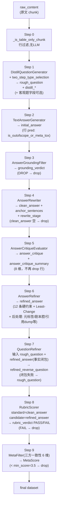

# TechDoc QA Pipeline V2 — 流程与提示词手册

> 基于 [`TechDocQAPipelineV2`](./test_filter.py) 的数据生成链路：**Step 0 无 LLM**（过滤纯表格 chunk），**Step 1–9 为显式打印的业务步骤**；其间的**读盘 / 写盘 / `storage.step()`** 会额外推进 `FileStorage.operator_step`，故落盘文件名 `qa_pipeline_v2_step_step{N}.json` 中的 **`N` 与打印的「V2 Step K」不对齐**——以 `cache_local_qa` 目录下实际文件为准。
>
> **Round 5（约 2026-05）**：Step 1 启用**两步题型选择**（`TextContentTypeAnalyzerPrompt` → 带 `allowed_types` 的蒸馏）；轴 B 扩展 **FillBlank / MultipleChoice**；`DistillQuestionGeneratorPrompt` 内置**截断后的种子示例**与**防复制示例实体**的隔离规则；`QuestionRefiner` 可对照 **`refined_answer`** 做事实闭包；`AnswerRefiner` 的 `fact_closure` 含**相对原文 `raw_content` 的长度兜底**；**Rubric** 侧题型键仍为中文枚举，与蒸馏轴 B 英文标签**未做自动映射**（见 [Step 8](#step-8--rubric-评分)）。
>
> **QA 对导出**：由宽表 JSON 生成的精简两列文件见 [`cache_local_qa/qa_pipeline_v2_step_step15_qa_pairs.json`](./cache_local_qa/qa_pipeline_v2_step_step15_qa_pairs.json) 与 [`.jsonl`](./cache_local_qa/qa_pipeline_v2_step_step15_qa_pairs.jsonl)（`question` + `answer`，并可带 `id`/题型/Meta 等元数据）。

## 目录

- [整体流程](#整体流程)
- [Step 0 — 纯表格 chunk 预过滤（无 LLM）](#step-0--纯表格-chunk-预过滤无-llm)
- [Step 1 — 蒸馏出题 (rough_question)](#step-1--蒸馏出题-rough_question)
- [Step 2 — 初始答案 (initial_answer) + 行级过滤](#step-2--初始答案-initial_answer--行级过滤)
- [Step 3 — 答案溯源判定 (grounding)](#step-3--答案溯源判定-grounding)
- [Step 4 — 答案改写 (clean_answer + anchor_sentences + rewrite_stage)](#step-4--答案改写-clean_answer--anchor_sentences--rewrite_stage)
- [Step 5 — 答案 critique](#step-5--答案-critique)
- [Step 6 — 答案精炼 (refined_answer)](#step-6--答案精炼-refined_answer)
- [Step 7 — 问题精炼 (refined_reverse_question)](#step-7--问题精炼-refined_reverse_question)
- [Step 8 — Rubric 评分](#step-8--rubric-评分)
- [Step 9 — Meta 三方一致性过滤](#step-9--meta-三方一致性过滤)
- [附录 A — pipeline 辅助工具](#附录-a--pipeline-辅助工具)
- [附录 B — 训练集污染治理（Round 4）](#附录-b--训练集污染治理round-4)
- [附录 C — Round 5 与 QA 导出](#附录-c--round-5-与-qa-导出)

---

## 整体流程



| Step | 算子 | 提示词类 / 片段 | 主要源码行号 |
|---|---|---|---|
| 0 | `_is_table_only_chunk`（无算子） | — | [`test_filter.py`](./test_filter.py) |
| 1 | `DistillQuestionGenerator`（可选 **`two_step_type_selection=True`**） | `TextContentTypeAnalyzerPrompt` + `DistillQuestionGeneratorPrompt`（`allowed_types`） | [`distill_question_generator.py`](../../DataFlow/dataflow/operators/text_sft/generate/distill_question_generator.py) + [`general_text.py`](../../DataFlow/dataflow/prompts/general_text.py)（`TextContentTypeAnalyzerPrompt` / `DistillQuestionGeneratorPrompt` 类定义处） |
| 2 | `TextAnswerGenerator` | `TextAnswerGeneratorPrompt` + `TECH_DOC_V2_ANSWER_PROMPT` | [`general_text.py`](../../DataFlow/dataflow/prompts/general_text.py) L1711 + [`test_filter.py`](./test_filter.py) L292 |
| 3 | `AnswerGroundingFilter` | `AnswerGroundingFilterPrompt` | [`tech_doc_qa.py`](../../DataFlow/dataflow/prompts/tech_doc_qa.py) L47 |
| 4 | `AnswerRewriter` | `AnswerRewriterPrompt` | [`tech_doc_qa.py`](../../DataFlow/dataflow/prompts/tech_doc_qa.py) L96 |
| 5 | `AnswerCritiqueEvaluator` | `AnswerCritiquePrompt`（§6 引用 `META_FORBIDDEN_ZH_CRITIQUE_BRIEF`） | [`general_text.py`](../../DataFlow/dataflow/prompts/general_text.py) L2203 |
| 6 | `AnswerRefiner` | `AnswerRefinePrompt`（§6 引用 `META_FORBIDDEN_ZH_REFINE_BLOCK`，`reuse_existing_critique=True`） | [`general_text.py`](../../DataFlow/dataflow/prompts/general_text.py) L2385 |
| 7 | `QuestionRefiner` | `QuestionCritiquePrompt` + `QuestionRefinePrompt` | [`general_text.py`](../../DataFlow/dataflow/prompts/general_text.py) L1798 / L1962 |
| 8 | `RubricScorer` | `RubricScorerPrompt` | [`tech_doc_qa.py`](../../DataFlow/dataflow/prompts/tech_doc_qa.py) L153 |
| 9 | `MetaFilter` + `MetaSampleEvaluator` | `MetaPrompt` + `tech_doc_qa_meta_dimensions` | [`general_text.py`](../../DataFlow/dataflow/prompts/general_text.py) L109 + [`test_filter.py`](./test_filter.py) L240 |

---

## Step 0 — 纯表格 chunk 预过滤（无 LLM）

- **入口**:[`TechDocQAPipelineV2.forward`](./test_filter.py) 首部，在 Step 1 蒸馏出题**之前**
- **作用**:跳过「纯表格 / 路径对照」类短文 chunk，减少对低价值题目的浪费；**不写入新列**，只对 `dataframe` 做行删减
- **输入列**:`text`（无则整块跳过过滤逻辑）
- **逻辑**[`_is_table_only_chunk`](./test_filter.py)：满足其一即视为表格 chunk（整行跳过）  
  - 含 `\t` 或 `</td>` 的「表格样」行占比 &gt; **60%** 且全文长度 &lt; **600**  
  - 或匹配 `[\w\\/._\-]+\s*\t\s*[^\n]+` 的「路径+描述」行占比 &gt; **70%**

---

## Step 1 — 蒸馏出题 (rough_question)

- **算子**:`DistillQuestionGenerator` — [`../../DataFlow/dataflow/operators/text_sft/generate/distill_question_generator.py`](../../DataFlow/dataflow/operators/text_sft/generate/distill_question_generator.py)
- **两步题型选择**（`TechDocQAPipelineV2` 中 `two_step_type_selection=True`）:
  1. **`TextContentTypeAnalyzerPrompt`**：对每个 `text` chunk 调用一次 LLM，解析 JSON `{"text_signals": [...], "suitable_types": [...]}`。
  2. **`DistillQuestionGeneratorPrompt.build_prompt(..., allowed_types=suitable_types)`**：仅允许在 `allowed_types`（交集轴 B 合法标签）内生成题目；若解析失败则退化为**不传 `allowed_types`**（行为与单步一致）。
- **提示词**:`DistillQuestionGeneratorPrompt` — [`general_text.py`](../../DataFlow/dataflow/prompts/general_text.py) 中类 `DistillQuestionGeneratorPrompt`；分析步为 `TextContentTypeAnalyzerPrompt`（同文件，紧邻蒸馏类）。
- **输入字段**:`text`(chunk 原文)
- **输出字段**:
  - **`rough_question`**、**`raw_content`**
  - **`distill_scenario`**（轴 A）、**`distill_question_type`**（轴 B 英文标签，如 `Diagnostic` / `FillBlank`）
  - 客观题（模型按格式输出时）: **`distill_blank_answer`**、**`distill_options`**（JSON 字符串）、**`distill_correct_answer`**
- **参数**:`current_tag="运维"`、`count=num_questions`(默认 4)

### 提示词要点（`DistillQuestionGeneratorPrompt`，完整实现见源码）

核心结构：**「运维过程 × 题型」双轴覆盖** + **种子示例（风格参考，禁止照搬实体）** + **占比契约** + **§9 溯源锚定**。

#### 问题实用性硬要求（须全部满足）

1. 必须来自真实运维 / 故障 / 调优 / 迁移等生产场景，不能是纯文档概念背诵
2. 必须从用户视角提问（遇到 X 现象 / 需要做 Y），禁止文档作者视角（"本节介绍…"）
3. 问题本身不得嵌入答案关键词、命令、参数值或结论（**FillBlank 除外**：可用 `___` 挖空；挖空处不得泄漏唯一答案词）
4. 必须有明确回答边界，禁止"请介绍 / 请总结 / 有哪些"等开口式无落点问法
5. **禁止索引型空问题**：除非参考上下文中已**显式列出**可数类别名称，否则不得生成"应重点确认哪两类/哪几项"类问题

#### 轴 A — 运维过程场景（每题必须先选定 1 类，整批至少覆盖 4 类）

| 场景 | 说明 |
|---|---|
| Incident | 线上服务中断、宕机、连接失败、慢骤增等一线告警场景 |
| Problem | 反复发生的类故障、慢性症状、需要根因分析的长期问题 |
| Change | 升级、打补丁、参数调整、结构变更、迁移等计划性变动 |
| Configuration | 参数、初始化项、实例属性、路径与资源清单的维护 |
| Release | 新版本、脚本化部署、对象发布、蓝绿/灰度推送 |
| Capacity | 存储、表空间、连接数、IO/CPU 容量评估与扩缩 |
| Availability | 主备、集群、故障切换、读写分离、RPO/RTO 达成 |
| Continuity | 备份恢复、异地容灾、闪回、演练与恢复验证 |
| Security | 权限、加密、审计、最小权限、合规标准落地 |
| DevOpsSRE | CI/CD、IaC、SLI/SLO、自动化运维与自愈 |

**强制下限**：Incident / Problem / Change / Availability 四类合计占比 ≥ 50%；`count ≥ 3` 时至少覆盖 4 个不同场景轴。

#### 轴 B — 题型标签（轴 B；含客观题）

蒸馏与 Rubric **使用不同命名体系**：此处为 **轴 B 英文标签**（写入 `distill_question_type`）。除下列外，另含 **Comparison** 等（以 `DistillQuestionGeneratorPrompt` 源码枚举为准）。

| 题型 | 合格要求（摘要） |
|---|---|
| Factoid | 必须绑定现象/决策点/版本约束；禁止裸的"X 的定义是什么" |
| Diagnostic | 给出现象 + 日志/指标/告警线索，问原因或"先查什么" |
| Procedural | 带可验收目标（切换成功标志、备份成功标志等） |
| RootCause | 针对类故障模式，问机制层根因与验证思路 |
| BestPractice | 题干必须含显式约束（维护窗口/RPO-RTO/版本/数据量级） |
| ConfigExample | 问"依据本场景应修改哪些参数/配置项，前后如何检查"，题干不写死目标值 |
| ScriptCommand | 问"给出可复用的脚本/命令骨架以完成 X"，敏感信息用占位符 |
| FaultReproFix | 必须含"在测试/预发/演练环境中"限定词，禁止生产环境破坏性动作 |
| ComplianceSecurity | 围绕权限、加密、审计、最小权限，必须与 context 中安全段落绑定 |
| **FillBlank** | 从 context 抽取**唯一可验证**事实挖空（`___`）；须输出 **`blank_answer`**（多处以 `；` 分隔） |
| **MultipleChoice** | 1 正确 + 3 合理干扰项；须输出 **`options`**（4 条 `"A. ..."` 形式）与 **`correct_answer`**（`A`–`D`） |

#### Seed Examples（内置 `_SEED_EXAMPLES`）

- **用途**：仅作风/结构参考；提示词中含 **「勿复制示例中的实体、数值、路径、错误码」** 及 **Constraints §9 种子隔离规则**（示例中出现的具体告警/参数若未出现在当前 Reference Context，禁止写入题干）。
- **控长**：展示用种子在构建 prompt 时 **按题型最多 1 条**，且题干示例 **截断**（客观题保留完整答案字段），以降低输入 token。

#### 占比契约（`count` 条总量计算）

- 核心排障/变更（Diagnostic + Procedural + RootCause）合计 ≥ 50%；`count ≥ 3` 时三者各至少 1 条
- 事实与配置（Factoid + ConfigExample）合计 ≤ 35%；Factoid 单独 ≤ 20%
- BestPractice ≤ 25%，且每条必须含显式约束从句
- FaultReproFix ≤ 15%，一律测试/演练语境
- ScriptCommand：context 中出现代码块/命令行/参数表时 ≥ 1 条，否则不强制
- ComplianceSecurity：context 中出现"加密/权限/审计/合规/TDE/SSL/角色"等关键词时 ≥ 1 条
- **FillBlank + MultipleChoice 合计 ≤ 30%**；**FillBlank ≤ 20%**；**MultipleChoice ≤ 15%**
- 同一场景轴 + 同一题型组合不得出现 3 条以上

#### §9 溯源锚定（最高优先级约束）

- 问题所有限定条件（实体名/参数/文件名/数值/版本号/场景现象）**必须全部出现在 Reference Context 中**，不得引入 chunk 未提及的外部知识
- 禁止在问题里写入占位式具体值示例（如 `event="vote_timeout" AND node_id="0x1234"`），任何带引号/反引号的具体值必须是从 context 原文摘录的
- 自检：把生成的问题给"只能看当前 Reference Context"的人，他能否直接得出结论？若否，该问题越界，**必须丢弃或重写**

#### 输出 JSON 格式（数组元素字段）

每条至少含 `scenario`、`question_type`、`question`；客观题额外字段见轴 B 表。

```json
[
  {
    "scenario": "Incident",
    "question_type": "Diagnostic",
    "question": "如果某节点磁盘IO带宽占用率超过95%..."
  },
  {
    "scenario": "Configuration",
    "question_type": "FillBlank",
    "question": "ALM-5014384 告警触发条件中，ntpq 查询失败或延迟超过 ___ 时上报。",
    "blank_answer": "1000ms"
  },
  {
    "scenario": "Incident",
    "question_type": "MultipleChoice",
    "question": "...",
    "options": ["A. ...", "B. ...", "C. ...", "D. ..."],
    "correct_answer": "B"
  }
]
```

> `scenario` → `distill_scenario`；`question_type` → `distill_question_type`；`question` → `rough_question`；客观题字段 → `distill_blank_answer` / `distill_options`(JSON 串) / `distill_correct_answer`。

---

## Step 2 — 初始答案 (initial_answer) + 行级过滤

- **算子**:`TextAnswerGenerator` — [`../../DataFlow/dataflow/operators/text_sft/generate/text_answer_generator.py`](../../DataFlow/dataflow/operators/text_sft/generate/text_answer_generator.py)
- **提示词**:`TextAnswerGeneratorPrompt.build_prompt(text, question)` — [`general_text.py`](../../DataFlow/dataflow/prompts/general_text.py) 约 L1711；`custom_prompt=TECH_DOC_V2_ANSWER_PROMPT` 定义在 **`test_filter.py`**（与同文件 `TechDocQAPipelineV2` 共用，非 `tech_doc_qa.py`）
- **输入字段**:`rough_question`(问题)、`raw_content`(原文)
- **输出字段**:`instruction`(=rough_question)、`initial_answer`
- **模板内硬约束**：在 `Constraints` 中除语言一致外，另含 **§5「禁止元信息开篇」** 与 **§6「枚举题禁止反向表述」**（与 Round4 对齐，详见下方摘录）
- **行级过滤**（Step 2 之后、`storage.step()`）:谓词 **`_initial_answer_valid`** ↔ `NOT is_outofscope_or_meta_tox(initial_answer)`。即：**`OUTOFSCOPE`** 令牌，或以元信息托词开头且短文（与 [`meta_label_filters.is_outofscope_or_meta_tox`](../../DataFlow/dataflow/utils/meta_label_filters.py) 同源）一律 drop，**早于** grounding LLM。

### `TextAnswerGeneratorPrompt`（Constraints 与源码一致，`build_prompt`）

```text
## Constraints:
1. The answer must be based on the given content.
2. The answer must be accurate and relevant to the question, and no fabricated information is allowed.
3. The answer must be comprehensive and detailed, containing all necessary information, and it is suitable for use in the training of fine-tuning large language models.
4. **CRITICAL: The answer MUST be in the SAME LANGUAGE as the reference content and question.** If the content is in Chinese, answer in Chinese. If the content is in English, answer in English. Do not translate or switch languages.
5. **No meta-info preamble (硬性约束)**: The answer MUST NOT begin with or contain meta-reference phrases such as "参考"、"参考文档"、"参考资料"、"根据参考内容"、"参考内容明确指出"、"原文指出"、"根据文档"、"根据提供的信息"、"在步骤X"、"根据流程图"、"根据表格" etc. State the facts directly. For example, instead of "根据参考文档指出，A 是 B", write "A 是 B". Never use words like "参考", "文档", "资料", "原文" to indicate the source of information.
6. **Reverse phrasing forbidden**: For enumeration-style questions (e.g., "需要填哪些参数 / 包含哪些字段 / 记录哪些信息"), use a direct enumeration ("需要填写的参数包括：XX、YY、ZZ"); do NOT use reverse phrasings like "应检查并重新确认 XX 是否正确" / "应关注 XX" / "需要注意 XX".
7. **Maintain Operational Value**: For questions about troubleshooting, configuration, or best practices, prioritize extracting actionable steps, exact parameters, and clear diagnostic criteria over generic theoretical descriptions.{template_section}{output_format_section}
```
（`TECH_DOC_V2_ANSWER_PROMPT` 通过 `template_section = f"\n4. {self.custom_prompt}"` **接在 `Constraints` 第 6 条之后**，以 `4.` 编号再次列出中文「严格要求」1–5 条；编号与上方 1–6 并列属模板历史形态，执行时以 [`general_text.py`](../../DataFlow/dataflow/prompts/general_text.py) `TextAnswerGeneratorPrompt.build_prompt` 为准。）

### `TECH_DOC_V2_ANSWER_PROMPT`（`test_filter.py` 内）

```text
严格要求：
1. 只使用参考内容中明确存在的信息作答
2. 不得添加参考内容中没有的任何具体信息
3. 不得出现"参考内容未提供"/"无法回答"/"文档未提及"等声明
4. 如果问题超出参考内容范围，仅输出 OUTOFSCOPE 四个大写字母（不要其它文字）
```

---

## Step 3 — 答案溯源判定 (grounding)

- **算子**:`AnswerGroundingFilter` — [`finetune/DataFlow/dataflow/operators/text_sft/tech_doc/answer_grounding_filter.py`](../../DataFlow/dataflow/operators/text_sft/tech_doc/answer_grounding_filter.py)
- **提示词**:`AnswerGroundingFilterPrompt.build_prompt(context, question, answer)` — [`tech_doc_qa.py`](../../DataFlow/dataflow/prompts/tech_doc_qa.py) L47
- **输入字段**:`raw_content`、`rough_question`、`initial_answer`
- **输出字段**:`grounding_verdict`(KEEP/REWRITE/DROP)、`grounding_result`(dict 含 problematic_parts、groundable_parts、original_evidence)
- **过滤**:`grounding_verdict == "DROP"` 的行 drop

### 提示词原文

```text
你是一个严格的技术文档QA质量审核专家。

请判断以下「答案」是否真正来自「参考原文」，并给出处理建议。

## 参考原文：
{context}

## 问题：
{question}

## 待审核答案：
{answer}

---

## 审核标准：

### 直接判 DROP（丢弃）：
- 答案出现："参考内容未提供"、"无法根据本文档回答"、
  "缺乏规范依据"、"原文未提及"、"无法确定"等表述
- 答案核心事实与原文明确矛盾
- 答案引入了原文完全不存在的概念作为核心答案

### 判 REWRITE（需要改写）：
- 答案方向正确，但加入了原文不支持的具体细节
- 答案在原文基础上过度扩写
- 答案结构混乱但原文中有对应内容

### 判 KEEP（保留）：
- 答案内容可以在原文中找到明确对应
- 没有添加原文不存在的信息
- 简洁准确，与原文高度一致

## 输出格式（严格JSON）：
{{
  "verdict": "KEEP / REWRITE / DROP",
  "reason": "一句话说明判断原因",
  "problematic_parts": ["有问题的片段1", "片段2"],
  "groundable_parts": ["有原文支撑的部分"],
  "original_evidence": "原文中对应的句子（逐字引用，若无则null）"
}}
```

---

## Step 4 — 答案改写 (clean_answer + anchor_sentences + rewrite_stage)

- **算子**:`AnswerRewriter` — [`finetune/DataFlow/dataflow/operators/text_sft/tech_doc/answer_rewriter.py`](../../DataFlow/dataflow/operators/text_sft/tech_doc/answer_rewriter.py)
- **提示词**:`AnswerRewriterPrompt.build_prompt(context, question, answer, grounding_result)` — [`tech_doc_qa.py`](../../DataFlow/dataflow/prompts/tech_doc_qa.py) 约 L96
- **输入字段**:`raw_content`、`rough_question`、`initial_answer`、`grounding_result`、`grounding_verdict`
- **输出字段**:
  - **`clean_answer`**：KEEP 时沿用 `initial_answer`；REWRITE 时取模型 JSON 的 `rewritten_answer`；DROP 或 **OUTOFSCOPE / 元信息托词**（[`is_outofscope_or_meta_tox`](../../DataFlow/dataflow/utils/meta_label_filters.py)）→ 空
  - **`anchor_sentences`**：列表，来自 grounding evidence 或改写 JSON
  - **`rewrite_stage`**：每行 `KEEP` / `REWRITE` / **`DROP`** —— **与 `grounding_verdict` 分列**，不写回同名列（默认 `output_stage_key="rewrite_stage"`），便于审计 rewriter 相对 grounding 的兜底 DROP
- **过滤**：`clean_answer` 为空的行 drop

### 提示词原文

```text
你是一个技术文档答案改写专家。

任务：将以下答案改写为严格基于原文的版本。

## 参考原文：
{context}

## 问题：
{question}

## 原始答案：
{answer}

## 审核发现的问题：
- 有问题的部分：{gr.get("problematic_parts", [])}
- 原文中有支撑的部分：{gr.get("groundable_parts", [])}
- 原文对应证据：{gr.get("original_evidence", "")}

## 改写规则：

**必须做到：**
1. 每一句话都必须能在原文中找到直接依据
2. 用原文的表述方式，可适当精简，不能改变意思
3. 答案不超过原文对应内容的1.5倍长度

**绝对禁止：**
1. 禁止出现："参考内容未提供"、"无法根据文档回答"等边界声明
2. 禁止添加原文中没有的具体数字、命令、步骤
3. 禁止基于"常识"或"行业经验"补充信息

**特殊情况：**
- 原文完全找不到对应内容 → verdict: "DROP"，不改写
- 原文只有部分答案 → 只回答有依据的部分，其余不提

## 输出格式（严格JSON）：
{{
  "verdict": "REWRITTEN / DROP",
  "rewritten_answer": "改写后的答案（DROP时为null）",
  "anchor_sentences": ["原文支撑句1（逐字引用）", "句子2"],
  "dropped_content": "删除了什么内容及原因"
}}
```

---

## Step 5 — 答案 critique

- **算子**:`AnswerCritiqueEvaluator` — [`finetune/DataFlow/dataflow/operators/text_sft/tech_doc/answer_critique_evaluator.py`](../../DataFlow/dataflow/operators/text_sft/tech_doc/answer_critique_evaluator.py)
- **提示词**:`AnswerCritiquePrompt.build_prompt(context, question, answer)` — [`general_text.py`](../../DataFlow/dataflow/prompts/general_text.py) 约 L2203
- **输入字段**:`raw_content`、`rough_question`、`clean_answer`
- **输出字段**:`answer_critique`、`answer_critique_summary`（含 `dimensions`/`failed_dimensions`/`issue_count`/`overall_assessment`/`needs_improvement`/`force_rewrite`/`suggestion`）
- **说明**：Step 5 后**不再 drop** 行；`answer_critique_force_rewrite` 仅影响 Step 6 行为，`_answer_critique_repairable` 行过滤谓词已移除。

### 提示词全文（`AnswerCritiquePrompt`，共 8 个评估维度）

```text
你是一个专业的答案质量评估专家，专注于评估面向运维人员的技术问答数据质量。
请根据以下参考上下文、问题和生成的答案，从8个维度对答案进行批评和评估。

## 评估维度

### 1. 完整性（Completeness）
检查答案是否包含了原文中的所有关键步骤/要点：
- ❌ 不完整：原文有10个处理步骤，但答案只提到1-2个
- ❌ 遗漏关键信息：缺少重要的前置条件、注意事项或后续步骤
- ✅ 完整：包含了原文中与问题相关的所有关键信息

### 2. 准确性（Accuracy）
检查答案内容是否正确：
- ❌ 事实错误：答案中的信息与原文不符
- ❌ 编造固定值：给出原文没有的固定端口号、固定挂载点等
- ❌ Shell/命令扩写编造：参考答案仅含一条简单命令或简短说明，答案却写出多行
  for/while、awk、grep -E 等组合脚本且原文无此类结构——判不准确
- ❌ 有乱码或格式错误
- ✅ 准确：答案内容与原文一致，无事实性错误

### 3. 针对性（Relevance）
检查答案是否直接回答了问题：
- ❌ 答非所问：问原因但答处理方法，或反之
- ❌ 整段抄原文（answer-as-quote）：把参考上下文中与问题仅弱相关的大段原文逐条
  列出，却不先给出针对问题的结论——判「针对性弱」
- ❌ 问防/问禁却答违规清单或答反：问「应做何种防护」却答「当前流程中可能存在的
  违规点」；问「应避免哪项操作」却用「✅ 优先操作：…」或只写「应优先…」——须
  改为与问题极性一致的直接答案
- ❌ 评判/排序语言泄漏：使用「最可能」「应优先检查以下」「当前维护流程中可能存在
  以下违反…」等出题或评估口吻——须改写为直白陈述
- ❌ 脱离运维实操：针对 Incident 排障、Change 变更等场景，答案停留在系统理论解释
- ❌ 场景推断溢出：纯事实/枚举型查询，但答案末尾追加自行扩写的因果推断 / 影响分
  析 / 后续风险判断段——须删除该推断段
- ❌ 答案不可脱离上下文独立成立：仅同义空话、未给出可核验条目
- ❌ 演练剧本灌水：问题仅问访问地址或下载路径，答案却写成多角色长篇演练对白
- ✅ 针对性强：直接回答问题，与问题焦点一致，不夹带未询问的推断

### 4. 结构清晰度（Structure）
检查答案的格式和可读性：
- ❌ 格式混乱：全部堆在一段，没有分点分段
- ❌ 逻辑不清：答案缺乏层次，难以理解
- ✅ 结构清晰：分点/分段，有条理，易于阅读

### 5. 原文支撑（Source Fidelity）
检查答案是否基于原文：
- ❌ 无原文支撑：答案内容在原文中找不到依据
- ❌ 模型编造：答案是模型自己的能力输出，非原文提供
- ❌ 超出原文范围：回答了原文没有涉及的内容
- ❌ 复杂 shell 仅出现在答案中：参考答案无 awk/grep -E/多行 for …; do，答案却出现
  ——高度疑似编造，判无支撑
- ✅ 有支撑：答案的每个要点都能在原文中找到依据

### 6. 元信息检查（Meta-info Avoidance）
答案中不得用「引用文档/章节/步骤/行号/图表/资料/信息」的方式交代出处（含：步骤编号、
章节与小节、代码行号、流程图/表格指称，以及「根据参考内容」「原文指出」「参考文档」
「参考资料」「根据告警参数」「如上所述」等套话）。应直接陈述事实。若出现任一类套话或
结构位点引用，判「不通过」。
- ❌ 装饰性栏目与 emoji 标签：行首 ✅/⚠️ 加「优先操作 / 验证方法 / 局限说明」等
  伪 UI 标签——判不通过，REWRITE 时删除装饰符，改为纯文本分点

### 7. 可操作性硬门槛（Executability Gate）
适用：诊断排查 / 报错处理 / 高可用应急 / 性能调优类问题。
以下两项必须同时满足，任意失败即判"不通过"并要求 REWRITE：
- has_executable_step：答案中至少包含一条可直接执行的命令、SQL、系统视图查询、
  配置项修改或检查动作
- step_is_complete：上述命令/步骤必须具备直接落地的完整度，值班人员可以复制即用
但本门槛不得诱导编造：
- 若参考上下文没有提供任何命令、路径、SQL、配置项、系统视图或可执行检查动作，
  不得自行发明——这种情况应在 Source Fidelity / Relevance 中说明"当前材料不足以
  支撑该操作型问题"，建议改为参考上下文能够支撑的最小答案
以下两类问题本条不适用（N/A）：
  (a) 纯知识记忆型：仅问定义 / 参数名 / 默认值 / 概念边界
  (b) 机制-决策-合规型：RootCause / BestPractice / ComplianceSecurity / 差异对比结论等

### 8. 结构压缩约束（Structure Compression）
以下任一命中即判"不通过"：
- ❌ 出现三级及以上嵌套（同时使用小标题 + 编号 + 子项缩进 + 二级无序列表）
- ❌ 同一条答案混用多种主组织形式（短段落、编号步骤、无序列表三选一，不得混用）
- ❌ 出现与问题无关的铺垫段、总结段或礼貌语
- （**不设固定字数上限**；以关键信息是否必要呈现为准，与源码 `AnswerCritiquePrompt` 中 Structure Check2 说明一致）

## 参考上下文
{context}

## 用户问题
{question}

## 待评估的答案
{answer}

## 输出格式要求
[Critique Start]

[Completeness Check Start]
评分：完整/不完整
说明：（评估答案是否包含所有关键信息）
[Completeness Check End]

[Accuracy Check Start]
评分：准确/不准确
说明：（评估答案是否有事实性错误或编造内容）
[Accuracy Check End]

[Relevance Check Start]
评分：针对性强/针对性弱
说明：（评估答案是否直接回答问题）
[Relevance Check End]

[Structure Check Start]
评分：清晰/不清晰
说明：（评估答案格式和可读性）
[Structure Check End]

[Source Fidelity Check Start]
评分：有支撑/无支撑
说明：（评估答案是否基于原文）
[Source Fidelity Check End]

[Meta Info Check Start]
评分：通过/不通过
说明：（如有元信息引用，请具体指出）
[Meta Info Check End]

[Executability Check Start]
适用性：适用/不适用
has_executable_step：通过/不通过
step_is_complete：通过/不通过
说明：（指出是否给出可直接复制执行的命令/SQL/检查动作，步骤是否完整闭合）
[Executability Check End]

[Structure Check2 Start]
评分：通过/不通过
说明：（检查是否出现三级嵌套、多种主组织形式混用、与问题无关的铺垫段/总结段/礼貌语；**不设固定字数上限**，以原文支撑的关键信息是否完整呈现为准）
[Structure Check2 End]

[Overall Assessment Start]
总体评估：需要改进/无需改进
问题数量：（指出有几个维度不通过）
强制重写（Force Rewrite）：是/否（当问题属于诊断排查/报错处理/高可用应急/性能调优类，
且 Executability 或 Structure Check2 任一为"不通过"时，必须填"是"）
[Overall Assessment End]

[Suggestion Start]
如需改进，请给出具体的改进建议，说明应该如何修改答案。
要求：建议本身也必须有原文支撑，不得给出参考上下文没有出现的命令、路径、字段、阈值、
目录结构、验证方法示例；如果某条要求受原文限制无法完全满足，请明确指出可安全执行的
删改动作（例如删除无支撑断言、删除文档坐标、改成"当前材料仅能确认……"），不要编造示例。
[Suggestion End]

[Critique End]
```

---

## Step 6 — 答案精炼 (refined_answer)

- **算子**:`AnswerRefiner` — [`../../DataFlow/dataflow/operators/text_sft/refine/answer_refiner.py`](../../DataFlow/dataflow/operators/text_sft/refine/answer_refiner.py)
- **后处理**(LLM 输出解析为 `extracted` 之后，顺序执行 — 以 [`answer_refiner.py`](../../DataFlow/dataflow/operators/text_sft/refine/answer_refiner.py) `generate_refined_answer` 为准):
  1. **`_enforce_fact_closure(extracted, clean_answer, critique, context)`**：含 **相对 `raw_content` 超长回退**（默认 &gt; **1.5×** 正文）、空答案回退、critique 触发的删减式修复分支
  2. `_scrub_meta_labels`（过短且无删减豁免时回退 `clean_answer`）
  3. `has_reverse_phrasing` → 仅 **WARNING**（**不退回**）
  4. `strip_training_decorators`
  5. `looks_like_fabricated_shell_block` → 回退 **`clean_answer`**
  6. `looks_like_answer_as_quote` → **WARNING**（不退回）
  7. `detect_evaluator_tone` → `strip_evaluator_tone`
  8. `detect_question_answer_polarity_issue` → **WARNING**
- **提示词**:先复用 Step 5 的 `answer_critique`（`reuse_existing_critique=True`），再 `AnswerRefinePrompt.build_prompt(context, question, answer, critique)` — [`general_text.py`](../../DataFlow/dataflow/prompts/general_text.py) 约 **L2385**
- **输入字段**:`raw_content`、`rough_question`、`clean_answer`（prompt 内标签为「**参考答案**」）、`answer_critique`
- **输出字段**:`refined_answer`
- **参数**:`reuse_existing_critique=True`（默认，与 `test_filter.py` 调用一致）

### `_critique_allows_subtractive_repair(critique)`
检测 critique 文本是否明确指出"无支撑 / 删除 / 元信息 / 越界"等字样，允许后续精炼以字符面重合低为代价完成删减。

### `_enforce_fact_closure`（含删减式修复例外）
- **原文长度兜底**：设 `context` 为 `raw_content`，若 `len(refined) > max_context_ratio * len(context)`（默认 `max_context_ratio=1.5`），回退到 **anchor**（`clean_answer`）。
- **删减式修复例外**：若 `_critique_allows_subtractive_repair == True` 且精炼结果满足源码中的长度上界，可保留精炼结果（见 `answer_refiner.py` 内注释与实现）。

### `scrub_stats` 计数器
| key | 含义 |
|---|---|
| `oversize` | 相对 **原文 context** 超长触发回退的次数 |
| `quote_dump_warn` | `looks_like_answer_as_quote` 告警次数 |
| `polarity_warn` | `detect_question_answer_polarity_issue` 告警次数 |
| `evaluator_tone_warn` | `detect_evaluator_tone` 相关计数（与 strip 配合） |

### `AnswerRefinePrompt` 完整提示词（约 L2385，与源码一致）

```text
你是一个专业的答案优化专家，专注于优化面向运维人员的技术问答数据。
请根据批评反馈和以下原则改进答案质量。

## 第一优先级：参考答案封闭约束（最高优先级，与任何其他原则冲突时本条优先）

本阶段接收到的「参考答案」已经过严格的原文溯源校验，是唯一被许可的事实来源。你的改写必须满足：
1. refined_answer 的信息集（命名实体、参数值、命令、步骤、阈值、验证方法、机制解释、因果链条、
   范围限定）必须是参考答案信息集的子集或同义改写
2. 不得从「参考上下文」中新增参考答案没有提到的内容。参考上下文仅用于术语消歧、原文风格对齐，
   不是信息来源
3. 不得基于常识、经验、行业最佳实践自行补充命令、数值、步骤、机制解释、验证方案、根因分析
4. 若参考答案只是一句事实陈述（例如"设备上有 X 标识，提示 Y"），必须保持为事实陈述形式，
   不得扩写成机制分析 / 验证方案 / 根因分析 / 多步操作指南
5. 允许的改写动作仅限：重组结构、分点排版、合并同义句、删除冗余、纠正错别字、
   替换元信息引用、做轻度语言润色
6. 禁止"整段换皮重写"：不得把参考答案整段替换成"同义"的新表述，尤其不得把短事实陈述
   重写成长篇解释段落
7. 删减式修复例外：当批评反馈明确指出参考答案中存在「无原文支撑 / 元信息引用 / 答非所问 /
   问题要求超出材料」时，允许删除这些有问题的句子或收缩成更保守的表述；这种情况下不要求
   保留多数原文字面，但仍然不得新增参考答案或参考上下文都没有的信息

## 最小代价原则（Least-Change Principle）

优先选择"对参考答案做最小修改"——只在有明确语法/排版/元信息问题时才改动。如果参考答案
本身已经干净、对齐问题、可读，refined_answer 应该与参考答案几乎一致（仅排版差异），不必
为了"优化"而重写。

## 第二优先级：批评反馈对齐（次优先级，以不违反第一优先级为前提）

必须逐项读取 Completeness / Accuracy / Relevance / Source Fidelity / Meta Info /
Executability / Structure 等失败维度，把其中可安全执行的要求转化为改写动作：
- 对"无支撑 / 模型编造 / 原文未提供"的内容：删除或改成当前材料能确认的最小事实
- 对"元信息引用"：删除文档页码、章节、步骤等出处坐标
- 对"答非所问"：先回答问题能被参考答案支撑的部分；不能回答的部分不要硬补
- 对"缺少命令 / 验证步骤"：只有参考答案或参考上下文已提供时才补；否则不要编造

当批评反馈的某条建议会导致引入参考答案之外的内容时：
- 必须拒绝该条建议，在 Analysis 段落里注明 "该建议会突破第一优先级封闭约束，忽略"
- 仍要执行该建议中不引入新事实的部分（例如删除无支撑断言、删除元信息、把答案收缩为
  "当前材料仅能确认 X，未提供 Y"）

## 改进原则（以下所有原则都受第一优先级约束）

### 1. 确保完整性（仅在参考答案内补齐）
仅在参考答案已经提到但被漏写的要点上做补齐，不得以"完整性"之名从原文或常识引入新要点

### 2. 保证准确性
核对答案中的信息是否与参考答案一致；删除任何编造的固定值；修正错别字、乱码、格式错误

### 3. 提高针对性
确保答案紧扣参考答案所支持的信息去回应问题；若问题粒度超出参考答案支撑范围，保持参考
答案粒度作答，不得为了对齐问题而编造

### 4. 优化结构
将长段落拆分为分点或分步骤；使用编号列表使步骤更清晰；保持逻辑层次，但不超过两级嵌套

### 5. 忠于参考答案（等价于第一优先级）
只使用参考答案里已有的信息；如果参考答案信息不足以回答问题，宁可不完整，也不得编造

### 6. 去除元信息引用（强制禁词清单）
必须删除并改写为直接陈述的元信息短语（regex 级别覆盖以下所有变体）：
- 引用参考内容的：`根据参考内容` / `根据参考` / `参考内容明确指出` / `参考内容要求` /
  `参考内容显示` / `参考文档` / `参考资料` / `参考信息` / `参考文件`
- 引用原文的：`原文指出` / `原文明确指出` / `原文要求` / `原文提到` / `原文中` /
  `根据原文` / `按照原文`
- 引用文档的：`根据文档` / `文档中` / `根据提供的参考` / `根据给定的参考内容` /
  `根据提供的信息` / `根据给定的文档`
- 引用结构位点的：`在步骤X` / `根据步骤` / `按照步骤` / `根据流程图` / `根据表格` /
  `在第X章` / `在第X节` / `第X行` / `上述` / `以下` / `如上文所述`
正确做法：把"根据参考文档指出 A 是 B"或"原文指出 A 是 B"改写为直接陈述"A 是 B"

### 7. 可操作性（软要求，受第一优先级约束）
若参考答案包含命令/SQL/系统视图查询/参数值/检查动作，精炼时保持这些信息完整；
若参考答案没有任何可执行内容，不得补命令，即使问题属于诊断/报错/应急/调优类

### 8. 结构压缩约束
- 禁止三级及以上嵌套
- 单条答案只允许一种主组织形式：短段落、编号步骤、无序列表三选一，不得混用
- 删除与问题无关的铺垫段、总结段、礼貌语和冗余背景介绍
- ❌ 禁止保留问题未要求的场景推断段：若 refined_answer 包含问题未询问的因果推断 /
  影响分析 / 后续风险判断段落，必须删除

### 9. 反向表述规范
- 枚举型问题（"需要填哪些参数/包含哪些字段"），refined_answer 必须采用直接陈述语气
- ❌ 禁止反向表述：应检查并重新确认 XX 是否正确 / 应关注 XX / 需要注意 XX / 建议核对 XX
- ✅ 要求直接陈述：需要填写的参数包括：XX、YY、ZZ

### 10. 输出禁内部标签词
严禁在 [Improved Answer Start]/[End] 区块内出现：
事实锚 / 事实锚答案 / 事实基准 / Fact Baseline / Target Answer / 精炼答案 /
事实集封闭 / Fact-Set Closure / 参考答案 / 可用信息集 / 批评反馈 / Critique / OUTOFSCOPE

### 11. 直接应答与问答极性对齐
- 禁止 answer-as-quote：必须先用一两句直接回应问题（结论/步骤/判断），再仅在必要时
  引用原文要点，且不得抄与问题无关的禁令或背景
- 问什么答什么：问「分别应执行什么防护」→ 答具体防护动作，不得改写成「可能存在哪些违规」
- 极性一致：问「应避免/禁止/切勿」时，不得只答「优先操作…」或「应优先…」而不提禁止项
- 禁评估腔：禁止使用「最可能」「应优先检查以下…」「当前维护流程中可能存在以下违反…」
- 禁剧本灌水：问地址/路径/下载入口时，只输出事实信息
- 禁装饰符与伪栏目：不得出现行首 ✅/⚠️ 以及「优先操作：」「验证方法：」「局限说明：」等
- 禁扩写 shell：参考答案仅为单行或简短命令时，不得改写成含 for/while、awk、grep -E 的多行脚本

## 参考上下文（仅供术语消歧和风格对齐，不是信息来源）
{context}

## 用户问题
{question}

## 参考答案（唯一信息来源，以下内容之外的事实一律不得写入 refined_answer）
{answer}

## 批评反馈（次优先级；与第一优先级封闭约束冲突的建议一律忽略）
{critique}

## 输出格式要求
[Analysis Start]
简要分析原答案的主要问题（1-2句话）。
若批评反馈中有建议会突破第一优先级封闭约束，请在这里点名拒绝并说明原因。
[Analysis End]

[Improved Answer Start]
你改进后的答案
[Improved Answer End]

硬性约束（违反任意一条视为本次改写不合格）：
1. 改进后的答案必须与原答案使用相同的语言
2. refined_answer 的信息集必须 ⊆ 参考答案的信息集，不得从参考上下文或常识引入新内容
3. 只允许一种主组织形式（短段落 / 编号步骤 / 无序列表），且不得出现三级及以上嵌套
4. 参考答案是简短事实陈述时，refined_answer 必须保持事实陈述形式，不得扩写
5. 未在参考答案中出现的命令、SQL、阈值、参数值、验证方法一律不得写入
6. 不得保留问题未要求的场景推断 / 影响分析 / 后续风险判断段落
7. 不得在输出中出现内部标签词（事实锚 / Target Answer / 参考答案 / 可用信息集 /
   批评反馈 / Critique / OUTOFSCOPE 等）
8. 不得以"参考 / 参考文档 / 根据参考内容 / 原文指出 / 上述信息"等元信息短语开头或
   穿插，必须直接陈述事实
9. 不得使用行首 emoji 装饰符（✅⚠️ 等）或「优先操作：/ 验证方法：」等伪栏目式标签行
10. 问题问「避免/禁止」时，答案不得仅用「优先/应首先」作答而不体现禁止对象；
    问题问「能否」时须先给出可否判断
11. 不得引入参考答案中未出现的多行 shell 结构（含 for/while、awk、grep -E 等）
12. 当批评反馈已指出答案中某些内容无支撑或属于元信息，必须删除/收缩这些内容；
    不要为了满足字符面重合而保留已被批评为错误的句子
```

---

## （历史）`ReverseQuestionBuilderFromAnswer`

> **`ReverseQuestionBuilderFromAnswer` 已从 `TechDocQAPipelineV2` 移除。** 场景继承与溯源约束现由 **Step 1 `DistillQuestionGeneratorPrompt`** 与 **Step 7 `QuestionRefiner` / `QuestionRefinePrompt`（§12 场景框架）** 承担。仓库中仍可查阅算子 [`reverse_question_builder.py`](../../DataFlow/dataflow/operators/text_sft/tech_doc/reverse_question_builder.py) 与提示词 `ReverseQuestionBuilderFromAnswerPrompt`（[`tech_doc_qa.py`](../../DataFlow/dataflow/prompts/tech_doc_qa.py)），仅供对比或与旧实验对齐，**不在当前 V2 主链路中调用**。

---

## Step 7 — 问题精炼 (refined_reverse_question)

- **算子**:`QuestionRefiner` — [`../../DataFlow/dataflow/operators/text_sft/refine/question_refiner.py`](../../DataFlow/dataflow/operators/text_sft/refine/question_refiner.py)
- **提示词(两步)**:`QuestionCritiquePrompt.build_prompt(context, question)`([`general_text.py`](../../DataFlow/dataflow/prompts/general_text.py) 约 **L1798**)，再 **`QuestionRefinePrompt.build_prompt(context, question, critique, answer=...)`**([`general_text.py`](../../DataFlow/dataflow/prompts/general_text.py) 内 `QuestionRefinePrompt`)
- **输入字段**:`raw_content`、**`rough_question`**；**`input_answer_key="refined_answer"`**（`TechDocQAPipelineV2` 传入，使 **[Fact Closure Check]** 对照「当前定稿答案」而非仅凭问题臆测）
- **输出字段**:`question_critique`、`refined_reverse_question`；结构化 **`[Fact Closure Check]`** JSON（见 `QuestionRefinePrompt`），算子 **`parse_fact_closure_check`**：**若 `new_facts_introduced` 非空、`replaced_facts` 非空或 `all_constraints_in_answer_or_context=false`，则整条回退改用 `rough_question`**，不写 refine 产出

### `QuestionCritiquePrompt`（摘录）

```text
你是一个专业的问题质量评估专家，专注于评估面向运维人员的技术问答数据质量。
请根据以下参考上下文和生成的问题，从8个维度对问题进行批评和评估。

## 评估维度

### 1. 元信息检查（Meta-info Avoidance）
检查问题是否包含不应该出现的文档结构引用：
- ❌ 步骤引用：如"在步骤6中"、"执行步骤4时"
- ❌ 章节引用：如"根据第三章"、"在3.2节中"
- ❌ 行号引用：如"第24行"、"代码第10行"
- ❌ 图表引用：如"根据流程图"、"表格中显示"
- ❌ 文档引用：如"根据提供的参考内容"、"原文中提到"、"根据告警参数"

### 2. 具体性平衡（Specificity Balance）
检查问题的具体程度是否适中：
- ❌ 过于细节：问到某个具体字段名、某个SQL语句中的参数、某个脚本的某一行
  - 反例："elp字段的含义是什么？"、"pg_replication进程的作用？"
- ❌ 过于宽泛：问题太泛，像摘要不像问题，无法明确回答
  - 反例："GaussDB集群无法使用怎么办？"（原因太多，无法针对性回答）
- ✅ 适中：有明确的问题范围，但不会细到某个字段/参数级别

### 3. 运维视角（Operator Perspective）
检查问题是否符合运维人员的知识背景、提问习惯以及真实的生产环境场景（如 Incident 排障、Change 变更、Configuration 配置等）：
- ❌ 脱离运维场景/缺乏环境约束：问题没有实际应用的业务背景，像是"为了提问而提问"（如"最佳实践是什么"却不带任何约束）
- ❌ 不符合运维人员知识水平：预设上帝视角（例如提问包含排障前不可能知道的底层原因），或问题假定已知答案
  - 反例："当网络分区导致 vote_timeout 时现象是什么？"（真实运维只能看到现象，不知根因）
- ❌ 常识性问题：问纯文档概念背诵、基础组件作用等，对排障决策无帮助
  - 反例："为什么集群需要有CN节点？"
- ❌ 与领域无关：问题与主系统运维无关，属于通用基础知识
- ✅ 场景贴合：紧扣真实的排障（Diagnostic）、变更操作（Procedural）、根因分析（RootCause）或配置说明（ConfigExample），基于可见现象或明确的运维目标发起

### 4. 表述清晰度（Clarity）
检查问题表述是否清晰无歧义：
- ❌ 有歧义：可能有多种理解，如数据盘还是日志盘
- ❌ 缺少上下文：问题没头没尾，需要补充信息才完整
  - 反例："哪里的24行？"、"什么步骤6？"
- ❌ 问题已包含答案：问题本身已经把答案说出来了
- ✅ 清晰完整：问题表述清晰，能明确理解意图

### 5. 实用价值（Practical Value）
检查问题对实际运维排障是否有帮助：
- ❌ 无实用价值：问题对解决实际问题没有帮助
  - 反例："界面上用什么颜色表示告警？"
- ❌ 不可操作：问题答案没有固定值，如"端口号是多少"（实际是配置决定的）
- ✅ 有价值：问题能帮助运维人员解决实际问题

### 6. 原文支撑（Source Alignment）
检查问题是否能在原文中找到对应内容：
- 无直接对应：原文没有专门说明该内容，需要从多处总结
- 完全无关：问题与原文内容完全无关
- 有支撑：问题在原文中有明确的对应内容

### 7. 回答边界与可验证目标（Answerable Boundary）
检查问题是否有明确的回答边界和可验证的落点：
- ❌ 开口式问法："请介绍 / 请总结 / 有哪些 / 如何评价 / 怎么看"等，没有具体落点
- ❌ 无边界的"最佳实践"：如"X 的最佳实践是什么"，未带维护窗口 / RPO-RTO / 版本 / 数据规模等任一约束
- ❌ FaultReproFix 类问题若未出现"测试 / 预发 / 演练 / 实验环境"等限定词，视为鼓励生产破坏性动作，不合格
- ✅ 有边界：问题能用一个明确答案回答，可被复核或被验证（例如：目标命令、阈值判断、决策选择、机制解释）

### 8. 答案泄漏检查（Answer Leakage）
检查问题本身是否已经把标准答案或核心结论写进题干：
- ❌ 题干直接包含参数值、命令名、阈值、结论：如"为什么把 innodb_buffer_pool_size 设置为物理内存的 70% 是合理的"（答案值已写进题干）
- ❌ 用因果陈述伪装提问：如"X 是因为 Y 才发生的，请解释 Y"
- ✅ 题干仅给出现象/约束，答案需要通过原文推断或查表才能给出

## 参考上下文
{context}

## 待评估的问题
{question}

## 输出格式要求
请严格按照以下格式输出你的评估：

[Critique Start]

[Meta Info Check Start]
评分：通过/不通过
说明：（如有元信息引用，请具体指出）
[Meta Info Check End]

[Specificity Check Start]
评分：适中/过于细节/过于宽泛
说明：（评估问题的具体程度）
[Specificity Check End]

[Operator Perspective Check Start]
评分：符合/不符合
说明：（评估是否符合运维人员提问习惯）
[Operator Perspective Check End]

[Clarity Check Start]
评分：清晰/不清晰
说明：（评估表述是否清晰无歧义）
[Clarity Check End]

[Value Check Start]
评分：有价值/无价值
说明：（评估对实际排障的帮助）
[Value Check End]

[Source Alignment Check Start]
评分：有支撑/无支撑
说明：（评估原文是否有对应内容）
[Source Alignment Check End]

[Answerable Boundary Check Start]
评分：通过/不通过
说明：（评估是否有明确回答边界和可验证落点；BestPractice 类是否含显式约束；FaultReproFix 类是否用测试/演练语境）
[Answerable Boundary Check End]

[Answer Leakage Check Start]
评分：通过/不通过
说明：（评估题干是否已把参数值/命令名/阈值/结论写进去）
[Answer Leakage Check End]

[Overall Assessment Start]
总体评估：需要改进/无需改进
问题数量：（指出有几个维度不通过）
[Overall Assessment End]

[Suggestion Start]
如需改进，请给出具体的改进建议，说明应该如何修改问题
[Suggestion End]

[Critique End]

请开始你的评估：
```

### `QuestionRefinePrompt`（Round 4 更新，与源码一致：`build_prompt`，约 L2076–2183）

- **维度**：**改进原则（12 个维度）**，其中 **§9 事实闭包**、**§10 粒度一致性** 为高优先级；**§11 保留题目性质**；**§12 保留有支撑的场景框架（Round 4 新增）**。
- 输出：**`[Analysis]`、`[Improved Question]`**，以及 **`[Fact Closure Check]`** 内 fenced JSON（见下方字段说明）。
- **内置 `_format_examples`**：当前多条正负例（含 #48/#73/#75 风格反例）；完整列表以仓库为准。
- Rubric：**不再**在此处重复粘贴万字示例；请参阅 [`general_text.py`](../../DataFlow/dataflow/prompts/general_text.py) `QuestionRefinePrompt`。

#### Round 4 主要变更

**§12 保留有支撑的场景框架（防止退化成文档背诵题）**（新增维度）：
- 若 `rough_question` 包含运维场景前缀（故障类型、操作阶段、环境约束、操作对象），且该场景能在「精炼答案 ∪ 参考上下文」中找到支撑，**必须保留**到精炼问题中。
- 仅当场景元素在答案与上下文中均无任何对应时，才允许删除。
- 典型错误：原问题是「XX 升级后出现光模块告警，如何操作」→ 错误精炼成「光模块损坏后应如何处理」（删除了升级场景）。

**注意事项 #5（新增）**：若不能确认原问题场景无支撑，不要删除场景；宁可保留一个短场景前缀，也不要把问题改成脱离场景的文档背诵题。

#### `[Fact Closure Check]` JSON（Round 4 新增 `scenario_preservation` 字段）

```json
{
  "all_constraints_in_answer_or_context": true,
  "new_facts_introduced": [],
  "replaced_facts": [],
  "granularity_match": "事实陈述 / 路径枚举 / 多步操作 / 机制解释 / 根因分析",
  "scenario_preservation": {
    "kept": ["保留的原问题场景元素"],
    "removed": ["删除的场景元素及原因"]
  }
}
```

算子 `parse_fact_closure_check` 回退规则：若 `new_facts_introduced` 非空、`replaced_facts` 非空或 `all_constraints_in_answer_or_context=false`，则整条回退改用 **`rough_question`**（原 `reverse_question` 已废弃），不写 refine 产出。

---

## Step 8 — Rubric 评分

- **算子**:`RubricScorer` — [`../../DataFlow/dataflow/operators/text_sft/tech_doc/rubric_scorer.py`](../../DataFlow/dataflow/operators/text_sft/tech_doc/rubric_scorer.py)
- **提示词**:`RubricScorerPrompt.build_prompt(context, question, answer, standard_answer, question_type, anchor_sentences)` — [`tech_doc_qa.py`](../../DataFlow/dataflow/prompts/tech_doc_qa.py) 内 `RubricScorerPrompt`
- **输入字段**:`raw_content`、`refined_reverse_question`、`clean_answer`(作为 standard_answer)、`refined_answer`、`question_type`、`anchor_sentences`
- **题型键 `question_type`（重要）**:`RubricScorer.run` 默认 **`input_type_key="question_type"`**，且 `_normalize_question_type` 仅在值为 **`HARD_CONSTRAINTS_BY_TYPE` 已有的中文键**（`命令查询` / `参数确认` / `故障处理` / `差异对比` / `版本特性`）时保留，否则归 **`default`**。当前蒸馏写入的是 **`distill_question_type`**（**英文**轴 B 标签，如 `Diagnostic`），**若宽表未额外提供 `question_type` 列，则 Rubric 恒走 `default` 的 HC/OC**。如需按中文题型分桶，请在管道中增加映射或把 `input_type_key` 改为已对齐的列名。
- **输出字段**:`rubric_result`(dict)、`rubric_score`、`rubric_verdict`(PASS/FAIL)
- **参数**:`min_soft_score=12.0`、`filter_on_run=False`(pipeline 外用 `storage_apply_row_mask(_rubric_pass)` drop FAIL 行)
- **硬约束按题型**:命令查询/参数确认/故障处理/差异对比/版本特性/default 各有独立 HC/OC 列表(详见 `HARD_CONSTRAINTS_BY_TYPE` / `OPTIONAL_CHECKS_BY_TYPE`)

### 提示词原文

```text
你是一个技术文档QA评测专家，请对以下问答对进行Rubric评分。

## 原文参考：
{context}
{anchors_text}

## 问题：
{question}

## 标准答案（经溯源的可信版本）：
{standard_answer}

## 待评分答案（精炼后的版本，可能与标准答案有差异）：
{answer}

## 题型：
{qc}

---

## 第一部分：硬约束（HC）—— 仅检查一票否决项
{hc_text}

判定要求：
- 先判断每条 HC 是否适用于当前问题，输出 `applicable: true/false`
- 若 `applicable=false`，则该条 `pass` 填 null，`reason` 说明为何不适用
- 只有 `applicable=true 且 pass=false` 才算硬约束失败
- 若存在任意硬约束失败，则最终 `verdict` 必须为 `FAIL`

## 第二部分：软约束（SC）—— 核心质量分（满分 16 分）

评分强制要求：
- 4 分是"几乎无瑕疵"的满分档，只要命中任何一条减分项，一律不得给 4 分
- 3 分代表"方向正确但存在明显瑕疵"，不是"还不错"的保底分
- 默认向下卡分，遇到拿不准时降一档，不要无脑给 3-4 分

SC-1 原文溯源性（0-4 分）—— 可信程度（**不惩罚同义改写和合理的结构重组**）
  评分宽松方向：本维度只惩罚"编造新事实"或"与原文矛盾"；**同义改写 / 术语替换 / 分点重排 / 合并同义句 / 适度精简 / 添加原文可直接推出的物理结构细化**（例如把"光接口"细化为"光接口法兰面"，这是器件物理结构常识性延伸）都**不得视为原文不支持**
  4 分：答案中的每一句陈述都能在原文或支撑句中找到明确对应；允许同义改写和结构重组；没有引入原文无法直接推出的新事实
  3 分：主体对齐原文，允许若干同义改写；最多出现 1-2 处"轻度合理化补充"（例如"目视确认"、"无松脱/歪斜"这类不矛盾、不伪造阈值的操作常识补全）
  2 分：核心事实正确，但出现了原文**没有**的**具体事实**（例如具体命令、具体数值、具体版本号、具体时长阈值、具体根因机制链），而这些具体事实是在原文中找不到依据的
  1 分：部分可溯源，另含较多编造的具体事实或原文不支持的具体数值 / 命令 / 机制
  0 分：大量编造具体事实、与原文明确矛盾，或整体内容换了一套原文未曾提及的说法
  **判分流程提示**：请先判断"是否引入了原文中找不到的**具体新事实**（命令 / 参数值 / 阈值 / 机制细节 / 版本号）"——若没有，**至少给 3 分**；仅在出现这些具体编造时才扣到 2 分及以下

SC-2 实用价值（0-4 分）—— 能否直接用于决策或排障
  4 分：面向真实运维 / 故障 / 调优 / 迁移场景，给出的判断或决策可以被值班人员直接采用，颗粒度到了"当下应该做什么 / 不做什么"
  3 分：方向正确、场景明确，但决策颗粒度不够（例如给了方向但没给阈值、没给优先级、没给取舍依据）
  2 分：只停留在概念解释或文档复述，对实际决策帮助有限
  1 分：与真实运维场景几乎不相关，属于纯背诵或纯概念
  0 分：答非所问，或仅是对文档标题/章节的重复，无任何决策价值

SC-3 可执行性（0-4 分）—— 能否直接照做
  4 分：至少一条命令 / SQL / 系统视图查询 / 参数修改可以直接复制执行，步骤闭合（前置条件 + 执行 + 验证方式齐全），运维人员可以无障碍落地
  3 分：命令或步骤存在，但缺少验证方式、前置条件未明确，或其中一步仅用自然语言描述
  2 分：只给出方向性动作（例如"修改参数 X"），没有具体命令或取值；或命令不完整、需要大量补全
  1 分：几乎无可执行信息，只是文字说明
  0 分：无任何可执行内容；或命令明显错误、无法运行
  豁免说明：以下两类问题本身不要求给出可执行命令，可在 reason 中注明类别并按 4 分处理，但 SC-2 必须真正给出决策 / 机制 / 依据解释，否则回落到常规评分：
    (a) 纯知识记忆型：仅问定义 / 参数名 / 默认值 / 概念边界
    (b) 机制-决策型：问根因机制 / 最佳实践的选型依据 / 权限与合规策略 / 差异对比结论等，答案以解释或决策依据为主，不以命令落地为交付物

SC-4 精确完整性（0-4 分）—— 关键事实 + 无水分
  4 分：所有关键事实均准确，完整覆盖问题真正需要的信息，且无冗余表述、无礼貌语、无与问题无关的铺垫段
  3 分：关键事实正确，但存在一处次要事实偏差，或包含少量冗余（铺垫段 / 总结段 / 重复说明）
  2 分：核心事实基本正确，但存在多处冗余或次要事实偏差
  1 分：关键事实存在明显错误，或答非所问的冗余段落占比超过 1/3
  0 分：关键事实错误，或未真正回答问题

## 第三部分：可选加分（OC）—— 按题型的加分项（满分3分）
{oc_text}

---

## 输出格式（严格JSON）：
{{
  "hard_constraints": {{
    "HC-1": {{"applicable": true, "pass": true, "reason": "判断依据"}},
    "HC-2": {{"applicable": true, "pass": true, "reason": "判断依据"}},
    "HC-3": {{"applicable": true, "pass": true, "reason": "判断依据"}}
  }},
  "hard_pass": true,
  "soft_scores": {{
    "SC-1": {{"score": 0, "reason": "评分依据"}},
    "SC-2": {{"score": 0, "reason": "评分依据"}},
    "SC-3": {{"score": 0, "reason": "评分依据"}},
    "SC-4": {{"score": 0, "reason": "评分依据"}}
  }},
  "optional_scores": {{
    "OC-1": {{"score": 0, "reason": "评分依据"}},
    "OC-2": {{"score": 0, "reason": "评分依据"}},
    "OC-3": {{"score": 0, "reason": "评分依据"}}
  }},
  "total_soft_score": 0,
  "total_optional_score": 0,
  "final_score": 0,
  "verdict": "PASS/FAIL",
  "main_issue": "最主要的问题是什么（一句话）"
}}

注意：
1. 只要有任意一个 `applicable=true and pass=false` 的 HC，`verdict` 必须为 `FAIL`
2. `applicable=false` 不算 fail，也不参与 `hard_pass` 判定
3. `total_soft_score` 的满分为 16 分（SC-1 ~ SC-4 各 0-4 分之和）
4. `verdict` 判定为 `PASS` 必须同时满足以下全部条件，任意一条不满足即为 `FAIL`：
   - `hard_pass=true`（所有适用的 HC 均通过）
   - `total_soft_score >= 12`
   - `SC-1.score >= 3`（原文溯源性至少"主体可对应原文"）
   - `SC-3.score >= 3`（可执行性至少"命令或步骤存在但未完全闭合"；符合 SC-3 豁免说明的题型按 4 分视为满足）
   - `SC-2.score >= 3`（实用价值不能低于 3）
5. 反作弊原则：默认向下卡分；不得因为"答案看起来专业 / 排版漂亮 / 字数多"就给 4 分。SC-1 / SC-3 的 4 分必须逐条对应到原文句子或可执行命令，给不出具体证据时必须降到 3 分及以下
```

### HC 按题型映射(`HARD_CONSTRAINTS_BY_TYPE`)

| question_type | HC-1 | HC-2 | HC-3 |
|---|---|---|---|
| 命令查询 | 仅当问题要求给出可执行命令时,答案中的命令字符串必须正确 | 答案必须直接回应问题,不能答非所问 | 答案不包含原文中不存在的虚构命令或参数 |
| 参数确认 | 仅当问题要求确认参数或数值时,答案中的参数值必须正确 | 仅当问题涉及单位或适用条件时,答案必须说明对应单位或适用条件 | 答案不包含原文不支持的固定值 |
| 故障处理 | 仅当问题要求处理路径时,答案中的关键处理路径不能错误 | 答案必须直接对应问题描述的故障场景 | 答案不包含原文不存在的处理方法 |
| 差异对比 | 仅当问题是对比题时,答案不能混淆被比较对象 | 仅当问题明确列出多个对比维度时,答案不能遗漏核心对比维度 | 答案不包含原文不支持的差异描述 |
| 版本特性 | 仅当问题涉及版本范围时,答案不能错误扩大或缩小版本范围 | 仅当问题询问特性表现或操作方式时,答案不能答非所问 | 答案不包含该版本范围之外的特性描述 |
| default | 答案内容与标准答案在核心事实上一致 | 答案直接回应问题,不答非所问 | 答案不包含原文不存在的虚构信息 |

### OC 按题型映射(`OPTIONAL_CHECKS_BY_TYPE`,每条 0-1 分)

| question_type | OC-1 | OC-2 | OC-3 |
|---|---|---|---|
| 故障处理 | 是否说明了适用场景、前置条件或风险提示 | 是否给出了恢复验证方法 | 是否补充了后续排查或收尾步骤 |
| 参数确认 | 是否说明了参数的适用范围 | 是否说明了单位、默认值或生效条件 | 是否给出了验证方式 |
| 命令查询 | 是否说明了命令的适用场景 | 是否补充了注意事项或前置条件 | 是否给出了验证方法或结果判断方式 |
| 差异对比 | 是否补充了适用范围或版本边界 | 是否解释了差异成立的条件 | 是否给出了对比后的使用建议 |
| 版本特性 | 是否说明了版本适用范围 | 是否补充了启用前提或限制条件 | 是否给出了验证方式 |
| default | 是否说明了适用范围 | 是否提供了注意事项或前置条件 | 是否给出了验证方法或后续步骤 |

---

## Step 9 — Meta 三方一致性过滤

- **算子**:`MetaFilter` 内部调 `MetaSampleEvaluator` — [`finetune/DataFlow/dataflow/operators/text_pt/filter/meta_filter.py`](../../DataFlow/dataflow/operators/text_pt/filter/meta_filter.py)
- **提示词**:`MetaPrompt`(system + user 模板)+ `tech_doc_qa_meta_dimensions`(6 个领域维度)— [`general_text.py`](../../DataFlow/dataflow/prompts/general_text.py) L105 + [`tech_doc_qa.py`](../../DataFlow/dataflow/prompts/tech_doc_qa.py) L239
- **输入字段**:`meta_triplet_instruction`(由 `storage_prepare_meta_triplet_view` 生成,格式见下)、`raw_content`、`refined_answer`
- **输出字段**:`MetaScore`(6 维平均分,1-5)+ 每维单独字段(原文溯源性 / 原始问题一致性 / 问题唯一性 / 核心信息需求一致性 / 技术准确性 / 表述清晰度)
- **过滤**:`MetaScore` 不在 `[min_score=3.5, max_score=5.0]` 范围内的行 drop

### `meta_triplet_instruction` 的构造(`storage_prepare_meta_triplet_view`)

```text
原始问题:
{rough_question}

最终问题:
{refined_reverse_question}
```

### `MetaPrompt` system 模板

```text
You are an expert evaluator of text content. You will be given a single piece of text and must evaluate it across six specific dimensions listed below. Each dimension includes a description and a list of concrete examples (example_list), each labeled with a quality score. Higher scores indicate better quality. Use these examples to guide your assessment.
{dimensions_list}

Instructions:
- Provide a clear evaluation for each of the six dimensions based on the input text.
- Each evaluation should be one short paragraph.
- Then assign an integer score from 1 to 5 for each dimension, where:
  5 = Excellent
  4 = Good
  3 = Fair
  2 = Poor
  1 = Very Poor

- Your output should end with a **separate final line** that contains a Python-style list of six integers in this format:
  [5, 4, 3, 5, 4, 5]
```

### `MetaPrompt` user 模板

```text
Please analyze and evaluate the following text:

Text:
{text}

Your output should include:
- One paragraph of analysis for each of the six quality dimensions listed above.
- A final line with your scores in this exact format:
  [score1, score2, score3, score4, score5, score6]
```

### 注入的 6 个维度(`tech_doc_qa_meta_dimensions`)

| # | dimension_name | description | 5 分正例 | 1 分反例 |
|---|---|---|---|---|
| 1 | 原文溯源性 | 最终答案是否仍完全受参考上下文支撑,没有编造或越界扩写 | 问答对中答案每句均可在参考上下文中逐句对应。 | 答案引入了参考上下文中不存在的参数名或版本特性。 |
| 2 | 原始问题一致性 | 最终问题是否仍保留原始问题的核心信息需求,而不是悄悄改题 | 最终问题只是比原始问题更精确,但仍围绕同一信息需求。 | 最终问题已经换成另一个主题,只是为了匹配当前答案。 |
| 3 | 问题唯一性 | 最终问题的约束是否足以在上下文中唯一定位该答案 | 最终问题包含场景、对象、限制条件等约束,答案在上下文中唯一。 | 最终问题过于宽泛,多种答案都能成立。 |
| 4 | 核心信息需求一致性 | 最终答案是否仍覆盖原始问题的核心信息需求,即使最终问题已做纠偏和收紧 | 最终答案仍回答了原始问题真正想问的信息,只是表达更精确。 | 最终答案只回答了新问题,原始问题的核心诉求已丢失。 |
| 5 | 技术准确性 | 最终问答中的术语、约束、操作描述是否准确规范 | 命令、参数、条件与文档一致,术语使用规范。 | 命令拼写错误或参数数量级明显不对。 |
| 6 | 表述清晰度 | 最终问答是否简洁清晰、无歧义、无多余套话 | 问题与答案均简洁明确,无套话与歧义。 | 表述冗长混乱或依赖未给出的上下文才能理解。 |

---

## 附录 A — pipeline 辅助工具

这些工具函数在 `test_filter.py` 流程里被多次使用,但不对应独立的 LLM 调用。

### `storage_apply_row_mask(storage, row_predicate)`

通用的行级过滤器。`row_predicate(row) -> bool`，True 的行保留。pipeline 中的典型谓词：

- `_initial_answer_valid`：**非** [`is_outofscope_or_meta_tox(initial_answer)`](../../DataFlow/dataflow/utils/meta_label_filters.py) — Step 2 后（早于 grounding LLM）
- `_grounding_not_drop`：`grounding_verdict != "DROP"` — Step 3 后
- `_has_clean_answer`：`clean_answer` 非空 — Step 4 后
- `_rubric_pass`：`rubric_verdict == "PASS"` — Step 8 后
- ~~`_answer_critique_repairable`~~：**已移除**；Step 5 后不再按 `unrepairable` 标记过滤行
- ~~`_has_reverse_question`~~：**已移除**；`ReverseQuestionBuilderFromAnswer` 步骤整体废弃

### [`tech_doc_prompt_snippets.py`](../../DataFlow/dataflow/prompts/tech_doc_prompt_snippets.py)

- `META_FORBIDDEN_ZH_CRITIQUE_BRIEF`：注入 `AnswerCritiquePrompt` §6，含所有元信息短语的简短检测口径
- `META_FORBIDDEN_ZH_REFINE_BLOCK`：注入 `AnswerRefinePrompt` §6，含 regex 级别完整禁词变体列表
- 两者与算子侧 `scrub_meta_labels` **同源维护**，禁词更新时三处需同步

### [`meta_label_filters.py`](../../DataFlow/dataflow/utils/meta_label_filters.py)（Round 4 大幅扩展）

Round 4 新增导出（`__all__` 中）：

| 函数 | 说明 |
|---|---|
| `looks_like_answer_as_quote(answer, context)` | 检测答案是否大段抄录原文（verbatim overlap 启发式） |
| `detect_question_answer_polarity_issue(question, answer)` | 检测 Q-A 极性错位（"避免什么"类问题用"应优先"作答等） |
| `detect_evaluator_tone(text)` | 检测评分语言泄漏（最可能/应优先检查以下/当前维护流程中可能存在以下违反…） |
| `strip_evaluator_tone(text)` | 自动中性化评分语言（返回 `(cleaned_text, list[matched_phrases])`） |

关键内部变更：
- `_split_content_units`：分隔符扩展为 `[。；;！？\n，、,：:]+|(?:\s*-\s*)`，最小单元长度降至 6，更好支持 Markdown 列表项检测。
- `looks_like_fabricated_shell_block`：新增检测 `awk` / `grep -E` 在答案中出现而 anchor 中不含的情形。
- `_FANCY_SECTION_PREFIX`：从「整行删除」改为「仅删除 emoji 前缀」（如 `✅ 验证方法：` → 保留验证方法内容）。
- `detect_question_answer_polarity_issue`：新增 `_DIRECT_AVOID_QUESTION_REGEX` 与 `_PURPOSE_AVOID_REGEX`，区分「直接问应避免什么」与「为了避免 X 应如何做」的语义差异，减少误报。

### `storage_prepare_meta_triplet_view(storage, rough_question_key, refined_question_key, output_key)`

把原始问题和精炼后的问题拼成单字段 `meta_triplet_instruction`，用于 Step 9 MetaFilter 的"三方一致性"视图。

```python
# 拼接格式（rough_question_key="rough_question"，refined_question_key="refined_reverse_question"）
f"原始问题:\n{rough_question}\n\n最终问题:\n{refined_reverse_question}"
```

### `analyze_rubric_results(df)`

pipeline 最后打印 Rubric HC 失败计数、SC 各维度平均分、按题型 PASS 比例、`rubric_score` 描述统计。输出示例见 `terminals/1.txt` 跑 pipeline 后的尾部。

### `TechDocQAPipelineV2.__init__`（与 [`test_filter.py`](./test_filter.py) 一致）

| 参数 / 行为 | 默认值 | 说明 |
|---|---|---|
| `num_questions` | 4 | 每个 chunk 蒸馏题量 |
| `distill_tag` | "运维" | 蒸馏主题标签 |
| `DistillQuestionGenerator` | — | **`two_step_type_selection=True`**（先 `TextContentTypeAnalyzerPrompt`，再带 `allowed_types` 蒸馏） |
| `min_score` | 3.5 | MetaFilter 最低平均分 |
| `max_score` | 5.0 | MetaFilter 最高平均分 |
| `min_soft_score` | 12.0 | Rubric SC 总分下限（SC-1~4 之和，满分 16） |
| `rubric_filter` | False | Rubric 算子内部不过滤，由 `_rubric_pass` 行过滤 |
| `api_url` | env `DF_API_URL` | LLM 服务端点 |
| `model_name` | env `DF_MODEL_NAME`（默认 `qwen-plus`） | 模型名 |
| `max_workers` | 100 | 并发请求数 |

---

## 附录 B — 训练集污染治理（Round 4）

本附录记录 Round 4 专项针对 QA 数据质量问题的系统性修复，适用于 `step17` 及后续所有 pipeline 产出。

### B.1 发现的六类污染模式

| # | 模式 | 典型表现 |
|---|---|---|
| 1 | **answer-as-quote**（原文照抄） | output 大段复制 input 中相关段落而非针对性作答 |
| 2 | **Q-A 极性错位** | 问"应避免什么" → 答案给出"应优先做什么" |
| 3 | **格式标注未清理** | 行首 `✅`/`⚠️` 或「优先操作：/ 验证方法：」等伪栏目标签 |
| 4 | **越界 shell 脚本** | 原文只有一条简单命令，答案生成 `for`/`awk`/`grep -E` 多行结构 |
| 5 | **模糊/演练型问题** | 问题脱离 input 无意义；答案是 200+ 字演练剧本 |
| 6 | **评分语言泄漏** | "最可能""应优先检查以下""当前维护流程中可能存在以下违反" |

### B.2 三层防御体系

#### 层 1 — Prompt 约束（`general_text.py` / `tech_doc_qa.py`）
- `AnswerCritiquePrompt`：§2/§3/§5/§6/§7 新增六类污染检测维度（见 Step 5 章节）。
- `AnswerRefinePrompt`：新增§9「删减式修复例外」、硬性约束 10–13（见 Step 6 章节）；第二优先级明确"读取所有不通过维度"。
- `QuestionRefinePrompt`：§12 保留有支撑的场景框架、注意事项 #5（见 [Step 7](#step-7--问题精炼-refined_reverse_question)）。
- （历史）`ReverseQuestionBuilderFromAnswerPrompt` 曾承担场景继承；**当前主链路已移除该算子**，以 Step 1 + Step 7 替代。

#### 层 2 — 共享规则层（`meta_label_filters.py`）
详见附录 A。Step 6 `AnswerRefiner` 在 **解析出 `extracted` 之后** 的顺序见 [Step 6](#step-6--答案精炼-refined_answer)（**先 `_enforce_fact_closure`，再 `scrub_meta_labels`**，其后 decorator / shell / quote / tone / polarity 等）；文档旧版「先 scrub 再 fact_closure」的叙述已废弃。

#### 层 3 — 离线清洗脚本（`sanitize_qa_pairs.py`）
位置：[`finetune/finetune/test/sanitize_qa_pairs.py`](./sanitize_qa_pairs.py)

用法：
```bash
# 清洗并标记告警（生成 .clean 文件）
python sanitize_qa_pairs.py input.jsonl output.clean.jsonl

# 清洗 + 过滤告警样本（生成 .filtered 文件）
python sanitize_qa_pairs.py input.jsonl output.filtered.jsonl --drop-suspect

# JSON 数组格式
python sanitize_qa_pairs.py input_min.json output_min.filtered.json --drop-suspect
```

- 直接通过 `importlib.util` 加载 `meta_label_filters.py`，无需完整 `dataflow` 环境。
- 自动检测并清理 `output`/`answer`/`refined_answer` 字段。
- 告警写入 `sanitize_warnings` 字段（告警样本使用 `--drop-suspect` 可过滤）。
- 统计信息输出至 `stderr`。

### B.3 QA 导出文件（step17 批次）

| 文件 | 说明 | 记录数 |
|---|---|---|
| `qa_pipeline_v2_step_step17_qa_pairs.jsonl` | 原始导出（含 pipeline 所有字段） | 80 行（含空行） |
| `qa_pipeline_v2_step_step17_qa_pairs_min.json` | 最小字段：`instruction`/`input`/`output` | 60 条 |
| `qa_pipeline_v2_step_step17_qa_pairs.clean.jsonl` | 清洗版（带 `sanitize_warnings`） | 60 条 |
| `qa_pipeline_v2_step_step17_qa_pairs_min.clean.json` | 最小清洗版 | 60 条 |
| `qa_pipeline_v2_step_step17_qa_pairs.filtered.jsonl` | 清洗 + 过滤版（drop suspects） | 60 条 |
| `qa_pipeline_v2_step_step17_qa_pairs_min.filtered.json` | 最小清洗过滤版（**当前推荐训练集**） | 60 条 |

`_min.filtered.json` 字段说明：
- `instruction`：原文 chunk（`raw_content`）
- `input`：精炼后的最终问题（`refined_reverse_question`）
- `output`：精炼后的答案（`refined_answer`）

### B.4 关键文件速查

| 文件 | 主要 Round 4 变更 |
|---|---|
| `dataflow/utils/meta_label_filters.py` | 新增 `looks_like_answer_as_quote`、`detect_question_answer_polarity_issue`、`detect_evaluator_tone`、`strip_evaluator_tone`；优化 `_split_content_units`、`looks_like_fabricated_shell_block`、`_FANCY_SECTION_PREFIX` |
| `dataflow/operators/text_sft/refine/answer_refiner.py` | 新增 `_critique_allows_subtractive_repair`；修改 `_enforce_fact_closure` 支持删减式修复；扩展后处理链（evaluator tone strip → polarity check → quote check） |
| `dataflow/prompts/general_text.py` | `AnswerCritiquePrompt` §2/§3/§5/§6/§7；`AnswerRefinePrompt` §9 + 硬约束 10–13 + 第二优先级读取所有维度；`QuestionRefinePrompt` §12 + 注意 #5 |
| `dataflow/prompts/tech_doc_qa.py` | `ReverseQuestionBuilderFromAnswerPrompt` 场景继承原则、步骤重构、禁止事项、场景保留自检、JSON `scenario_preservation` 字段 |
| `dataflow/operators/text_sft/tech_doc/answer_critique_evaluator.py` | 移除 `unrepairable` 字段与相关解析逻辑 |
| `finetune/test/test_filter.py` | 移除 `_answer_critique_repairable` 行过滤谓词 |
| `finetune/test/sanitize_qa_pairs.py` | 新文件：离线 QA 清洗与过滤工具 |

---

## 附录 C — Round 5 与 QA 导出

### C.1 Round 5 摘要（与当前代码对齐）

| 主题 | 说明 |
|---|---|
| 两步题型选择 | `TextContentTypeAnalyzerPrompt` 输出 `suitable_types`；`DistillQuestionGeneratorPrompt` 使用 `allowed_types` 约束本批轴 B |
| 轴 B 扩展 | **FillBlank**、**MultipleChoice**；客观题附加列 `distill_blank_answer` / `distill_options` / `distill_correct_answer` |
| 种子问题 | `_SEED_EXAMPLES` 控长 + **防复制示例实体**（Constraints / Seed 区明确不得将示例中的告警号、路径等迁入题干） |
| QuestionRefiner | `input_answer_key="refined_answer"`，`QuestionRefinePrompt` 增加参考答案段落实事实闭包 |
| AnswerRefiner | `_enforce_fact_closure`：**精炼答案相对 `raw_content` 超过 1.5× 则回退**；后处理顺序见 [Step 6](#step-6--答案精炼-refined_answer) |
| AnswerCritique | Structure Check2：**不设固定字数上限**（以信息完整性为准） |
| 初答模板 | `TECH_DOC_V2_ANSWER_PROMPT` **已移除「150 字」硬限制**（见 `test_filter.py`） |
| Rubric 题型键 | `RubricScorer` 默认 `question_type` 列为中文题型；与蒸馏 `distill_question_type` **未自动映射**，宽表无 `question_type` 时走 `default` HC/OC（见 [Step 8](#step-8--rubric-评分)） |

### C.2 从宽表导出 QA 对

由 Meta 之后某一步的宽表（示例文件名 `qa_pipeline_v2_step_step15.json`）可导出精简训练对；**`stepN` 以本次运行 `FileStorage` 写盘序号为准**。

| 文件 | 说明 |
|---|---|
| [`qa_pipeline_v2_step_step15_qa_pairs.json`](./cache_local_qa/qa_pipeline_v2_step_step15_qa_pairs.json) | `question`（`refined_reverse_question` → `instruction` → `rough_question`）+ `answer`（`refined_answer` → `clean_answer` → `initial_answer`）+ 题型 / Rubric / Meta 等元数据 |
| [`qa_pipeline_v2_step_step15_qa_pairs.jsonl`](./cache_local_qa/qa_pipeline_v2_step_step15_qa_pairs.jsonl) | 每行仅 `question`、`answer` |

> 宽表 → QA 对：可用 Python `json.load` 后按上列优先级取字段，再 `json.dump` 或逐行写入 JSONL。

---

> 本文档与代码的同步点：`test_filter.py` 中 `TechDocQAPipelineV2.forward()` 为流程权威定义；`general_text.py` / `tech_doc_qa.py` 中 prompt 类为提示词权威定义。流程或提示词变更时须同步更新本文档。
>
> **主要变更记录**：
>
> - **Round 5（2026-05-12 文档对齐）**：两步题型选择；FillBlank/MultipleChoice；种子示例与隔离；QuestionRefiner 传入 `refined_answer`；AnswerRefiner 相对**原文**长度兜底及后处理顺序勘误；AnswerCritique Structure2 去固定字数；初答 `TECH_DOC_V2_ANSWER_PROMPT` 去 150 字；Rubric `question_type` / `distill_question_type` 说明；[`qa_pipeline_v2_step_step15_qa_pairs`](./cache_local_qa/qa_pipeline_v2_step_step15_qa_pairs.json)；`ReverseQuestionBuilder` 长节改为历史脚注；附录 B 层 2 与算子一致
> - **Round 4（2026-04-30）**：训练集污染治理（answer-as-quote / Q-A 极性 / 评分腔 / 越界 shell / 装饰符）；`sanitize_qa_pairs.py`；Critique `unrepairable` 移除等
> - **2026-04-30**：Step 1 `DistillQuestionGeneratorPrompt`；Step 5/6 全文展开；Step 7 以 `rough_question` 为输入；附录 A 谓词表更新
